# Sơ Đồ Chi Tiết Thuật Toán iNSSSO

> **Lệnh:** `python main.py --mode single --instance C101 --time 30`
>
> **Lưu ý:** Tên class trong code là `ABSearch` nhưng thực chất là alias của `ALNSearch` (ALNS — Adaptive Large Neighbourhood Search).

---

## 1. Luồng Tổng Thể (End-to-End)

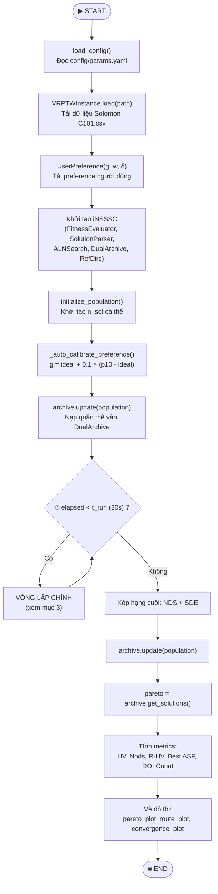

---

## 2. Khởi Tạo Quần Thể — `initialize_population()`

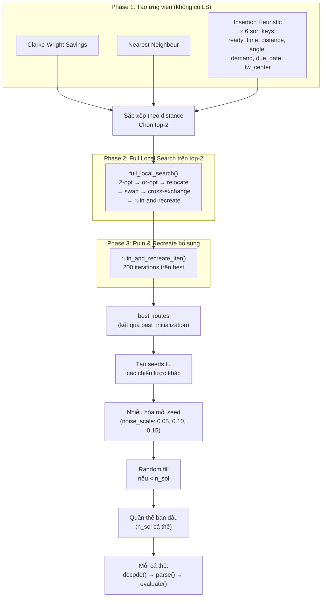

---

## 3. Vòng Lặp Chính — 1 Generation

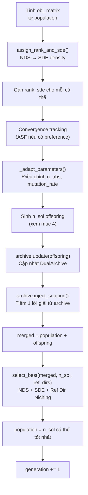

---

## 4. Sinh Con (Offspring) — Mỗi Cá Thể i

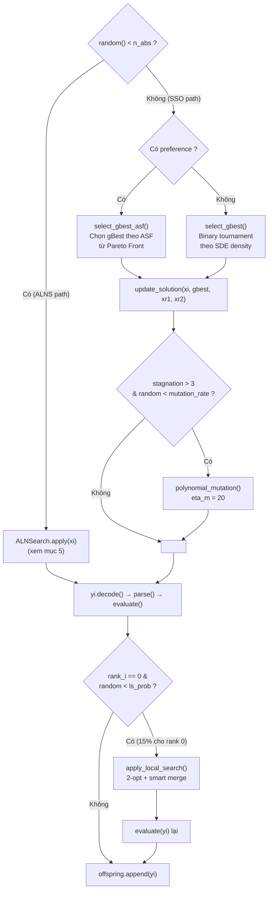

---

## 5. ALNSearch (ALNS) — `apply()` Chi Tiết

> Class: `ALNSearch` (alias `ABSearch`)
> File: `algorithm/abs_search.py`

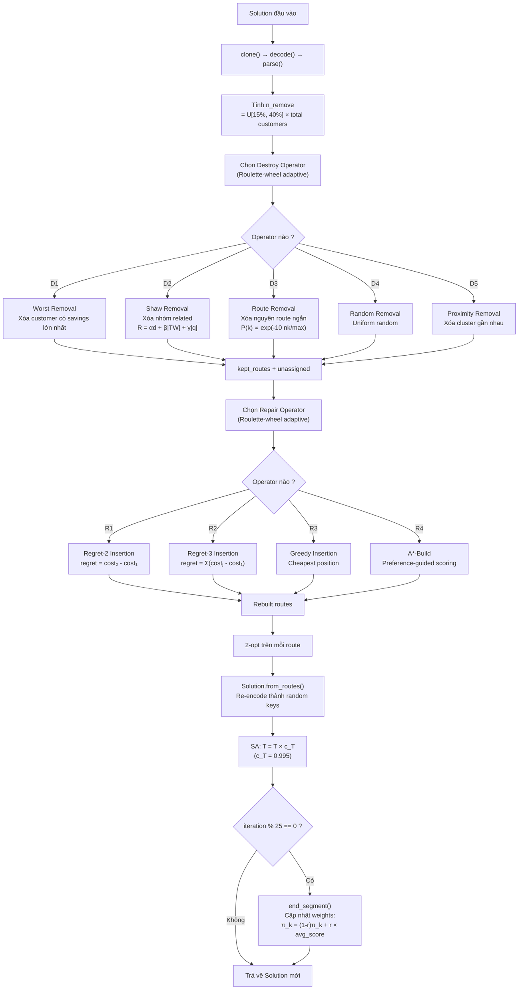

### Bảng Operator Scoring (Ropke & Pisinger 2006)

| Reward Level | Điều kiện | Điểm (σ) |
|:---:|---|:---:|
| 0 | New global best | 33 |
| 1 | Improving, not dominated | 9 |
| 2 | Accepted by SA | 3 |
| 3 | Rejected | 0 |

---

## 6. SSO Update — `update_solution()` Chi Tiết

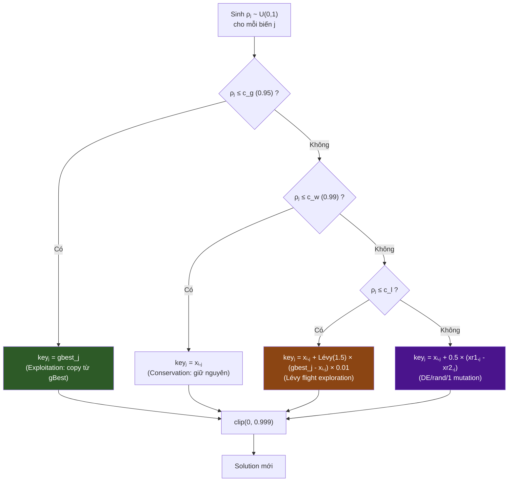

> **c_l = c_w + 0.6 × (1 - c_w)** → với c_w = 0.99 thì c_l = 0.996

---

## 7. DualArchive — Cơ Chế Lưu Trữ Kép

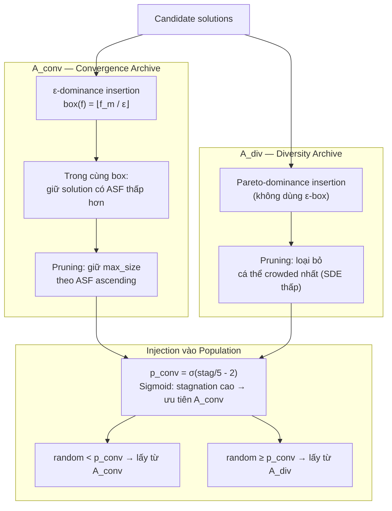

---

## 8. Selection — `select_best()` Chi Tiết

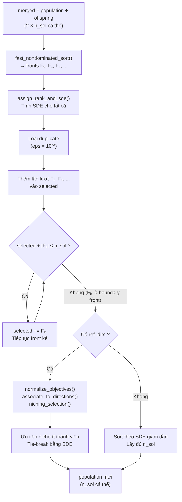

---

## 9. 5 Hàm Mục Tiêu — `FitnessEvaluator`

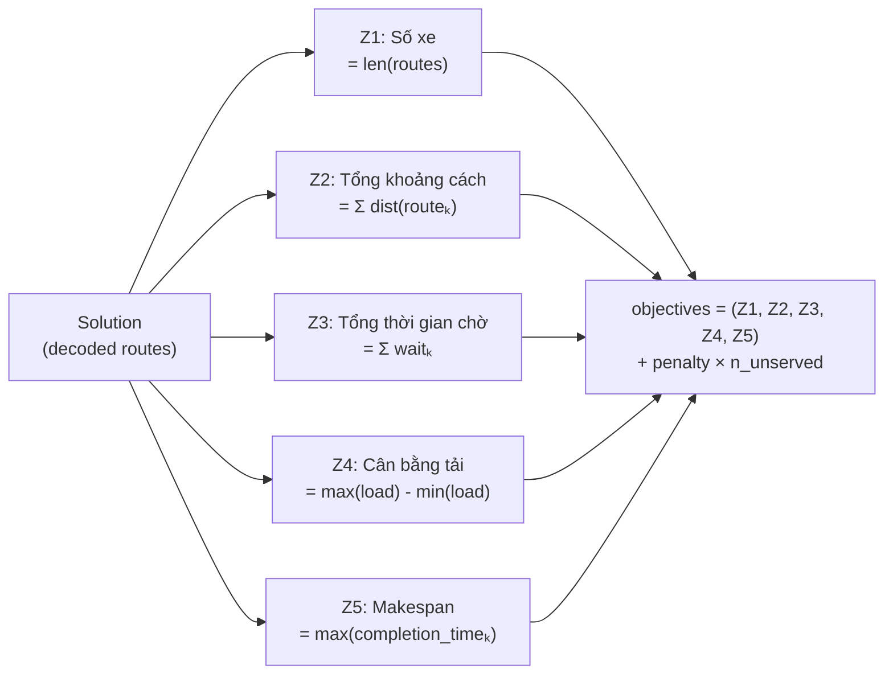

> Tất cả 5 mục tiêu đều **minimize**. Penalty = 10⁴ cho mỗi khách hàng không phục vụ được.

---

## 10. Kiến Trúc Module Đầy Đủ

```mermaid
flowchart TD
    subgraph "main.py"
        CLI["argparse CLI"]
        MODE["mode_single()"]
    end

    subgraph "core/"
        INST["VRPTWInstance\n(.load, customers, depot,\ndistance_matrix)"]
        SOL["Solution\n(.keys, .routes, .decode(),\n.from_routes(), .clone())"]
        PARSE["SolutionParser\n(.parse, .route_details)"]
        FIT["FitnessEvaluator\n(.evaluate → Z1..Z5)\n+ ObjectiveNormalizer"]
        PREF["UserPreference\n(g, w, δ, .asf(), .asf_batch())"]
    end

    subgraph "algorithm/"
        ALGO["iNSSSO\n(.run, .update_solution,\n.initialize_population)"]
        ALNS["ALNSearch\n(5 Destroy + 4 Repair\n+ OperatorScoring + SA)"]
        NDS["fast_nondominated_sort()"]
        CROWD["assign_rank_and_sde()\nsde_density()\nselect_best() + niching"]
        RDOM["r_assign_rank_and_crowding()\nselect_gbest_asf()"]
        RDIR["das_dennis()\npreference_biased_dirs()\nniching_selection()"]
        INIT["best_initialization()\nclarke_wright_savings()\ninsertion_heuristic()\nfull_local_search()"]
    end

    subgraph "benchmark/"
        METRICS["PerformanceMetrics\n(HV, Nnds, R-HV, ROI)"]
    end

    subgraph "visualization/"
        VP["plot_pareto_2d()"]
        VR["plot_routes()"]
        VC["plot_convergence()"]
    end

    CLI --> MODE
    MODE --> INST
    MODE --> PREF
    MODE --> ALGO
    ALGO --> SOL
    ALGO --> PARSE
    ALGO --> FIT
    ALGO --> ALNS
    ALGO --> NDS
    ALGO --> CROWD
    ALGO --> RDOM
    ALGO --> RDIR
    ALGO --> INIT
    MODE --> METRICS
    MODE --> VP
    MODE --> VR
    MODE --> VC
```

---

## 11. Tham Số Thích Ứng — `_adapt_parameters()`

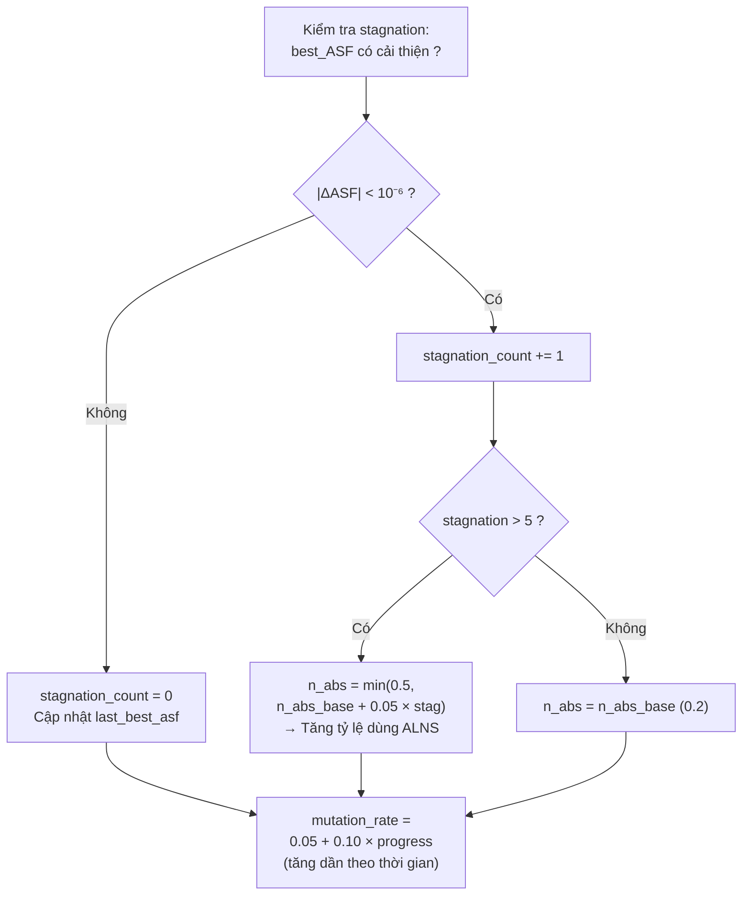

> **Ý nghĩa:** Khi thuật toán bế tắc (stagnation), tự động tăng tỷ lệ sử dụng ALNS destroy/repair để thoát khỏi cực tiểu cục bộ.
