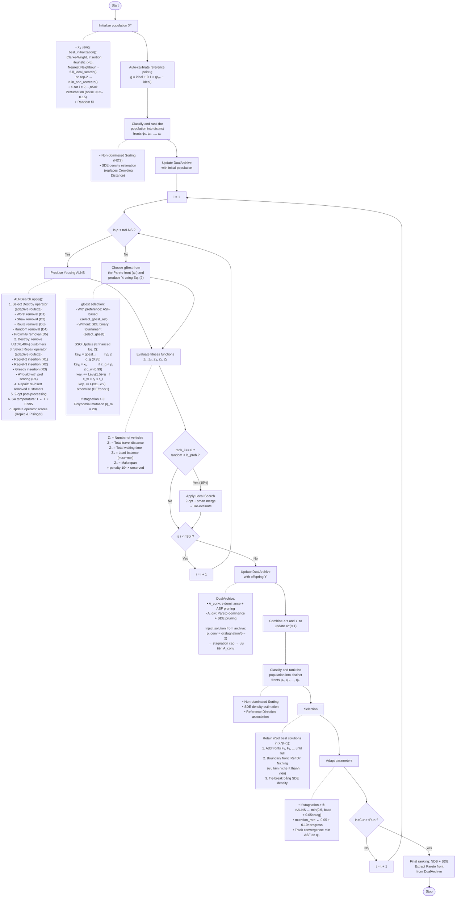

# Flowchart of the Proposed iNSSSO (Paper Style)

> Sơ đồ theo phong cách Fig.1 của bài báo, nhưng phản ánh đúng code thực tế.

---

## Fig. 1 — Flowchart Chính của iNSSSO

---

## So Sánh: Bài Báo Gốc vs. Code Thực Tế

| Thành phần | Bài báo gốc (Fig.1) | Code thực tế |
|---|---|---|
| **Khởi tạo X₁** | LKH | `best_initialization()`: CW + Insertion(×6) + NN → `full_local_search()` → `ruin_and_recreate()` |
| **Khởi tạo Xᵢ** | Random | Perturbation (noise 0.05–0.15) + Random fill |
| **Ranking** | NDS + Crowding Distance | NDS + **SDE** (Shift-based Density Estimation) |
| **ABS / ALNS** | ABS (Attraction-Based Search) | **ALNSearch** (ALNS): 5 Destroy + 4 Repair + Adaptive Scoring + SA |
| **SSO (Eq. 2)** | Standard SSO (3 bands) | Enhanced SSO: 4 bands (gBest copy + conservation + **Lévy flight** + **DE/rand/1**) |
| **gBest selection** | CD-based tournament | **ASF-based** (preference) hoặc SDE binary tournament |
| **Fitness** | Eq. (15), (16), (17) — 3 objectives | **5 objectives**: Z₁(vehicles), Z₂(distance), Z₃(wait), Z₄(balance), Z₅(makespan) |
| **Archive** | Không đề cập | **DualArchive**: A_conv (ε-dominance + ASF) + A_div (Pareto + SDE) |
| **Selection** | Rank + CD | Rank + SDE + **Reference Direction Niching** (Das-Dennis / Preference-biased) |
| **Mutation** | Không đề cập | **Polynomial mutation** (η_m=20) khi stagnation > 3 |
| **Adaptive** | Không đề cập | n_ALNS tăng khi stagnation; mutation_rate tăng theo progress |
| **Preference** | Không đề cập | **R-Dominance**, ASF, auto-calibrate g, ROI (δ) |
| **Local Search** | Không đề cập | 2-opt + smart merge (15% cho rank-0 offspring) |
