# Flowchart of `iNSSSO.run()` — Line-by-Line from Code

> Vẽ theo đúng thứ tự code trong `algorithm/inssso.py` → function `run()` (L598–L736)

---

## Flowchart Chính

```mermaid
flowchart TD
    START(["Start"]) --> LOG["Log: iNSSSO starting on instance\n(nSol, tRun, nABS, preference)"]

    LOG --> INIT["population = initialize_population()"]
    INIT -.- INIT_N["• X₁: best_initialization()\n   CW, Insertion(×6), NN\n   → full_local_search top-2\n   → ruin_and_recreate\n• Seeds: 6 sort keys + CW + NN\n   → 2-opt mỗi seed\n• Perturbation: noise 0.05, 0.10, 0.15\n• Random fill nếu < nSol\n• Mỗi cá thể: decode → parse → evaluate"]

    INIT --> CALIB["_auto_calibrate_preference()\ng = ideal + 0.1 × (p₁₀ − ideal)"]
    CALIB -.- CALIB_N["Chỉ dùng feasible solutions (restcus=0)\nCập nhật g cho pref, abs_search, archive"]

    CALIB --> ARCH0["archive.update(population)\nNạp quần thể vào DualArchive"]

    ARCH0 --> TIME0["start = time.time()\ngeneration = 0"]

    TIME0 --> WHILE{"elapsed < t_run ?"}

    %% ═══ VÒNG LẶP CHÍNH ═══

    WHILE -- "Không → thoát" --> FINAL

    WHILE -- "Có" --> PROGRESS["progress = elapsed / t_run"]

    PROGRESS --> RANK["obj_matrix = objectives của population\nranks, sde_vals = assign_rank_and_sde()"]
    RANK -.- RANK_N["• fast_nondominated_sort → fronts\n• SDE density trong mỗi front\n  (thay thế Crowding Distance)"]

    RANK --> ASSIGN["Gán rank, sde cho mỗi cá thể\npf_indices = các cá thể rank == 0"]

    ASSIGN --> CONV["Convergence tracking"]
    CONV -.- CONV_N["Có preference:\n  conv_metric = min ASF trên PF\nKhông preference:\n  conv_metric = mean Z₁ trên PF\n→ convergence.append(elapsed, metric)"]

    CONV --> ADAPT["_adapt_parameters(gen, progress)"]
    ADAPT -.- ADAPT_N["Kiểm tra stagnation:\n  |ΔASF| < 10⁻⁶ → stag += 1\nStag > 5:\n  n_abs ← min(0.5, base + 0.05×stag)\nmutation_rate ← 0.05 + 0.10×progress"]

    ADAPT --> SYNC["abs_search.n_abs = self.n_abs"]

    %% ═══ SINH CON ═══

    SYNC --> LOOP_I["offspring = []\nfor i in range(n_sol):"]

    LOOP_I --> RHO{"random() < n_abs ?"}

    RHO -- "Có" --> ALNS["yi = abs_search.apply(population[i])"]
    ALNS -.- ALNS_N["ALNSearch (ALNS):\n1. Chọn Destroy (roulette adaptive)\n   D1: worst, D2: Shaw, D3: route,\n   D4: random, D5: proximity\n2. Remove U[15%,40%] customers\n3. Chọn Repair (roulette adaptive)\n   R1: regret-2, R2: regret-3,\n   R3: greedy, R4: A*-build\n4. 2-opt post-process\n5. T ← T × 0.995"]

    RHO -- "Không" --> PREF_CHECK{"self.pref is not None ?"}

    PREF_CHECK -- "Có" --> GBEST_ASF["gb_idx = select_gbest_asf()\nChọn gBest theo ASF từ PF"]
    PREF_CHECK -- "Không" --> GBEST_SDE["gb_idx = select_gbest()\nBinary tournament theo SDE"]

    GBEST_ASF --> GET_GB["gbest = population[gb_idx]"]
    GBEST_SDE --> GET_GB

    GET_GB --> DE_DONOR["r_indices = random 2 cá thể\nxr1, xr2 = population[r1], population[r2]"]

    DE_DONOR --> SSO["yi = update_solution(xi, gbest, xr1, xr2)"]
    SSO -.- SSO_N["Enhanced SSO (4 bands):\n  ρⱼ ≤ 0.95 → keyⱼ = gbest_j\n  ρⱼ ≤ 0.99 → keyⱼ = xᵢ,ⱼ  (giữ)\n  ρⱼ ≤ c_l  → Lévy flight\n  ρⱼ > c_l  → DE: xᵢ + 0.5(xr1−xr2)\nclip(0, 0.999)"]

    SSO --> MUT_CHECK{"stagnation > 3\nAND random < mutation_rate ?"}
    MUT_CHECK -- "Có" --> MUTATE["yi = polynomial_mutation(yi)\nη_m = 20"]
    MUT_CHECK -- "Không" --> EVAL

    MUTATE --> EVAL

    ALNS --> EVAL

    EVAL["yi.decode()\nparser.parse(yi)\nevaluator.evaluate(yi)"]
    EVAL -.- EVAL_N["evaluate → (Z₁, Z₂, Z₃, Z₄, Z₅)\nZ₁ = vehicles, Z₂ = distance\nZ₃ = wait, Z₄ = balance\nZ₅ = makespan\n+ penalty 10⁴ × unserved"]

    EVAL --> LS_CHECK{"yi.restcus == 0\nAND random < ls_prob ?"}
    LS_CHECK -.- LS_N["ls_prob = 0.15 nếu rank_i == 0\nls_prob = 0.03 nếu rank_i > 0"]

    LS_CHECK -- "Có" --> LS["yi = apply_local_search(yi)\n2-opt + smart merge\nevaluator.evaluate(yi)"]
    LS_CHECK -- "Không" --> APPEND

    LS --> APPEND["offspring.append(yi)"]

    APPEND --> I_CHECK{"i < nSol - 1 ?"}
    I_CHECK -- "Có" --> LOOP_I
    I_CHECK -- "Không → hết loop" --> ARCH_UP

    %% ═══ ARCHIVE + SELECTION ═══

    ARCH_UP["archive.update(offspring)\nCập nhật DualArchive"]
    ARCH_UP -.- ARCH_N["DualArchive:\n• A_conv: ε-dominance, ASF pruning\n• A_div: Pareto-dominance, SDE pruning\nMỗi archive tối đa max_size"]

    ARCH_UP --> INJECT["injected = archive.inject_solution(stag)"]
    INJECT -.- INJECT_N["p_conv = σ(stag/5 − 2)\nrandom < p_conv → lấy từ A_conv\nngược lại → lấy từ A_div\nDecode + evaluate nếu cần\n→ offspring.append(injected)"]

    INJECT --> MERGE["merged = population + offspring"]
    MERGE --> SEL["best_indices = select_best(\n    merged_obj, nSol, ref_dirs)"]
    SEL -.- SEL_N["1. NDS → fronts F₀, F₁, ...\n2. Thêm fronts đến khi đầy\n3. Boundary front:\n   Ref Dir Niching\n   (ưu tiên niche ít thành viên)\n   Tie-break bằng SDE"]

    SEL --> NEW_POP["population = merged[best_indices]\ngeneration += 1"]

    NEW_POP --> WHILE

    %% ═══ KẾT THÚC ═══

    FINAL["Final ranking:\nranks, cds = assign_rank_and_crowding()"]
    FINAL --> FINAL_ASSIGN["Gán rank, cd cho population"]
    FINAL_ASSIGN --> FINAL_ARCH["archive.update(population)"]
    FINAL_ARCH --> GET_PF["pareto = archive.get_solutions()"]
    GET_PF -.- PF_N["get_solutions('combined'):\nMerge A_conv + A_div\n→ NDS → lấy front 0\nFallback: population rank == 0"]

    GET_PF --> RETURN["return pareto, info"]
    RETURN -.- RETURN_N["info = {\n  generations,\n  runtime,\n  convergence,\n  evaluations\n}"]

    RETURN --> STOP(["Stop"])
```

---

## Mapping: Code Line → Flowchart Block

| Dòng code | Block trong sơ đồ |
|---|---|
| L598–604 | Log khởi đầu |
| L607 | `initialize_population()` |
| L610 | `_auto_calibrate_preference()` |
| L612 | `archive.update(population)` |
| L614–615 | `start = time.time()`, `generation = 0` |
| L617–620 | `while True` + `elapsed >= t_run → break` |
| L621 | `progress = elapsed / t_run` |
| L623–625 | NDS + SDE ranking |
| L627–629 | Gán rank, sde |
| L631–632 | `pf_indices` |
| L635–644 | Convergence tracking |
| L647–648 | `_adapt_parameters()` + sync |
| L651–652 | Offspring loop bắt đầu |
| L653–654 | `random < n_abs` → ALNS |
| L656–661 | gBest selection (ASF / SDE) |
| L663 | `gbest = population[gb_idx]` |
| L666–670 | DE donors: xr1, xr2 |
| L672–674 | `update_solution()` — SSO |
| L676–677 | Polynomial mutation (nếu stagnation) |
| L679–681 | `decode → parse → evaluate` |
| L684–688 | Adaptive local search |
| L690 | `offspring.append(yi)` |
| L693 | `archive.update(offspring)` |
| L696–702 | `inject_solution()` |
| L705–707 | `merged` + `select_best()` |
| L709–710 | `population = ...`, `generation += 1` |
| L713–714 | Final ranking |
| L716–718 | Gán rank, cd |
| L720 | `archive.update(population)` |
| L723–725 | `archive.get_solutions()` + fallback |
| L731–736 | Return pareto + info |
