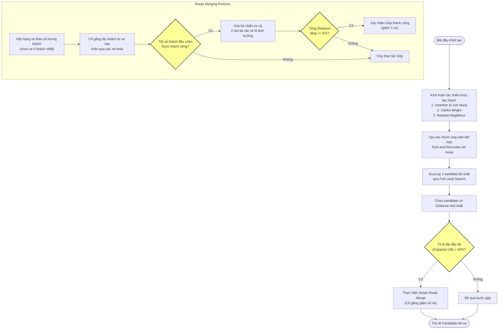
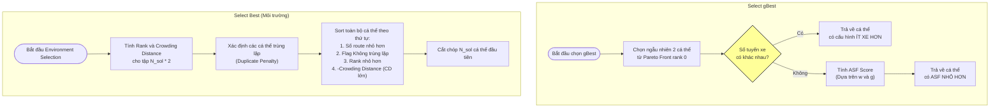
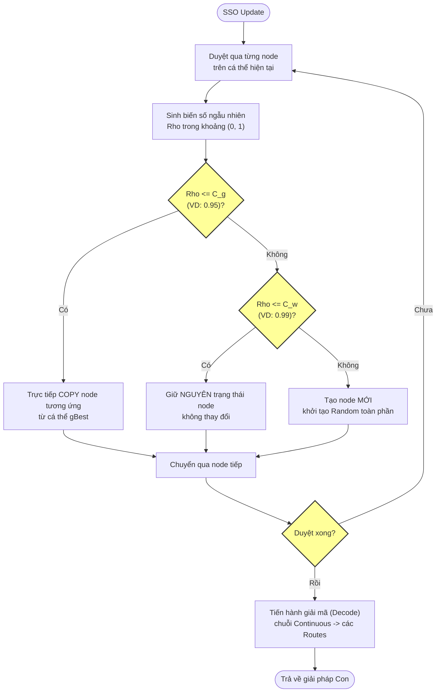
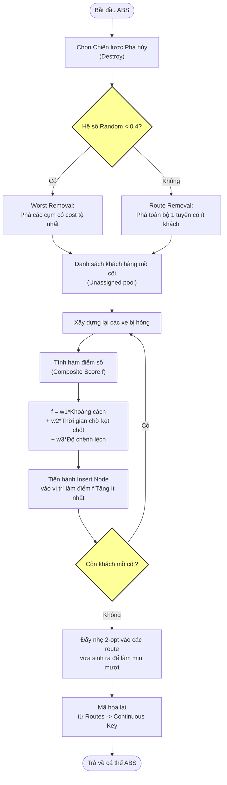
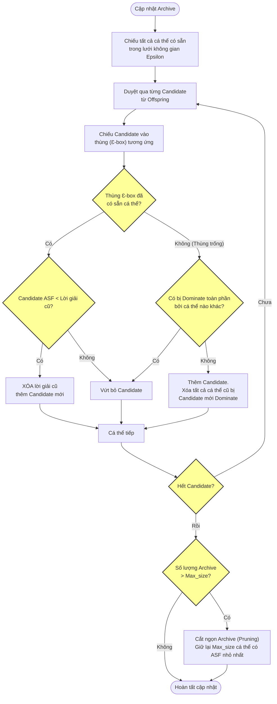

# Lưu đồ Thuật toán (Flowcharts) - Preference-Based iNSSSO

Dưới đây là sơ đồ chi tiết luồng hoạt động tổng quan của thuật toán iNSSSO và các thuật toán thành phần bên trong. Các sơ đồ sử dụng standard Mermaid.js hỗ trợ hiển thị trực tiếp. Đã khắc phục lỗi cú pháp bằng cách sử dụng `""` chặt chẽ cho syntax của Mermaid.

---

## 1. Lưu đồ Tổng quan iNSSSO (Main Loop)

Đây là luồng thực thi chính của toàn bộ hệ thống từ khi bắt đầu chạy cho đến khi trả về kết quả cuối cùng (Pareto front).

```mermaid
flowchart TD
    Start(["Bắt đầu iNSSSO"]) --> InitPop["Khởi tạo Quần thể ban đầu<br/>N_sol lời giải"]
    InitPop --> AutoCal["Tính tự động Reference Point g<br/>(Auto-calibration)"]
    AutoCal --> InitArchive["Thêm quần thể vào External Archive"]
    
    InitArchive --> CheckGen{"Đạt giới hạn<br/>thời gian?"}
    
    CheckGen -- Có --> Finalize["Cập nhật Rank cuối cùng<br/>Trích xuất Pareto Front"]
    Finalize --> End(["Kết thúc"])
    
    CheckGen -- Không --> RankPop["Fast Non-dominated Sort<br/>& Crowding Distance"]
    RankPop --> AdaptParam["Điều chỉnh tham số thích nghi<br/>N_abs, mutation_rate"]
    AdaptParam --> Offspring["Bắt đầu tạo Thế hệ con<br/>Offspring = rỗng"]
    
    Offspring --> LoopPop["Lặp qua từng cá thể i trong Quần thể"]
    
    LoopPop --> CheckProb{"Hệ số Random < N_abs?"}
    
    CheckProb -- Có --> DoABS["Thực hiện ABS Search<br/>(Tìm kiếm lân cận cục bộ)"]
    CheckProb -- Không --> SelGBest["Chọn gBest bằng ASF<br/>(Binary Tournament)"]
    SelGBest --> DoSSO["Cập nhật vị trí bằng SSO<br/>(Squirrel Search)"]
    DoSSO --> CheckStag{"Có đang bị Stagnation?"}
    CheckStag -- Có --> DoMut["Đột biến Đa thức<br/>(Polynomial Mutation)"]
    DoMut --> EvalMut["Đánh giá lại hàm mục tiêu"]
    CheckStag -- Không --> EvalMut
    
    DoABS --> CheckValid["Decode và Đánh giá"]
    EvalMut --> CheckValid
    
    CheckValid --> CheckLocal{"Là Rank 0<br/>& Random < LS_Prob?"}
    CheckLocal -- Có --> DoLocal["Thực hiện Local Search<br/>(2-opt + Smart Merge)"]
    DoLocal --> EvalLocal["Đánh giá lại"]
    CheckLocal -- Không --> SaveOffspring["Đưa vào tập Offspring"]
    EvalLocal --> SaveOffspring
    
    SaveOffspring --> CheckLoopEnd{"Đã duyệt hết<br/>cá thể?"}
    CheckLoopEnd -- Chưa --> LoopPop
    
    CheckLoopEnd -- Rồi --> UpdateArchive["Cập nhật External Archive<br/>(Ɛ-dominance + ASF)"]
    UpdateArchive --> Inject["Chèn ngẫu nhiên 1 cá thể<br/>từ Archive vào Offspring"]
    Inject --> MergePop["Gộp Population cũ và Offspring<br/>(Kích thước = 2 * N_sol)"]
    MergePop --> RankMerged["Rank và Crowding tập gộp"]
    RankMerged --> SelectBest["Select Best (Env Selection)<br/>Ưu tiên: 1. Số xe nhỏ, 2. No Duplicate, 3. Rank, 4. CD"]
    SelectBest --> UpdatePop["Cập nhật Population mới<br/>(Kích thước = N_sol)"]
    UpdatePop --> CheckGen

    classDef main fill:#f9f,stroke:#333,stroke-width:2px;
    classDef decision fill:#ff9,stroke:#333,stroke-width:2px;
    class CheckGen,CheckProb,CheckStag,CheckValid,CheckLocal,CheckLoopEnd decision;
```

---

## 2. Lưu đồ Khởi tạo (Best Initialization & Smart Merge)

Bước tạo ra seed ban đầu để thuật toán xoay vòng. Giai đoạn này rất quan trọng để có được số lượng xe tối ưu.

---

## 3. Lưu đồ Chọn gBest và Chọn lọc Cá thể (Selection mechanism)

Bước quyết định xu hướng tiến hóa của thuật toán — ép giảm số lượng tuyến xe trước, sau đó rẽ theo ưu tiên của người dùng.

---

## 4. Lưu đồ Toán tử SSO (Squirrel Search Update)

Thao tác mô phỏng chú Sóc đang bay nhảy, giúp thuật toán khám phá và khai thác không gian lời giải.

---

## 5. Lưu đồ ABS Search (A*-Based / Destroy & Rebuild)

Toán tử phá hủy một phần chiếc xe và xây lại để sửa dần các khiếm khuyết trong vùng lân cận. Đây là vùng có gắn Preference để đẩy xe theo tham số Weight Vector.

---

## 6. Lưu đồ Cập nhật Archive (Epsilon-dominance)

Để giới hạn kho lưu trữ không bị phình to (tốn RAM) mà vẫn đảm bảo tính bao phủ (Diversity), Epsilon-dominance được sử dụng kết hợp với ASF.

