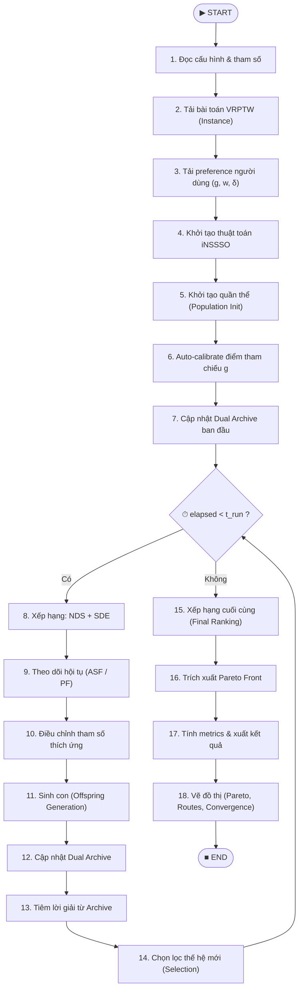
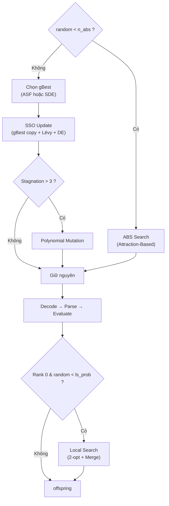
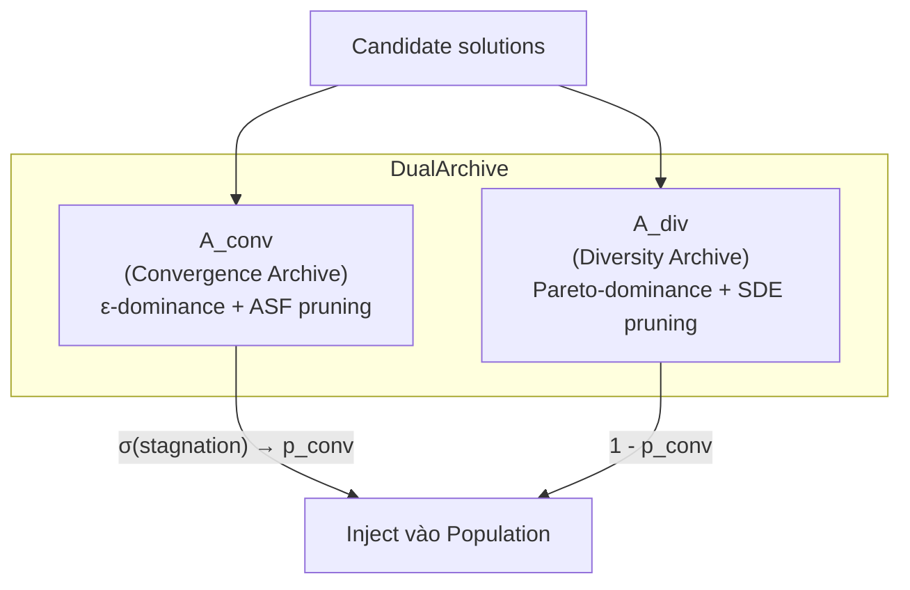
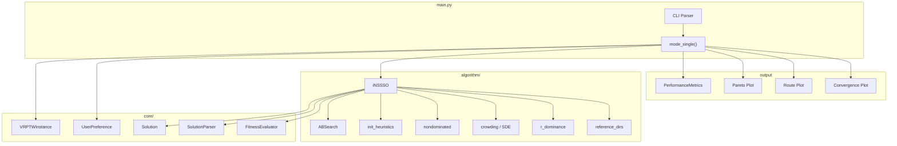

# Sơ Đồ Tổng Quát Thuật Toán iNSSSO

> **Lệnh chạy:** `python main.py --mode single --instance C101 --time 30`

## 1. Sơ Đồ Luồng Chính (High-Level Flowchart)

---

## 2. Chi Tiết Các Khối Chính

### 🔹 Giai đoạn Chuẩn Bị (Bước 1–4)

| Bước | Mô tả | Module |
|------|--------|--------|
| 1 | Đọc `config/params.yaml` → tham số thuật toán | `main.py` → `load_config()` |
| 2 | Tải instance Solomon (CSV) → tọa độ, demand, time window | `VRPTWInstance.load()` |
| 3 | Tải preference: điểm tham chiếu **g**, trọng số **w**, ngưỡng **δ** | `UserPreference` |
| 4 | Khởi tạo: `FitnessEvaluator`, `SolutionParser`, `ABSearch`, `DualArchive`, Reference Directions | `iNSSSO.__init__()` |

### 🔹 Giai đoạn Khởi Tạo Quần Thể (Bước 5–7)

### 🔹 Vòng Lặp Chính — Sinh Con (Bước 11)

### 🔹 Chọn Lọc & Archive (Bước 12–14)

---

## 3. Dual Archive — Cơ Chế Lưu Trữ

---

## 4. Tổng Quan Kiến Trúc Module

---

> [!NOTE]
> Đây là sơ đồ **tổng quát nhất** của thuật toán iNSSSO. Mỗi khối có thể được mở rộng chi tiết thêm (VD: bên trong ABS Search, chi tiết SSO Update, cách tính ASF, cơ chế ε-dominance, v.v.)
