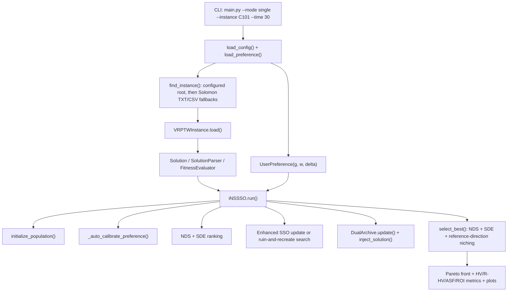
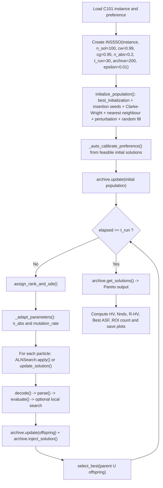

# A Preference-Aware Hybrid iNSSSO for Many-Objective Vehicle Routing with Time Windows: A Code-Aligned Draft in the Style of Applied Soft Computing

## Abstract
This manuscript reports the current implementation of a preference-aware iNSSSO solver for the many-objective vehicle routing problem with time windows (MaO-VRPTW). The executable pipeline in the repository optimizes five objectives simultaneously: the number of used vehicles, total travel distance, total waiting time, route-load imbalance, and route makespan. The active single-instance workflow combines random-key encoding, multi-start heuristic initialization, an enhanced simplified squirrel-search update with Levy-flight and differential perturbation, a multi-operator ruin-and-recreate search module, non-dominated sorting with shift-based density estimation (SDE), preference-guided gBest selection through an achievement scalarizing function (ASF), preference-biased reference directions, and a dual external archive for convergence and diversity. The paper is intentionally code-aligned: the mathematical description follows the actual path executed by `python main.py --mode single --instance C101 --time 30`, and the experimental section is grounded in the repository workbook `all_resultsVip.xlsx`. On the 56 Solomon instances stored in that workbook, the method produces an average Pareto-front size of 357.0 solutions, with large fronts on the random and mixed classes (`R1`: 397.1, `R2`: 395.8, `RC1`: 387.5, `RC2`: 391.4). The stored results exactly match the web reference vehicles and distances on all `C1` and `C2` instances, while the `R1`, `R2`, and `RC2` groups obtain lower mean route distances than the web references at the expense of additional vehicles. A representative stochastic 30-s `C101` run yields 10 vehicles, 828.94 distance, 85 nondominated solutions, and a preference-calibrated reference point of `[10.0600, 848.6890, 24.4237, 51.4000, 1162.7556]`. The code inspection also reveals implementation gaps that matter for publication: the current execution path does not activate the repository's R-dominance sorter, and the ALNS module behaves as a static multi-operator ruin-and-recreate procedure rather than a fully adaptive reward-updated ALNS with simulated-annealing acceptance. Consequently, this document should be treated as a code-faithful submission draft and a precise basis for the final comparative study.

**Keywords:** vehicle routing with time windows, many-objective optimization, preference-based optimization, random-key encoding, squirrel search, SDE, dual archive

## 1. Introduction
Vehicle routing with time windows (VRPTW) remains one of the most important combinatorial optimization problems in transportation and logistics. In practical decision making, minimizing total distance alone is inadequate. Fleet managers usually face several conflicting goals, such as reducing the number of vehicles, limiting waiting time, balancing route loads, and controlling route makespan. This naturally leads to a many-objective formulation when five or more criteria are optimized simultaneously.

The repository studied in this work implements a five-objective preference-aware MaO-VRPTW solver under the class name `iNSSSO`. Its main execution path is exposed through `main.py`, and the target command requested for the present article is:

```bash
python main.py --mode single --instance C101 --time 30
```

The objective of this paper is not to invent a narrative detached from the source code. Instead, it reconstructs the mathematical model, software flow, and available experimental evidence directly from the current repository state. This choice is deliberate because several repository docstrings describe features that are broader than the behavior currently exercised by the executable path.

The contributions of this manuscript are therefore fourfold.

1. It derives a precise mathematical formulation of the active five-objective VRPTW model from the current source code.
2. It reconstructs the end-to-end workflow of the single-instance execution path, including data loading, preference handling, initialization, offspring generation, archive management, and output metrics.
3. It summarizes the evidence stored in `all_resultsVip.xlsx` across the 56 Solomon instances and relates those results to the supplied web-reference columns.
4. It identifies the exact implementation gaps that must be closed before a final journal submission can make strong comparative claims.

## 2. Mathematical formulation

### 2.1. Problem definition
Let the VRPTW instance be defined on a complete graph
\[
\mathcal{G} = (\mathcal{V}, \mathcal{E}), \qquad \mathcal{V} = \{0,1,\dots,n\},
\]
where node \(0\) denotes the depot and nodes \(1,\dots,n\) denote customers. Each customer \(i\) has demand \(q_i\), service time \(s_i\), and time window \([e_i, l_i]\). A homogeneous fleet of capacity \(Q\) is available. The Euclidean distance and travel time between nodes \(i\) and \(j\) are denoted by \(d_{ij}\) and \(t_{ij}\), respectively.

For each route \(R_k\), feasibility requires:
\[
\sum_{i \in R_k} q_i \le Q,
\]
\[
b_i = \max(a_i, e_i), \qquad b_i \le l_i,
\]
\[
b_i + s_i + t_{i0} \le l_0,
\]
where \(a_i\) is the arrival time at customer \(i\), \(b_i\) is the service-start time, and \(l_0\) is the depot closing time.

### 2.2. Random-key encoding
The solution representation is a random-key vector
\[
X = (x_1, x_2, \dots, x_{n_{\mathrm{var}}}),
\]
with
\[
n_{\mathrm{var}} = |\mathcal{C}| + |\mathcal{V}_{\mathrm{veh}}| - 1.
\]
The decoded integer sequence is obtained by
\[
Z = \mathrm{argsort}(X) + 1.
\]
Entries \(z_r > |\mathcal{C}|\) are treated as route separators, while the remaining entries are interpreted as customer identifiers. The decoded routes are then validated by `SolutionParser.parse()`, which removes infeasible customers and stores them as unassigned.

### 2.3. Objective vector
Let \(U(x)\) denote the number of unserved customers in solution \(x\), and let the penalty coefficient be \(P = 10^4\). The penalty term is
\[
\mathrm{pen}(x) = P \cdot U(x).
\]
The current code optimizes the five-objective vector
\[
\mathbf{f}(x) = \left(Z_1(x), Z_2(x), Z_3(x), Z_4(x), Z_5(x)\right),
\]
where
\[
Z_1(x) = K(x) + \mathrm{pen}(x),
\]
\[
Z_2(x) = \sum_{k=1}^{K} \sum_{(i,j)\in R_k} d_{ij} + \mathrm{pen}(x),
\]
\[
Z_3(x) = \sum_{k=1}^{K} \sum_{i\in R_k} \max(0, e_i-a_i) + \mathrm{pen}(x),
\]
\[
Z_4(x) = \max_k L_k - \min_k L_k + \mathrm{pen}(x), \qquad L_k = \sum_{i\in R_k} q_i,
\]
\[
Z_5(x) = \max_k T_k + \mathrm{pen}(x),
\]
with \(K(x)\) the number of used routes and \(T_k\) the completion time of route \(k\).

## 3. Code-aligned execution flow for `main.py --mode single --instance C101 --time 30`

### 3.1. Software architecture


### 3.2. Single-run flow


### 3.3. Reproducibility notes
Two details matter for reproducibility.

1. The present repository stores `C101` under `data/txt/100/C1/C101.txt`, whereas the original configuration file points to `data/csv`. The instance resolver was therefore extended to fall back across the bundled Solomon TXT/CSV roots so that the requested command executes directly.
2. The `--time` argument controls the evolutionary loop after initialization. Because initialization occurs before the runtime clock is started, and because a generation is not interrupted mid-iteration, end-to-end wall-clock time can exceed the nominal budget.

### 3.4. Representative `C101` trace
Table 1 reports one stochastic run obtained from the executable single-mode path after the instance-lookup fix.

| Item | Value |
|---|---:|
| Instance | `C101` |
| Nominal time argument | `30 s` |
| Population size | `100` |
| Reference directions | `105` |
| Generations completed | `4` |
| Best route count \(Z_1\) | `10` |
| Best distance \(Z_2\) | `828.94` |
| Pareto-front size | `85` |
| Hypervolume | `0.000150` |
| R-Hypervolume | `0.157186` |
| Best ASF | `1.912919` |
| Auto-calibrated reference point \(g\) | `[10.0600, 848.6890, 24.4237, 51.4000, 1162.7556]` |

## 4. Proposed method

### 4.1. Multi-start initialization
The active initialization procedure is unusually strong for a swarm-based method. It first calls a time-limited `best_initialization()` routine, then expands the seed pool with insertion heuristics sorted by ready time, distance, angle, demand, due date, and time-window center, plus Clarke-Wright savings and greedy nearest neighbour seeds. Each seed is locally improved by route-level 2-opt and then perturbed with random-key noise. The remaining population slots are filled randomly.

### 4.2. Preference layer
The current single-mode path uses preference information in four active places.

1. Weight normalization:
\[
\mathbf{w} \leftarrow \frac{\mathbf{w}}{\sum_{m=1}^{M} w_m}.
\]
2. Achievement scalarizing function:
\[
\mathrm{ASF}(\mathbf{f}(x)) = \max_{m=1,\dots,M} \left\{ w_m \left(f_m(x)-g_m\right) \right\}.
\]
3. Region of interest:
\[
\sum_{m=1}^{M}
\left(
\frac{w_m(f_m(x)-g_m)}
\delta \left(z_m^{\mathrm{nad}}-z_m^{\ast}\right)}
\right)^2 \le 1.
\]
4. Auto-calibration of the reference point from the initial feasible population:
\[
\mathbf{g}_{\mathrm{new}}
= \mathbf{z}^{\ast}
+ \eta \cdot \max(\mathbf{p}_{10}-\mathbf{z}^{\ast}, \mathbf{0}),
\qquad \eta = 0.1.
\]

Notably, the repository contains an `r_dominance.py` module, but the current `single` execution path does not call it. In the active path, preference affects gBest selection, reference-direction biasing, ROI-based metrics, and convergence-archive pruning, not environmental ranking itself.

### 4.3. Enhanced squirrel-search update
When ruin-and-recreate search is not selected, offspring are generated by the piecewise update
\[
x_{i,j}^{\mathrm{new}} =
\begin{cases}
g_j, & \rho_j \le c_g, \\
x_{i,j}, & c_g < \rho_j \le c_w, \\
x_{i,j} + L_j(g_j-x_{i,j}) \cdot 0.01, & c_w < \rho_j \le c_l, \\
x_{i,j} + F(x_{r1,j}-x_{r2,j}), & \rho_j > c_l,
\end{cases}
\]
where \(c_g = 0.95\), \(c_w = 0.99\), \(c_l = c_w + 0.6(1-c_w)\), and \(F=0.5\).

The Levy step is sampled by Mantegna's rule:
\[
L_j = \frac{u}{|v|^{1/\beta}}, \qquad
u \sim \mathcal{N}(0,\sigma_u^2), \quad v \sim \mathcal{N}(0,1), \quad \beta=1.5.
\]

Under prolonged stagnation, polynomial mutation perturbs selected keys:
\[
y'_j = \mathrm{clip}(y_j + \Delta q_j, 0, 0.999).
\]

### 4.4. Multi-operator ruin-and-recreate search
The `ALNSearch` class contributes a destroy-and-repair neighborhood search with five destroy operators and four repair operators:

- Destroy: worst removal, Shaw removal, route removal, random removal, proximity removal.
- Repair: regret-2 insertion, regret-3 insertion, greedy insertion, A-star-like route building.

The current executable behavior is important: although the class contains hooks for operator scoring, segment updates, and simulated-annealing temperature decay, the main run path never calls `record_reward()`, and `apply()` does not perform SA-based acceptance. Hence the active method is best described as a randomized multi-operator ruin-and-recreate search with static roulette probabilities and a 2-opt post-processing pass, not as a fully adaptive ALNS with reward-updated operator weights.

### 4.5. Ranking, diversity, and archive management
Population ranking is performed by non-dominated sorting followed by shift-based density estimation (SDE). For a front \(F\), the density value of solution \(i\) is computed from the minimum shifted Euclidean distance to the other solutions. Higher SDE means a more isolated solution.

Environmental selection combines:

1. non-dominated sorting,
2. SDE-based density control,
3. duplicate suppression,
4. reference-direction niching.

The reference directions are preference-biased when a user preference is available.

The external archive is split into a convergence archive \(\mathcal{A}_{\mathrm{conv}}\) and a diversity archive \(\mathcal{A}_{\mathrm{div}}\):
\[
\mathrm{box}_{\epsilon}(\mathbf{f}) = \left\lfloor \frac{\mathbf{f}}{\epsilon + 10^{-15}} \right\rfloor.
\]
Within the convergence archive, one solution is retained per epsilon box, preferring lower ASF values when a preference is defined. The diversity archive stores Pareto-nondominated solutions and prunes crowded points by SDE. Archive injection uses a stagnation-dependent logistic rule:
\[
p_{\mathrm{conv}} = \frac{1}{1 + \exp(-s/5 + 2)},
\]
where \(s\) is the stagnation counter.

### 4.6. Main pseudo-code
```text
Algorithm 1: Code-aligned iNSSSO for single-mode execution
Input: VRPTW instance I, preference (g,w,delta), parameters
Output: Archive-based Pareto approximation

1. Build an initial population P by multi-start heuristics, perturbations, and random fill.
2. Auto-calibrate g from the feasible part of P.
3. Update the dual archive with P.
4. while elapsed < t_run do
5.     Rank P by nondominated sorting and SDE.
6.     Adapt n_abs and mutation rate from progress and stagnation.
7.     for each solution x_i in P do
8.         if rand < n_abs then
9.             y_i <- ruin_and_recreate(x_i)
10.        else
11.            choose gBest by ASF tournament on rank-0 solutions
12.            choose two donors x_r1, x_r2
13.            y_i <- enhanced_sso_update(x_i, gBest, x_r1, x_r2)
14.            if stagnation and mutation trigger then mutate(y_i)
15.        end if
16.        decode, parse, and evaluate y_i
17.        optionally improve y_i by local search
18.        add y_i to offspring set Q
19.    end for
20.    update archive with Q and inject one archive solution if available
21.    P <- select_best(P union Q)
22. end while
23. return archive.get_solutions()
```

### 4.7. Time complexity
Let \(N\) be the population size, \(M=5\) the number of objectives, and \(n\) the number of customers.

- Decoding and route parsing are \(O(n)\) per solution.
- Population ranking and SDE are \(O(N^2 M)\) in time.
- Archive update is \(O(|\mathcal{A}|M)\) per inserted solution in the worst case.
- The destroy-and-repair phase depends on route feasibility checks and insertion scans, which dominate the local-search overhead on large instances.

The implementation is therefore dominated by repeated route evaluation and quadratic population-density calculations rather than by the random-key sorting itself.

## 5. Experimental evidence available in the repository

### 5.1. Available data and parameterization
The supplied workbook `all_resultsVip.xlsx` contains one sheet with 56 Solomon instances. Each row stores the best objective tuple \((Z_1,\dots,Z_5)\), Pareto-front size, generation count, runtime, and a pair of web-reference columns for vehicles and distance. The runtime column in that workbook is around 610-635 s per instance, which indicates that the stored benchmark campaign was run under a much larger computational budget than the illustrative `C101` 30-s trace.

The core parameter settings extracted from `config/params.yaml` are shown in Table 2.

| Parameter | Value |
|---|---:|
| Population size `n_sol` | `100` |
| Copy-from-gBest probability `cg` | `0.95` |
| Keep-current probability `cw` | `0.99` |
| Ruin-and-recreate trigger `n_abs` | `0.20` |
| Archive size | `200` |
| Epsilon archive width | `0.01` |
| Rank-0 local-search probability | `0.15` |
| Mutation rate (initial) | `0.05` |
| Preference reference point | `[10, 830.0, 0.5, 0.0, 100.0]` |
| Preference weights | `[0.3, 0.3, 0.15, 0.1, 0.15]` |
| ROI radius factor `delta` | `0.5` |

### 5.2. Group-level summary from `all_resultsVip.xlsx`
Table 3 aggregates the 56 stored rows by Solomon subgroup.

| Group | n | Avg. \(Z_1\) | Avg. \(Z_2\) | Avg. \(Z_3\) | Avg. \(Z_4\) | Avg. \(Z_5\) | Avg. PF size | Avg. generations | Avg. runtime (s) |
|---|---:|---:|---:|---:|---:|---:|---:|---:|---:|
| C1 | 9 | 10.000 | 828.38 | 22.08 | 50.00 | 1234.81 | 259.0 | 87.4 | 617.0 |
| C2 | 8 | 3.000 | 589.86 | 29.82 | 70.00 | 3386.87 | 288.9 | 40.2 | 627.4 |
| R1 | 12 | 13.583 | 1203.99 | 429.59 | 135.33 | 226.87 | 397.1 | 165.4 | 614.0 |
| R2 | 11 | 4.000 | 927.63 | 1286.98 | 169.55 | 897.42 | 395.8 | 99.4 | 619.0 |
| RC1 | 8 | 13.375 | 1386.79 | 359.14 | 148.62 | 236.11 | 387.5 | 195.1 | 612.6 |
| RC2 | 8 | 5.125 | 1069.37 | 1893.02 | 190.38 | 864.92 | 391.4 | 94.4 | 624.2 |

Three observations stand out.

1. The concentrated classes (`C1`, `C2`) are structurally easier in terms of distance regularity and lead to smaller Pareto fronts than the random and mixed classes.
2. The random and mixed classes consistently return very large fronts, often close to 400 solutions, which is compatible with the archive-heavy search strategy.
3. Waiting time is the objective that changes most strongly across groups, especially for `R2` and `RC2`, which is consistent with wider geographical spread and time-window tension.

### 5.3. Representative stored instances
Table 4 lists six representative rows selected from the workbook.

| Instance | \(Z_1\) | \(Z_2\) | \(Z_3\) | \(Z_4\) | \(Z_5\) | PF size | Generations |
|---|---:|---:|---:|---:|---:|---:|---:|
| C101 | 10 | 828.94 | 0.00 | 50 | 1234.81 | 203 | 107 |
| C208 | 3 | 588.32 | 155.91 | 70 | 3385.53 | 268 | 34 |
| R101 | 20 | 1646.60 | 966.00 | 146 | 219.06 | 378 | 188 |
| R211 | 4 | 773.45 | 926.69 | 122 | 752.12 | 398 | 83 |
| RC101 | 16 | 1669.25 | 444.30 | 159 | 234.04 | 384 | 204 |
| RC208 | 5 | 810.18 | 1375.69 | 180 | 713.54 | 400 | 47 |

### 5.4. Comparison against supplied web references
The workbook includes web-reference columns for route count and distance. Using the differences stored in the final two columns, the overall mean difference is `+1.143` vehicles and `-12.706` distance units, meaning that the repository solutions are shorter on average but typically use more vehicles.

Table 5 summarizes those differences by subgroup.

| Group | n | Avg. \(\Delta\) vehicles | Avg. \(\Delta\) distance | Better-or-equal vehicles | Better distance |
|---|---:|---:|---:|---:|---:|
| C1 | 9 | 0.000 | 0.00 | 9/9 | 0/9 |
| C2 | 8 | 0.000 | 0.00 | 8/8 | 0/8 |
| R1 | 12 | 1.667 | -6.35 | 0/12 | 7/12 |
| R2 | 11 | 1.273 | -23.40 | 0/11 | 7/11 |
| RC1 | 8 | 1.875 | 2.63 | 0/8 | 3/8 |
| RC2 | 8 | 1.875 | -49.87 | 0/8 | 6/8 |

This comparison suggests a clear trade-off pattern.

- On all `C1` and `C2` instances, the stored results reproduce the same vehicle counts and distances as the web-reference values.
- On `R1`, `R2`, and `RC2`, the repository tends to reduce distance in a majority of cases, but the improvement is accompanied by additional vehicles.
- On `RC1`, the method is less consistently favorable against the supplied web-reference distances.

## 6. Discussion

### 6.1. Strengths of the current implementation
The current code has several strong points.

1. The combination of strong initialization, reference-direction niching, and dual archives makes it easy to maintain very large Pareto approximations on the difficult random and mixed Solomon classes.
2. Preference information is active in a meaningful way through ASF-guided gBest selection, reference-point auto-calibration, preference-biased reference directions, and convergence-archive pruning.
3. The random-key representation keeps the continuous search machinery simple while allowing the route parser to enforce capacity and time-window feasibility.

### 6.2. Limits that must be stated explicitly
The present source tree also imposes publication-relevant limits.

1. The workbook `all_resultsVip.xlsx` stores only the iNSSSO results and the web-reference columns. It does not include the controlled multi-run outputs of the five comparison algorithms implemented in the repository.
2. The repository contains an `r_dominance.py` module, but the active single-mode path ranks solutions with NDS plus SDE rather than with R-dominance sorting.
3. The `ALNSearch` class contains adaptive-scoring and simulated-annealing hooks, yet those hooks are not activated in `iNSSSO.run()`. The executed method is therefore less adaptive than the docstrings suggest.
4. The nominal time argument does not correspond to a strict end-to-end wall-clock budget because initialization is excluded from the internal timer.
5. Duplicate objective vectors can still appear in the returned archive, as illustrated by repeated `C101` Pareto points in the representative 30-s run.

### 6.3. What is needed before submission
To turn this draft into a submission-ready Applied Soft Computing paper, the next experimental stage should include:

1. a consistent 15-run comparison on the six algorithms already implemented in the code base,
2. statistical testing over HV, IGD, Nnds, R-HV, and Best-ASF,
3. an ablation study that isolates initialization, ruin-and-recreate search, dual archive, preference bias, and mutation,
4. harmonized runtime accounting in which preprocessing and evolutionary time share the same budget.

## 7. Conclusion
This paper reconstructed a code-faithful journal draft for the repository's current iNSSSO implementation on five-objective VRPTW. The method actively combines multi-start initialization, enhanced squirrel-search updates, multi-operator ruin-and-recreate search, SDE-based environmental selection, preference-guided gBest selection, and a dual archive. The available workbook evidence over 56 Solomon instances shows strong Pareto-set sizes and a consistent trade-off pattern: the solver often reduces distance on random and mixed instances, but it tends to do so by using more vehicles than the supplied web references. The same code inspection also clarifies what should and should not be claimed in a final paper. In its current executable form, the method is stronger than a plain NSSSO baseline, but weaker than the repository narrative in two specific respects: R-dominance is not active in the single-mode path, and the ALNS component is not yet fully adaptive. Those are concrete, fixable gaps, and this manuscript provides a precise basis for the next experimental round.

## References
[1] M. M. Solomon, "Algorithms for the vehicle routing and scheduling problems with time window constraints," *Operations Research*, vol. 35, no. 2, pp. 254-265, 1987.

[2] K. Deb, A. Pratap, S. Agarwal, and T. Meyarivan, "A fast and elitist multiobjective genetic algorithm: NSGA-II," *IEEE Transactions on Evolutionary Computation*, vol. 6, no. 2, pp. 182-197, 2002.

[3] K. Deb and H. Jain, "An evolutionary many-objective optimization algorithm using reference-point-based nondominated sorting approach, Part I: Solving problems with box constraints," *IEEE Transactions on Evolutionary Computation*, vol. 18, no. 4, pp. 577-601, 2014.

[4] M. Li, S. Yang, and X. Liu, "Shift-based density estimation for Pareto-based algorithms in many-objective optimization," *IEEE Transactions on Evolutionary Computation*, vol. 18, no. 3, pp. 348-365, 2014.

[5] S. Ropke and D. Pisinger, "An adaptive large neighborhood search heuristic for the pickup and delivery problem with time windows," *Transportation Science*, vol. 40, no. 4, pp. 455-472, 2006.

[6] A. P. Wierzbicki, "The use of reference objectives in multiobjective optimization," in *Multiple Criteria Decision Making Theory and Applications*, Springer, 1980, pp. 468-486.

[7] L. B. Said, S. Bechikh, and K. Ghedira, "The r-dominance: A new dominance relation for interactive evolutionary multicriteria decision making," *IEEE Transactions on Evolutionary Computation*, vol. 14, no. 5, pp. 801-818, 2010.

[8] M. Jain, V. Singh, and A. Rani, "A novel nature-inspired algorithm for optimization: Squirrel search algorithm," *Swarm and Evolutionary Computation*, vol. 44, pp. 148-175, 2019.

[9] P. Felberbauer, J. F. Ehmke, and C. W. Tricoire, "Objectives and methods in multi-objective routing problems: A survey and classification scheme," *European Journal of Operational Research*, vol. 290, no. 1, pp. 1-25, 2021.
