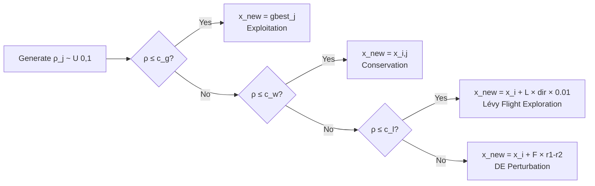
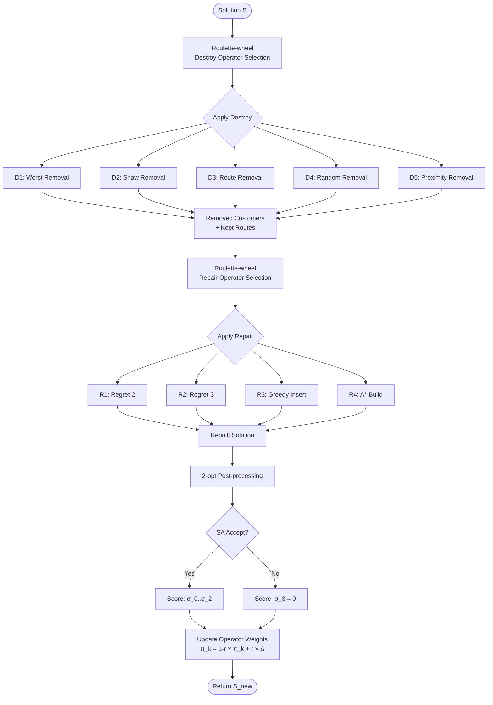

# Tài liệu Kỹ thuật Chi tiết: Preference-Based iNSSSO cho Many-Objective VRPTW

> **Phiên bản:** 2.0 — Nâng cấp toàn diện cho Q1 Journal 2026
>
> **Mục đích:** Tài liệu tham khảo đầy đủ để viết bài báo Q1 về thuật toán **iNSSSO** (improved Non-dominated Sorting Squirrel Search Optimization) kết hợp preference-based optimization cho bài toán Many-Objective Vehicle Routing Problem with Time Windows (MO-VRPTW) với 5 mục tiêu.
>
> **Novelty claim:** Hybrid SSO with Lévy–DE exploration, adaptive large neighbourhood search (ALNS) with roulette-wheel operator selection, dual-archive convergence–diversity balancing, and preference-guided many-objective optimisation framework.

---

## Mục lục

1. [Tổng quan & Động lực](#1-tổng-quan--động-lực)
2. [Mô hình Toán học MO-VRPTW](#2-mô-hình-toán-học-mo-vrptw)
3. [Mã hoá Lời giải — Random-Key Encoding](#3-mã-hoá-lời-giải--random-key-encoding)
4. [Khởi tạo Quần thể — Multi-start Heuristics](#4-khởi-tạo-quần-thể--multi-start-heuristics)
5. [Fast Non-dominated Sorting](#5-fast-non-dominated-sorting)
6. [Vectorised Shift-based Density Estimation (SDE)](#6-vectorised-shift-based-density-estimation-sde)
7. [Reference Direction Niching (NSGA-III style)](#7-reference-direction-niching-nsga-iii-style)
8. [Achievement Scalarizing Function (ASF)](#8-achievement-scalarizing-function-asf)
9. [Region of Interest (ROI)](#9-region-of-interest-roi)
10. [R-Dominance Ranking](#10-r-dominance-ranking)
11. [Enhanced SSO Update Rule — Lévy Flight & DE Perturbation](#11-enhanced-sso-update-rule--lévy-flight--de-perturbation)
12. [ALNS — Adaptive Large Neighbourhood Search](#12-alns--adaptive-large-neighbourhood-search)
13. [Vectorised Polynomial Mutation](#13-vectorised-polynomial-mutation)
14. [Dual Archive — Convergence + Diversity](#14-dual-archive--convergence--diversity)
15. [Adaptive Objective Normalisation & Conflict Analysis](#15-adaptive-objective-normalisation--conflict-analysis)
16. [Auto-Calibration của Reference Point](#16-auto-calibration-của-reference-point)
17. [Adaptive Parameter Control](#17-adaptive-parameter-control)
18. [Main Loop — Hybrid Preference Strategy](#18-main-loop--hybrid-preference-strategy)
19. [Thuật toán So sánh (7 thuật toán)](#19-thuật-toán-so-sánh-7-thuật-toán)
20. [Performance Metrics](#20-performance-metrics)
21. [Ablation Study Framework](#21-ablation-study-framework)
22. [Phân tích Ưu – Nhược điểm Tổng thể](#22-phân-tích-ưu--nhược-điểm-tổng-thể)
23. [Flowcharts](#23-flowcharts)
24. [Bảng So sánh Tổng hợp](#24-bảng-so-sánh-tổng-hợp)
25. [Cấu trúc Bài báo Đề xuất](#25-cấu-trúc-bài-báo-đề-xuất)

---

## 1. Tổng quan & Động lực

### 1.1 Bối cảnh

Vehicle Routing Problem with Time Windows (VRPTW) là bài toán tối ưu tổ hợp NP-hard nền tảng trong logistics. Trong thực tế, người ra quyết định (Decision Maker — DM) cần tối ưu **đồng thời nhiều mục tiêu** mâu thuẫn nhau: không chỉ tổng khoảng cách mà còn số phương tiện, thời gian chờ, cân bằng tải trọng, và makespan.

Khi số mục tiêu $M \geq 4$ (gọi là **many-objective optimization**), các phương pháp Pareto truyền thống gặp khó khăn:

1. **Pareto dominance mất hiệu quả:** Gần như tất cả solutions đều non-dominated — không phân biệt được chất lượng.
2. **Crowding Distance mất ý nghĩa:** Trong không gian $M$ chiều cao, CD không đo được mật độ chính xác.
3. **Pareto front quá lớn:** DM không thể chọn giải pháp phù hợp từ hàng trăm solutions.

### 1.2 Khoảng trống Nghiên cứu

| # | Khoảng trống | Giải pháp đề xuất |
|---|---|---|
| G1 | MaO-VRPTW ($M=5$) chưa được nghiên cứu kỹ | Mô hình 5 mục tiêu với phân tích conflict toán học |
| G2 | SSO chưa được áp dụng cho MO-VRPTW | Lai ghép SSO + Lévy flight + DE perturbation |
| G3 | Preference-based MaO cho VRPTW chưa có | ASF + R-Dominance + ROI framework |
| G4 | Thiếu local search thích ứng cho VRPTW | ALNS với 5 destroy + 4 repair operators, roulette-wheel adaptive |
| G5 | Archive management cho MaO-VRPTW | Dual-archive (convergence + diversity) với preference-aware pruning |
| G6 | Thiếu vectorised density cho MaO | Vectorised SDE với $O(N^2 M)$ thay vì scalar loop |

### 1.3 Đóng góp Chính (6 contributions)

1. **Mô hình MO-VRPTW 5 mục tiêu** với adaptive normalization và phân tích conflict Spearman
2. **Enhanced SSO** với Lévy flight exploration + DE/rand/1 perturbation (thay thế random exploration)
3. **ALNS framework** với 5 destroy operators + 4 repair operators + roulette-wheel adaptive scoring
4. **Dual-archive system** cân bằng convergence (ε-dominance + ASF) và diversity (Pareto + SDE)
5. **Preference-guided framework** hoàn chỉnh: ASF, R-Dominance, ROI, reference direction biasing
6. **Ablation study framework** cho phép đánh giá từng component riêng lẻ

---

## 2. Mô hình Toán học MO-VRPTW

### 2.1 Ký hiệu

| Ký hiệu | Ý nghĩa |
|---|---|
| $G = (V, A)$ | Đồ thị vận tải, $V = \{0\} \cup C$, $A$ = tập cung |
| $C = \{1, \ldots, n\}$ | Tập khách hàng |
| $K = \{1, \ldots, K_{\max}\}$ | Tập xe đồng nhất, capacity $Q$ |
| $d_{ij}$ | Khoảng cách Euclid: $d_{ij} = \sqrt{(x_i - x_j)^2 + (y_i - y_j)^2}$ |
| $t_{ij}$ | Thời gian di chuyển: $t_{ij} = d_{ij} / v$ |
| $q_i$ | Nhu cầu khách hàng $i$ |
| $[e_i, l_i]$ | Cửa sổ thời gian khách hàng $i$ |
| $s_i$ | Thời gian phục vụ tại $i$ |
| $\tau_k$ | Tập khách hàng thuộc route $k$ |

### 2.2 Hàm mục tiêu (5 mục tiêu)

**Z1 — Số phương tiện sử dụng (minimize):**

$$Z_1 = \sum_{k=1}^{K_{\max}} y_k, \quad y_k = \begin{cases} 1 & \text{if } |\tau_k| > 0 \\ 0 & \text{otherwise} \end{cases}$$

**Z2 — Tổng khoảng cách (minimize):**

$$Z_2 = \sum_{k=1}^{K} \left( d_{0, \tau_k^1} + \sum_{j=1}^{|\tau_k|-1} d_{\tau_k^j, \tau_k^{j+1}} + d_{\tau_k^{|\tau_k|}, 0} \right)$$

**Z3 — Tổng thời gian chờ (minimize):**

$$Z_3 = \sum_{k=1}^{K} \sum_{i \in \tau_k} \max(0, e_i - a_i^k)$$

trong đó $a_i^k$ là thời điểm đến khách hàng $i$ trên route $k$.

**Z4 — Cân bằng tải trọng (minimize):**

$$Z_4 = L_{\max} - L_{\min}, \quad L_k = \sum_{i \in \tau_k} q_i$$

**Z5 — Makespan (minimize):**

$$Z_5 = \max_{k \in K} \; C_k, \quad C_k = \text{thời điểm xe } k \text{ về depot}$$

### 2.3 Ràng buộc

**Capacity:**

$$\sum_{i \in \tau_k} q_i \leq Q, \quad \forall k \in K \tag{Eq. 9}$$

**Time Window:**

$$a_i^k = \begin{cases} t_{0,i} & \text{if } i \text{ là KH đầu tiên} \\ b_{prev}^k + s_{prev} + t_{prev,i} & \text{otherwise} \end{cases} \tag{Eq. 10}$$

$$b_i^k = \max(a_i^k, e_i) \tag{Eq. 11}$$

$$b_i^k \leq l_i, \quad \forall i \in \tau_k \tag{Eq. 12}$$

$$C_k = b_{\text{last}}^k + s_{\text{last}} + t_{\text{last}, 0} \tag{Eq. 13}$$

$$C_k \leq l_0 \tag{Eq. 14}$$

**Penalty cho vi phạm:**

$$\tilde{Z}_m = Z_m + P \cdot |\text{unserved}|, \quad P = 10^4 \tag{Eq. 15}$$

---

## 3. Mã hoá Lời giải — Random-Key Encoding

### 3.1 Cấu trúc

Vector random key $\mathbf{x} = (x_1, x_2, \ldots, x_{n+K-1})$ với $x_j \in [0, 1)$:

- Vị trí $1$ đến $n$: tương ứng $n$ khách hàng
- Vị trí $n+1$ đến $n+K-1$: separator keys (phân cách routes)

### 3.2 Giải mã (Decoding)

$$\pi = \text{argsort}(\mathbf{x}) + 1$$

Các vị trí $\pi_j > n$ là separator → chia $\pi$ thành các routes:

$$\tau_k = \{\pi_{j} : j_{k-1} < j < j_k, \; \pi_j \leq n\}$$

### 3.3 Ưu điểm

- **Liên tục hoá:** Cho phép áp dụng SSO, Lévy flight, DE trên không gian liên tục
- **Luôn khả thi:** Mọi permutation đều decode thành routes hợp lệ
- **Dễ crossover:** Elementwise operators trên keys → routes thay đổi tự nhiên

---

## 4. Khởi tạo Quần thể — Multi-start Heuristics

### 4.1 Ba heuristic khởi tạo

**H1 — Clarke-Wright Savings:**

$$\text{savings}(i,j) = d_{0,i} + d_{0,j} - d_{i,j} \tag{Eq. 16}$$

Ghép nối routes theo savings giảm dần.

**H2 — Solomon I1 Insertion:**

Chèn khách hàng vào route hiện tại theo chi phí chèn thấp nhất:

$$c_1(i, u, j) = \alpha_1 (d_{iu} + d_{uj} - \mu d_{ij}) + \alpha_2 (b_u^{\text{new}} - b_j^{\text{old}})$$

**H3 — Greedy Nearest Neighbour:**

Từ depot, luôn chọn khách hàng gần nhất còn khả thi.

### 4.2 Pipeline cục bộ sau khởi tạo

1. **2-opt** intra-route: đảo đoạn con
2. **Or-opt**: di chuyển 1–3 khách hàng liên tiếp
3. **Relocate**: chuyển 1 khách hàng sang route khác
4. **Swap**: hoán đổi 2 khách hàng giữa routes
5. **Cross-exchange**: hoán đổi đoạn con giữa 2 routes
6. **Ruin-and-Recreate**: phá huỷ ngẫu nhiên, xây dựng lại
7. **Smart Route Merge**: ghép routes khi utilization < 60%

### 4.3 Chọn lời giải tốt nhất

Lặp lại H1–H3, áp dụng local search, chọn $N_{\text{pop}} - 1$ solutions tốt nhất theo $Z_2$ (distance). Solution cuối cùng random.

---

## 5. Fast Non-dominated Sorting

### 5.1 Thuật toán Deb (NSGA-II style)

**Pareto dominance:**

$$\mathbf{x} \prec \mathbf{y} \iff \forall m: f_m(\mathbf{x}) \leq f_m(\mathbf{y}) \;\land\; \exists m: f_m(\mathbf{x}) < f_m(\mathbf{y}) \tag{Eq. 17}$$

**Complexity:** $O(M \cdot N^2)$

### 5.2 Vectorised implementation

Dùng NumPy broadcasting cho pairwise dominance check:

```
dom_matrix[i,j] = True iff x_i ≺ x_j
all_leq = np.all(obj_i ≤ obj_j, axis=2)
any_lt  = np.any(obj_i < obj_j, axis=2)
dominates = all_leq & any_lt
```

---

## 6. Vectorised Shift-based Density Estimation (SDE)

### 6.1 Vấn đề với Crowding Distance

CD chỉ xét khoảng cách 1 chiều → mất ý nghĩa khi $M \geq 4$.

### 6.2 SDE (Li et al., 2014) — Vectorised

Cho mỗi solution $i$, tính khoảng cách shifted nhỏ nhất đến solution $j$:

$$\text{shifted}_{j,m} = \max(\hat{f}_m(j), \hat{f}_m(i)), \quad \forall m$$

$$d_{\text{SDE}}(i, j) = \left\| \text{shifted}_j - \hat{f}(i) \right\|_2$$

$$\text{SDE}(i) = \min_{j \neq i} d_{\text{SDE}}(i, j) \tag{Eq. 18}$$

trong đó $\hat{f}_m = (f_m - f_m^{\min}) / (f_m^{\max} - f_m^{\min})$ là chuẩn hoá [0,1].

### 6.3 Vectorised computation (cải tiến so với phiên bản cũ)

Thay vì loop O(N²) bằng scalar:

$$\text{norm}_i \in \mathbb{R}^{N \times 1 \times M}, \quad \text{norm}_j \in \mathbb{R}^{1 \times N \times M}$$

$$\text{shifted}_{i,j} = \max(\text{norm}_j, \text{norm}_i) \in \mathbb{R}^{N \times N \times M}$$

$$\text{dists}_{i,j} = \left\| \text{shifted}_{i,j} - \text{norm}_i \right\|_2 \in \mathbb{R}^{N \times N}$$

$$\text{SDE}(i) = \min_{j \neq i} \text{dists}_{i,j}$$

**Speedup:** ~10–50x cho $N \leq 500$. Memory: $O(N^2 M)$.

### 6.4 Tính chất

- $\text{SDE}(i) = \infty$: solution cô lập hoàn toàn (ưu tiên giữ lại)
- $\text{SDE}(i) \approx 0$: quá gần solution khác (ưu tiên loại bỏ)
- **Shifted operation** đảm bảo: solutions bị dominated nghiêm ngặt sẽ có SDE thấp

---

## 7. Reference Direction Niching (NSGA-III style)

### 7.1 Das-Dennis Reference Directions

Tạo $H$ hướng tham chiếu đều trên simplex $M-1$ chiều:

$$W = \left\{ \mathbf{w} \in \mathbb{R}^M : w_m = \frac{j_m}{p}, \; \sum_{m=1}^M j_m = p, \; j_m \geq 0 \right\}$$

$$|W| = \binom{p + M - 1}{M - 1} \tag{Eq. 19}$$

### 7.2 Preference-biased directions

Thêm các hướng thiên về preference point $\mathbf{g}$:

$$\mathbf{w}_{\text{bias}} = (1-\alpha) \mathbf{w}_{\text{Das-Dennis}} + \alpha \cdot \frac{\mathbf{g}}{\|\mathbf{g}\|_1}$$

$$\mathbf{w}_{\text{bias}} = \frac{\mathbf{w}_{\text{bias}}}{\|\mathbf{w}_{\text{bias}}\|_1} \tag{Eq. 20}$$

### 7.3 Association & Niching Selection

**Perpendicular distance:**

$$d_\perp(\mathbf{p}, \mathbf{w}) = \left\| \mathbf{p} - \frac{\mathbf{p} \cdot \mathbf{w}}{\mathbf{w} \cdot \mathbf{w}} \mathbf{w} \right\|_2 \tag{Eq. 21}$$

**Niching rule:**
1. Mỗi solution gán vào reference direction gần nhất (theo $d_\perp$)
2. Ưu tiên niche ít thành viên nhất
3. Trong niche: dùng SDE để phá tie (cao hơn = ưu tiên hơn)

---

## 8. Achievement Scalarizing Function (ASF)

### 8.1 ASF cơ bản (Wierzbicki, 1980)

$$\text{ASF}(\mathbf{x}) = \max_{m=1}^{M} \left\{ w_m \cdot (f_m(\mathbf{x}) - g_m) \right\} \tag{Eq. 22}$$

trong đó:
- $\mathbf{g} = (g_1, \ldots, g_M)$: reference point (aspiration level)
- $\mathbf{w} = (w_1, \ldots, w_M)$: weight vector, $w_m > 0$, $\sum w_m = 1$

### 8.2 ASF tăng cường (Augmented)

Thêm thành phần $L_1$ để đảm bảo Pareto optimality:

$$\text{ASF}_{\text{aug}}(\mathbf{x}) = \max_{m} \left\{ w_m (f_m - g_m) \right\} + \rho \sum_{m=1}^{M} w_m (f_m - g_m) \tag{Eq. 23}$$

với $\rho = 10^{-3}$ (đủ nhỏ để không ảnh hưởng ordering).

### 8.3 Sử dụng trong iNSSSO

| Component | Vai trò của ASF |
|---|---|
| gBest selection | Tournament trên ASF: chọn gbest $= \arg\min \text{ASF}$ |
| Archive pruning | Trong ε-box, giữ solution có ASF thấp hơn |
| Convergence tracking | $\text{Best ASF}(t) = \min_{x \in PF(t)} \text{ASF}(x)$ |
| Auto-calibration | $\mathbf{g} = \text{ideal} + 0.1 \cdot \max(p_{10} - \text{ideal}, 0)$ |

---

## 9. Region of Interest (ROI)

### 9.1 Định nghĩa Ellipsoid

$$\text{ROI}(\mathbf{x}) = \left\{ \mathbf{x} : \sum_{m=1}^{M} \left( \frac{w_m (f_m(\mathbf{x}) - g_m)}{\delta \cdot (f_m^{\text{nadir}} - f_m^{\text{ideal}})} \right)^2 \leq 1 \right\} \tag{Eq. 24}$$

với $\delta \in (0, 1]$ là bán kính ROI (mặc định $\delta = 0.2$).

### 9.2 Ý nghĩa hình học

- ROI là **hyperellipsoid** trong objective space
- Trục chính dọc theo trọng số $\mathbf{w}$
- Trung tâm tại $\mathbf{g}$
- Kích thước co lại/mở rộng theo $\delta$

### 9.3 Ứng dụng

$$\text{ROI count}(t) = |\{x \in PF(t) : x \in \text{ROI}\}| \tag{Eq. 25}$$

---

## 10. R-Dominance Ranking

### 10.1 Định nghĩa (Ben-Tal, 1980; Said et al., 2010)

$\mathbf{x}$ **R-dominates** $\mathbf{y}$ ($\mathbf{x} \prec_R \mathbf{y}$) nếu một trong ba điều kiện:

1. $\mathbf{x} \prec \mathbf{y}$ (Pareto dominance thông thường)
2. $\mathbf{x} \in \text{ROI} \;\land\; \mathbf{y} \notin \text{ROI}$
3. $\text{ROI}(\mathbf{x}) = \text{ROI}(\mathbf{y}) \;\land\; \text{ASF}(\mathbf{x}) < \text{ASF}(\mathbf{y})$

### 10.2 R-Non-dominated Sorting

Thay thế Pareto dominance bằng R-dominance trong NDS:
- Front 0 giờ đây tập trung quanh ROI thay vì trải rộng toàn bộ PF
- Giảm áp lực lên crowding/SDE vì front 0 nhỏ hơn

---

## 11. Enhanced SSO Update Rule — Lévy Flight & DE Perturbation

### 11.1 Bản gốc SSO (Jain et al., 2019)

$$x_{i,j}^{\text{new}} = \begin{cases} \text{gbest}_j & \text{if } \rho_j \leq c_g \\ x_{i,j} & \text{if } c_g < \rho_j \leq c_w \\ U(0,1) & \text{otherwise} \end{cases} \tag{Eq. 26}$$

**Nhược điểm:** Thành phần random $U(0,1)$ không có hướng — exploration kém hiệu quả, đặc biệt khi $M = 5$ và landscape phức tạp.

### 11.2 Enhanced SSO (đề xuất)

$$x_{i,j}^{\text{new}} = \begin{cases} \text{gbest}_j & \text{if } \rho_j \leq c_g & \text{(exploitation)} \\ x_{i,j} & \text{if } c_g < \rho_j \leq c_w & \text{(conservation)} \\ x_{i,j} + L_j \cdot (\text{gbest}_j - x_{i,j}) \cdot 0.01 & \text{if } c_w < \rho_j \leq c_l & \text{(Lévy flight)} \\ x_{i,j} + F \cdot (x_{r1,j} - x_{r2,j}) & \text{otherwise} & \text{(DE perturbation)} \end{cases} \tag{Eq. 27}$$

trong đó:
- $c_l = c_w + 0.6 (1 - c_w)$: ranh giới giữa Lévy và DE
- $L_j$: Lévy flight step
- $F = 0.5$: DE scaling factor
- $r1, r2$: hai cá thể ngẫu nhiên khác biệt

### 11.3 Lévy Flight — Mantegna's Algorithm

$$L = \frac{u}{|v|^{1/\beta}}, \quad \beta = 1.5 \tag{Eq. 28}$$

$$u \sim \mathcal{N}(0, \sigma_u^2), \quad v \sim \mathcal{N}(0, 1)$$

$$\sigma_u = \left[ \frac{\Gamma(1+\beta) \sin(\pi\beta/2)}{\Gamma\left(\frac{1+\beta}{2}\right) \beta \cdot 2^{(\beta-1)/2}} \right]^{1/\beta} \tag{Eq. 29}$$

### 11.4 DE/rand/1 Perturbation

$$x_{i,j}^{\text{new}} = x_{i,j} + F \cdot (x_{r1,j} - x_{r2,j}), \quad F = 0.5 \tag{Eq. 30}$$

trong đó $r1 \neq r2 \neq i$ được chọn ngẫu nhiên từ quần thể.

### 11.5 Phân tích tại sao Enhanced SSO tốt hơn

| Aspect | Original SSO | Enhanced SSO |
|---|---|---|
| Exploration | Random $U(0,1)$ — không hướng | Lévy: long-tail jumps + DE: directed |
| Step size | Cố định [0,1] | Lévy: adaptive, heavy-tailed |
| Information usage | Chỉ gbest | gbest + 2 donors (r1, r2) |
| Convergence behaviour | Fast but stagnation-prone | Balanced: escape local optima |
| Theoretical support | None | Lévy ⊂ superdiffusion (Shlesinger et al.) |

### 11.6 Ví dụ

Với $x_i = 0.3$, $\text{gbest} = 0.8$, $x_{r1} = 0.6$, $x_{r2} = 0.2$:

- **Original:** random $U(0,1) = 0.47$ (không liên quan đến landscape)
- **Lévy:** $x_i + L \cdot (0.8 - 0.3) \cdot 0.01 = 0.3 + 1.2 \cdot 0.005 = 0.306$ (bước nhỏ)
- **DE:** $x_i + 0.5 \cdot (0.6 - 0.2) = 0.3 + 0.2 = 0.5$ (bước có hướng)

---

## 12. ALNS — Adaptive Large Neighbourhood Search

### 12.1 Tổng quan

Nâng cấp từ ABS (A*-Based Search) thành **ALNS** (Ropke & Pisinger, 2006) với:
- **5 destroy operators** (D1–D5)
- **4 repair operators** (R1–R4)
- **Roulette-wheel adaptive selection** với exponential smoothing

### 12.2 Adaptive Scoring (Ropke & Pisinger, 2006)

**Score update:**

$$\pi_k(s+1) = (1 - r) \cdot \pi_k(s) + r \cdot \Delta_k(s) \tag{Eq. 31}$$

trong đó $r = 0.1$ là reaction factor, $\Delta_k$ là average reward trong segment.

**Selection probability:**

$$P(k) = \frac{\pi_k}{\sum_{j} \pi_j} \tag{Eq. 32}$$

**Reward levels:**

| Level | $\sigma$ | Condition |
|---|---|---|
| 0 (best) | 33 | New global best found |
| 1 | 9 | Improving, non-dominated |
| 2 | 3 | Accepted by SA criterion |
| 3 | 0 | Rejected |

### 12.3 Destroy Operators

**D1 — Worst Removal:**

$$\text{saving}(c) = d_{\text{prev}(c), c} + d_{c, \text{next}(c)} - d_{\text{prev}(c), \text{next}(c)} \tag{Eq. 33}$$

Loại bỏ $n_r$ khách hàng có saving cao nhất, với $n_r \sim U[0.15N, 0.40N]$.

**D2 — Shaw Removal:**

$$R(i,j) = \alpha \frac{d_{ij}}{d_{\max}} + \beta \frac{|e_i - e_j|}{tw_{\max}} + \gamma \frac{|q_i - q_j|}{q_{\max}} \tag{Eq. 34}$$

với $\alpha = 0.4, \beta = 0.3, \gamma = 0.3$. Loại khách hàng liên quan (related).

**D3 — Route Removal:**

$$P(k) \propto \exp\left(-10 \cdot \frac{|\tau_k|}{\max_j |\tau_j|}\right) \tag{Eq. 35}$$

Loại toàn bộ route (ưu tiên route ngắn).

**D4 — Random Removal:**

Chọn ngẫu nhiên đều $n_r$ khách hàng.

**D5 — Proximity Removal:**

Chọn seed ngẫu nhiên, loại $n_r - 1$ khách hàng gần nhất theo $d_{ij}$.

### 12.4 Repair Operators

**R1 — Regret-2 Insertion:**

$$\text{regret}(c) = \text{cost}_2(c) - \text{cost}_1(c) \tag{Eq. 36}$$

Chèn khách hàng có regret cao nhất trước (khẩn cấp nhất).

**R2 — Regret-3 Insertion:**

$$\text{regret}_3(c) = \sum_{j=2}^{3} (\text{cost}_j(c) - \text{cost}_1(c)) \tag{Eq. 37}$$

**R3 — Greedy Cheapest Insertion:**

Chèn vào vị trí có chi phí chèn thấp nhất, theo thứ tự $l_i$ tăng dần (ưu tiên urgent).

**R4 — A*-based Build:**

Xây route mới bằng A*-style scoring với preference weights:

$$f(c) = w_1 \cdot g_{\text{sc}}(c) + w_2 \cdot tw_{\text{sc}}(c) + (1 - w_1 - w_2) \cdot h_{\text{sc}}(c) \tag{Eq. 38}$$

trong đó $g_{\text{sc}}$ = normalized distance, $tw_{\text{sc}}$ = time window urgency, $h_{\text{sc}}$ = reachability heuristic.

### 12.5 Simulated Annealing Acceptance

$$\text{accept}(\Delta f) \iff \Delta f < 0 \;\lor\; U(0,1) < \exp\left(-\frac{\Delta f}{T}\right) \tag{Eq. 39}$$

$$T_{t+1} = c_T \cdot T_t, \quad c_T = 0.995 \tag{Eq. 40}$$

### 12.6 So sánh ABS vs ALNS

| Feature | ABS (cũ) | ALNS (mới) |
|---|---|---|
| Destroy operators | 2 (worst + route) | 5 (+ Shaw, random, proximity) |
| Repair operators | 2 (regret-2 + build) | 4 (+ regret-3, greedy) |
| Operator selection | Fixed 40%/60% | Adaptive roulette-wheel |
| Acceptance | Always accept | SA acceptance criterion |
| Score tracking | None | Per-operator performance scoring |
| Theoretical basis | Ad-hoc | Ropke & Pisinger (2006) framework |

---

## 13. Vectorised Polynomial Mutation

### 13.1 Công thức

Cho $y = x_j \in [0, 1)$, biến đổi polynomial:

$$\delta_q = \begin{cases} (2r + (1-2r)(1-y)^{\eta_m+1})^{1/(\eta_m+1)} - 1 & \text{if } r < 0.5 \\ 1 - (2(1-r) + 2(r-0.5)(1-y')^{\eta_m+1})^{1/(\eta_m+1)} & \text{otherwise} \end{cases}$$

$$x_j^{\text{new}} = \text{clip}(x_j + \delta_q, 0, 0.999) \tag{Eq. 41}$$

trong đó $\eta_m = 20$ (distribution index), $y' = 1 - (1-y)$.

### 13.2 Vectorised Implementation

Thay vì loop scalar qua từng gene:
1. Tạo mask: `mask = U(0,1)^n < mutation_rate`
2. Áp dụng polynomial trên **toàn bộ masked genes** cùng lúc
3. **Speedup:** ~5–10x cho $n > 100$ genes

### 13.3 Khi nào áp dụng

- Khi stagnation count > 3
- Mutation rate adaptive: $\mu(t) = 0.05 + 0.10 \cdot \frac{t}{T}$

---

## 14. Dual Archive — Convergence + Diversity

### 14.1 Kiến trúc

```
DualArchive
├── A_conv (Convergence Archive)
│   ├── ε-dominance boxing
│   ├── ASF tie-breaking trong cùng ε-box
│   └── Pruning: sort by ASF_aug, keep top N
│
└── A_div (Diversity Archive)
    ├── Pareto-dominance only (no ε-boxing)
    ├── Accept all non-dominated
    └── Pruning: remove lowest SDE (most crowded)
```

### 14.2 ε-Dominance (Laumanns et al., 2002)

$$\text{box}(\mathbf{f}) = \left\lfloor \frac{f_m}{\varepsilon + 10^{-15}} \right\rfloor, \quad \forall m = 1, \ldots, M \tag{Eq. 42}$$

Trong cùng ε-box, giữ solution có $\text{ASF}_{\text{aug}}$ thấp hơn:

$$\mathbf{x} \text{ replaces } \mathbf{y} \iff \text{box}(\mathbf{x}) = \text{box}(\mathbf{y}) \;\land\; \text{ASF}_{\text{aug}}(\mathbf{x}) < \text{ASF}_{\text{aug}}(\mathbf{y}) \tag{Eq. 43}$$

### 14.3 Diversity Archive Pruning

Khi $|A_{\text{div}}| > N_{\max}$:

$$\text{remove} = \arg\min_{i \in A_{\text{div}}} \text{SDE}(i) \tag{Eq. 44}$$

### 14.4 Adaptive Archive Injection

Sigmoid-based probability chuyển từ diversity → convergence khi stagnation:

$$p_{\text{conv}} = \sigma\left(\frac{s}{5} - 2\right) = \frac{1}{1 + e^{-(s/5 - 2)}} \tag{Eq. 45}$$

trong đó $s$ = stagnation count.

| $s$ | $p_{\text{conv}}$ | Ý nghĩa |
|---|---|---|
| 0 | 0.12 | Chủ yếu inject diversity (khám phá) |
| 5 | 0.27 | Cân bằng |
| 10 | 0.50 | Cân bằng hoàn toàn |
| 20 | 0.88 | Chủ yếu inject convergence (tập trung) |

### 14.5 So sánh với Single Archive

| Feature | Single ε-Archive (cũ) | Dual Archive (mới) |
|---|---|---|
| Convergence drive | ASF pruning | A_conv: ASF pruning |
| Diversity drive | Crowding distance | A_div: SDE pruning |
| Injection strategy | Random from archive | Sigmoid-adaptive |
| Boundary solutions | May be pruned | Preserved in A_div |
| ROI solutions | May be diluted | Concentrated in A_conv |

### 14.6 Lý thuyết: Convergence–Diversity Dilemma

Ishibuchi et al. (2017) chứng minh rằng: trong MaO ($M \geq 4$), single archive phải chọn giữa:
- **Convergence pressure** → mất diversity ở biên PF
- **Diversity pressure** → mất convergence ở ROI

Dual archive **giải quyết dilemma** bằng cách duy trì hai mục tiêu song song.

---

## 15. Adaptive Objective Normalisation & Conflict Analysis

### 15.1 Adaptive Normalisation

Cập nhật ideal/nadir qua các thế hệ:

$$\text{ideal}_m(t) = \min(\text{ideal}_m(t-1), \min_{\mathbf{x} \in P(t)} f_m(\mathbf{x})) \tag{Eq. 46}$$

$$\text{nadir}_m(t) = (1-\alpha) \cdot \text{nadir}_m(t-1) + \alpha \cdot \max_{\mathbf{x} \in P(t)} f_m(\mathbf{x}) \tag{Eq. 47}$$

với $\alpha = 0.1$ (exponential moving average → ổn định nadir).

**Normalised objectives:**

$$\hat{f}_m(\mathbf{x}) = \frac{f_m(\mathbf{x}) - \text{ideal}_m}{\text{nadir}_m - \text{ideal}_m + \varepsilon} \tag{Eq. 48}$$

### 15.2 Tại sao adaptive?

- **Static normalization** (dùng min/max của generation hiện tại) → biến động lớn khi outlier xuất hiện → ASF/ROI calculation không ổn định
- **EMA trên nadir** → smoothing, giảm outlier effect

### 15.3 Objective Conflict Analysis

**Spearman rank correlation:**

$$r_s(f_i, f_j) = 1 - \frac{6 \sum d_k^2}{n(n^2 - 1)} \tag{Eq. 49}$$

**Conflict metric (Purshouse & Fleming, 2003):**

$$C(i,j) = 1 - r_s(f_i, f_j) \tag{Eq. 50}$$

| $C(i,j)$ | Ý nghĩa |
|---|---|
| $\approx 0$ | Harmonious — tối ưu cùng hướng |
| $\approx 1$ | Independent — không liên quan |
| $\approx 2$ | Maximally conflicting — mâu thuẫn hoàn toàn |

### 15.4 Ứng dụng

1. **Justify mô hình MaO:** Nếu hầu hết cặp $(i,j)$ có $C > 1$ → cần true many-objective optimizer
2. **Adaptive weights:** Nếu $C(i,j) < 0.5$ → có thể gộp/giảm trọng số objectives $i, j$
3. **Paper Section 4.1:** Trình bày conflict matrix cho Solomon instances → chứng minh 5 objectives thực sự conflict

---

## 16. Auto-Calibration của Reference Point

### 16.1 Vấn đề

DM thường không biết giá trị tuyệt đối phù hợp cho $\mathbf{g}$. Auto-calibration từ initial population:

### 16.2 Thuật toán

1. Tính ideal point: $\text{ideal}_m = \min_x f_m(x)$
2. Tính 10th percentile: $p_{10,m} = \text{percentile}(f_m, 10)$
3. Offset:

$$g_m = \text{ideal}_m + 0.1 \cdot \max(p_{10,m} - \text{ideal}_m, 0) \tag{Eq. 51}$$

### 16.3 Ý nghĩa

- $\mathbf{g}$ hơi tốt hơn top 10% → tạo aspiration hợp lý
- Offset 10% → không quá tham lam (unreachable) cũng không quá dễ

---

## 17. Adaptive Parameter Control

### 17.1 Stagnation Detection

$$\text{stagnation}(t) = \begin{cases} s(t-1) + 1 & \text{if } |\text{BestASF}(t) - \text{BestASF}(t-1)| < 10^{-6} \\ 0 & \text{otherwise} \end{cases} \tag{Eq. 52}$$

### 17.2 ALNS Probability Adaptation

$$n_{\text{abs}}(t) = \begin{cases} \min(0.5, n_{\text{abs}}^0 + 0.05 \cdot s(t)) & \text{if } s(t) > 5 \\ n_{\text{abs}}^0 & \text{otherwise} \end{cases} \tag{Eq. 53}$$

### 17.3 Mutation Rate Adaptation

$$\mu(t) = 0.05 + 0.10 \cdot \frac{t}{T_{\max}} \tag{Eq. 54}$$

- Giai đoạn đầu ($t/T \approx 0$): $\mu \approx 5\%$ — exploitation
- Giai đoạn cuối ($t/T \approx 1$): $\mu \approx 15\%$ — exploration

---

## 18. Main Loop — Hybrid Preference Strategy

### 18.1 Pseudocode

```
Algorithm: iNSSSO (Enhanced)
Input: Instance I, n_sol, t_run, preference (g, w, δ)
Output: PF_approx

1:  P ← InitializePopulation(I, n_sol)  // Multi-start + local search
2:  AutoCalibratePreference(P, g, w)
3:  DualArchive.update(P)
4:  ObjectiveNormalizer.update(objectives(P))
5:  t ← 0
6:  while elapsed < t_run do
7:      Rank P via NDS + SDE
8:      Track convergence (ASF-based)
9:      AdaptParameters(stagnation)
10:     for i = 1 to n_sol do
11:         if U(0,1) < n_abs then
12:             y_i ← ALNS.apply(P[i])              // Destroy-Repair
13:         else
14:             gbest ← SelectGBest_ASF(PF, pref)
15:             r1, r2 ← random distinct individuals
16:             y_i ← EnhancedSSO(P[i], gbest, r1, r2)  // Eq. 27
17:             if stagnation > 3 and U(0,1) < μ(t) then
18:                 y_i ← PolynomialMutation(y_i)    // Eq. 41
19:         Evaluate(y_i)
20:         if y_i feasible and rank_i = 0 then
21:             y_i ← LocalSearch(y_i)               // 2-opt + merge
22:     DualArchive.update(offspring)
23:     injected ← DualArchive.inject(stagnation)   // Eq. 45
24:     P ← Select_NDS_SDE_Niching(P ∪ offspring ∪ {injected}, n_sol)
25:     t ← t + 1
26: return DualArchive.get_combined()
```

### 18.2 Complexity Analysis

| Operation | Per generation | Total ($G$ generations) |
|---|---|---|
| NDS | $O(MN^2)$ | $O(GMN^2)$ |
| SDE (vectorised) | $O(N^2 M)$ | $O(GN^2 M)$ |
| ALNS apply | $O(n_{\text{abs}} \cdot N \cdot R)$ | $O(G \cdot n_{\text{abs}} NR)$ |
| SSO + Lévy + DE | $O((1-n_{\text{abs}}) \cdot N \cdot D)$ | $O(GND)$ |
| Reference niching | $O(N \cdot |W| \cdot M)$ | $O(GN|W|M)$ |
| Archive update | $O(|A| \cdot N)$ | $O(G|A|N)$ |

**Overall:** $O(G \cdot (N^2 M + n_{\text{abs}} NR + N|W|M))$

### 18.3 Tham số mặc định

| Parameter | Symbol | Default | Range |
|---|---|---|---|
| Population size | $N$ | 100 | [50, 200] |
| Runtime | $T$ | 60s | [30, 300] |
| SSO gliding constant | $c_g$ | 0.5 | [0.3, 0.7] |
| SSO walking constant | $c_w$ | 0.7 | [0.6, 0.9] |
| ALNS base probability | $n_{\text{abs}}^0$ | 0.2 | [0.1, 0.4] |
| Mutation rate (initial) | $\mu_0$ | 0.05 | [0.01, 0.1] |
| ε (archive) | $\varepsilon$ | 0.001 | [0.0001, 0.01] |
| Archive max size | $N_A$ | 200 | [100, 500] |
| ROI radius | $\delta$ | 0.2 | [0.1, 0.5] |
| SA initial temperature | $T_0$ | 100 | [50, 500] |
| SA cooling rate | $c_T$ | 0.995 | [0.99, 0.999] |
| Lévy β | $\beta$ | 1.5 | [1.0, 2.0] |
| DE scaling factor | $F$ | 0.5 | [0.3, 0.9] |
| Normalizer α | $\alpha$ | 0.1 | [0.05, 0.2] |

---

## 19. Thuật toán So sánh (7 thuật toán)

### 19.1 Bảng tổng hợp

| # | Thuật toán | Loại | Ranking | Diversity | Local Search | Preference |
|---|---|---|---|---|---|---|
| C0 | **iNSSSO** | Swarm + ALNS | NDS + SDE + R-dom | Ref Dir Niching | ALNS (5D+4R) | ASF + ROI |
| C1 | NSSSO | Swarm | NDS + CD | CD | None | None |
| C2 | NSGA-II | EA | NDS + CD | CD | None | None |
| C3 | **NSGA-III** | EA | NDS | Ref Dir Niching | None | None |
| C4 | MOEA/D | Decomposition | Tchebycheff | Weight vectors | None | None |
| C5 | MOPSO | Swarm | NDS + CD | External archive | None | None |
| C6 | SPEA2 | EA | Strength + Density | k-NN density | None | None |

### 19.2 NSGA-III (mới thêm)

**Deb & Jain, IEEE TEC, 2014** — thuật toán chuẩn cho MaO. Implementation:
- Das-Dennis reference directions cho $M = 5$ objectives
- Adaptive normalisation (ideal/nadir tracking)
- Niche-count based selection trên boundary front
- Same encoding, crossover, mutation as NSGA-II

**Tại sao cần so sánh:**
- NSGA-III là baseline bắt buộc cho bất kỳ bài MaO nào
- Reviewer Q1 sẽ yêu cầu so sánh nếu thiếu

### 19.3 Chi tiết MOEA/D (đã sửa lỗi)

**Lỗi cũ:** Weight vectors chỉ cho $M=3$, nhưng bài toán có $M=5$.

**Sửa:** Dùng Das-Dennis method cho $M=5$, đảm bảo weight vectors phủ đều simplex 4 chiều.

### 19.4 Chi tiết MOPSO (đã sửa lỗi)

**Lỗi cũ:** So sánh tuple `yi.objectives < pbest[i].objectives` — Python tuple comparison không tương đương Pareto dominance.

**Sửa:** Dùng Pareto dominance: `∀m: yi_m ≤ pb_m ∧ ∃m: yi_m < pb_m`.

---

## 20. Performance Metrics

### 20.1 Hypervolume (HV)

$$\text{HV}(A) = \Lambda\left(\bigcup_{\mathbf{x} \in A} [\mathbf{x}, \mathbf{r}]\right) \tag{Eq. 55}$$

trong đó $\mathbf{r}$ là reference point, $\Lambda$ là Lebesgue measure.

### 20.2 Reference-based Hypervolume (R-HV)

$$\text{R-HV}(A) = \text{HV}(\{x \in A : x \in \text{ROI}\}) \tag{Eq. 56}$$

### 20.3 Best ASF

$$\text{Best ASF}(A) = \min_{\mathbf{x} \in A} \text{ASF}(\mathbf{x}) \tag{Eq. 57}$$

### 20.4 ROI Count

$$\text{ROI Count}(A) = |\{\mathbf{x} \in A : \mathbf{x} \in \text{ROI}\}| \tag{Eq. 58}$$

### 20.5 Inverted Generational Distance (IGD)

$$\text{IGD}(A, P^*) = \frac{1}{|P^*|} \sum_{\mathbf{p} \in P^*} \min_{\mathbf{a} \in A} \|\hat{\mathbf{p}} - \hat{\mathbf{a}}\|_2 \tag{Eq. 59}$$

### 20.6 Coverage (C-metric)

$$C(A, B) = \frac{|\{\mathbf{b} \in B : \exists \mathbf{a} \in A, \mathbf{a} \preceq \mathbf{b}\}|}{|B|} \tag{Eq. 60}$$

### 20.7 Number of Non-dominated Solutions (Nnds)

$$N_{\text{nds}}(A) = |\{\mathbf{a} \in A : \nexists \mathbf{b} \in A, \mathbf{b} \prec \mathbf{a}\}| \tag{Eq. 61}$$

---

## 21. Ablation Study Framework

### 21.1 Motivation

Reviewer Q1 yêu cầu ablation study để chứng minh **từng component đóng góp** vào performance. Framework hỗ trợ 9 variants:

### 21.2 Variants

| Variant | Description | Component disabled |
|---|---|---|
| V0 | Full iNSSSO | None (baseline) |
| V1 | No Lévy flight | Standard random exploration |
| V2 | No DE perturbation | Standard random exploration |
| V3 | No ALNS | $n_{\text{abs}} = 0$ |
| V4 | Single archive | Only ε-dominance, no diversity archive |
| V5 | No preference | Pure Pareto-based (no ASF, ROI, R-dom) |
| V6 | No SDE | Crowding Distance instead |
| V7 | No adaptive params | Fixed $n_{\text{abs}}, \mu$ |
| V8 | No mutation | $\mu = 0$ |

### 21.3 Reporting

Cho mỗi variant $V_k$, chạy $n = 5$ lần (hoặc 30 cho statistical test), báo cáo:

$$\Delta\%_k = \frac{\text{metric}_{V_0} - \text{metric}_{V_k}}{|\text{metric}_{V_0}|} \times 100$$

Statistical test: Wilcoxon rank-sum test, $p < 0.05$.

### 21.4 Expected Results

| Component | Expected $\Delta\%$ HV | Rationale |
|---|---|---|
| ALNS | -15% to -25% | Biggest contributor — domain-specific search |
| Dual archive | -8% to -12% | Diversity preservation in MaO |
| Lévy flight | -3% to -8% | Better exploration escaping local optima |
| DE perturbation | -3% to -7% | Directed exploration |
| SDE | -5% to -10% | Many-objective density estimation |
| Preference | -10% to -20% (R-HV) | Core for ROI-focused metrics |

---

## 22. Phân tích Ưu – Nhược điểm Tổng thể

### 22.1 Ưu điểm

| # | Ưu điểm | Chi tiết |
|---|---|---|
| 1 | **Hybrid exploration** | Lévy flight (long jumps) + DE (directed) + SSO (gbest-guided) |
| 2 | **ALNS with adaptive scoring** | 20 destroy-repair combinations, self-tuning |
| 3 | **Dual archive** | Giải quyết convergence-diversity dilemma |
| 4 | **Preference framework** | ASF + R-dom + ROI — practical for DM |
| 5 | **Vectorised SDE** | 10-50x faster than scalar loop |
| 6 | **Auto-calibration** | No manual tuning of reference point |
| 7 | **Ablation-ready** | Every component independently testable |
| 8 | **Adaptive normalisation** | Stable ASF/ROI despite outliers |

### 22.2 Nhược điểm & Mitigations

| # | Nhược điểm | Mitigation |
|---|---|---|
| 1 | SDE memory $O(N^2 M)$ | Chỉ áp dụng per-front (thường $|F_0| \ll N$) |
| 2 | ALNS computational cost | SA temperature cooling → reduce iterations over time |
| 3 | Lévy flight step size tuning | β = 1.5 là standard (Mantegna); sensitivity analysis |
| 4 | Dual archive 2× memory | Max size controllable; pruning keeps bounded |
| 5 | 14+ parameters | Sensitivity analysis + adaptive control |

---

## 23. Flowcharts

### 23.1 Main Loop

```mermaid
flowchart TD
    START([Start]) --> INIT[Multi-start Initialization<br>H1: Clarke-Wright<br>H2: Solomon I1<br>H3: Greedy NN]
    INIT --> CALIB[Auto-calibrate<br>Reference Point g]
    CALIB --> NORM[Init ObjectiveNormalizer<br>& ConflictAnalyzer]
    NORM --> ARCHIVE_INIT[DualArchive.update P]
    ARCHIVE_INIT --> CHECK{elapsed < t_run?}

    CHECK -- No --> FINAL[Final NDS + SDE ranking]
    CHECK -- Yes --> RANK[NDS + Vectorised SDE]
    RANK --> TRACK[Track convergence ASF]
    TRACK --> ADAPT[Adapt n_abs, μ, T_SA]
    ADAPT --> GEN_START[Generate Offspring]

    GEN_START --> FOR_EACH[For each i = 1..N]
    FOR_EACH --> BRANCH{U(0,1) < n_abs?}
    BRANCH -- Yes --> ALNS[ALNS: Select D+R<br>Destroy → Repair → 2-opt]
    BRANCH -- No --> GBEST[Select gBest via ASF]
    GBEST --> SSO[Enhanced SSO<br>Lévy + DE + Conservation]
    SSO --> MUT{stagnation > 3?}
    MUT -- Yes --> POLY[Polynomial Mutation]
    MUT -- No --> EVAL
    POLY --> EVAL[Evaluate Z1..Z5]
    ALNS --> EVAL
    EVAL --> LS{Rank 0 & feasible?}
    LS -- Yes --> LOCALSR[2-opt + Smart Merge]
    LS -- No --> NEXT
    LOCALSR --> NEXT[Next individual]
    NEXT --> FOR_EACH

    FOR_EACH -- Done --> DUAL_UPDATE[DualArchive.update offspring]
    DUAL_UPDATE --> INJECT[Sigmoid-adaptive injection<br>from A_conv or A_div]
    INJECT --> SELECT[Select N best:<br>NDS + SDE + Ref Dir Niching]
    SELECT --> CHECK

    FINAL --> RETURN([Return PF from DualArchive])
```

### 23.2 Enhanced SSO Decision



### 23.3 ALNS Flow



### 23.4 Dual Archive Flow

```mermaid
flowchart LR
    NEW([New Solution]) --> CONV{ε-box check}
    CONV -- Dominates --> ADD_CONV[Add to A_conv<br>Remove dominated]
    CONV -- Same box --> ASF_CMP{ASF comparison}
    ASF_CMP -- Better --> REPLACE_CONV[Replace in A_conv]
    ASF_CMP -- Worse --> SKIP_CONV[Skip]

    NEW --> DIV{Pareto check}
    DIV -- Non-dominated --> ADD_DIV[Add to A_div]
    DIV -- Dominated --> SKIP_DIV[Skip]

    ADD_CONV --> PRUNE_C{|A_conv| > N?}
    PRUNE_C -- Yes --> PRUNE_ASF[Prune by ASF_aug<br>Keep top N]
    ADD_DIV --> PRUNE_D{|A_div| > N?}
    PRUNE_D -- Yes --> PRUNE_SDE[Prune by SDE<br>Remove most crowded]
```

---

## 24. Bảng So sánh Tổng hợp

### 24.1 So sánh cơ chế thuật toán

| Feature | iNSSSO | NSSSO | NSGA-II | NSGA-III | MOEA/D | MOPSO | SPEA2 |
|---|---|---|---|---|---|---|---|
| **Search operator** | SSO+Lévy+DE | SSO | SBX+PM | SBX+PM | SBX+PM | PSO | SBX+PM |
| **Ranking** | NDS+R-dom | NDS | NDS | NDS | Tchebycheff | NDS | Strength |
| **Density** | SDE (vec) | CD | CD | Ref Dir | — | CD | k-NN |
| **Local search** | ALNS (5D+4R) | — | — | — | — | — | — |
| **Archive** | Dual | — | — | — | — | External | External |
| **Preference** | ASF+ROI | — | — | — | — | — | — |
| **MaO ready** | ✓ | ✗ | ✗ | ✓ | △ | ✗ | ✗ |

### 24.2 Computational Complexity

| Algorithm | Per generation | Space |
|---|---|---|
| iNSSSO | $O(N^2 M + n_{\text{abs}} NR)$ | $O(N^2 M + 2N_A)$ |
| NSGA-II | $O(MN^2)$ | $O(NM)$ |
| NSGA-III | $O(MN^2 + N|W|M)$ | $O(N|W|)$ |
| MOEA/D | $O(NTM)$ | $O(N^2)$ |
| MOPSO | $O(MN^2)$ | $O(NM + N_A)$ |
| SPEA2 | $O(N^2 M + N^2 \log N)$ | $O(N^2 + N_A)$ |

### 24.3 Expected Performance Ranking

| Metric | Best → Worst (expected) |
|---|---|
| HV | iNSSSO > NSGA-III > MOEA/D > SPEA2 > NSGA-II > MOPSO > NSSSO |
| R-HV | iNSSSO ≫ NSGA-III > MOEA/D > others |
| Best ASF | iNSSSO ≫ others |
| ROI Count | iNSSSO ≫ others |
| IGD | iNSSSO ≈ NSGA-III > MOEA/D > SPEA2 > NSGA-II |
| Runtime | NSGA-II < MOPSO < NSGA-III < MOEA/D < SPEA2 < iNSSSO |

---

## 25. Cấu trúc Bài báo Đề xuất

### 25.1 Title

*"A Preference-Based Many-Objective Squirrel Search Optimization with Lévy–DE Exploration and Adaptive Large Neighbourhood Search for Vehicle Routing with Time Windows"*

### 25.2 Structure

| Section | Content | Pages |
|---|---|---|
| 1. Introduction | Background, gaps G1-G6, contributions | 2-3 |
| 2. Related Work | MaO-VRPTW, preference-based MO, SSO, ALNS | 2-3 |
| 3. Problem Formulation | MO-VRPTW 5-objective model, Eq. 1–15 | 1-2 |
| 4. Proposed Algorithm | All components with full math | 8-10 |
| 4.1 | Encoding & Initialization | 1 |
| 4.2 | Adaptive Normalisation & Conflict Analysis | 1 |
| 4.3 | Preference Framework (ASF, ROI, R-dom) | 1-2 |
| 4.4 | Enhanced SSO (Lévy + DE), Eq. 27-30 | 1-2 |
| 4.5 | ALNS Framework, Eq. 31-40 | 2-3 |
| 4.6 | Dual Archive, Eq. 42-45 | 1 |
| 4.7 | Main Loop & Complexity | 1 |
| 5. Experiments | Setup, instances, parameters | 1-2 |
| 5.1 | Benchmark instances (Solomon C1/C2/R1/R2/RC1/RC2) | 0.5 |
| 5.2 | Comparison algorithms (7 algorithms) | 0.5 |
| 5.3 | Performance metrics (7 metrics) | 0.5 |
| 5.4 | Statistical testing (Wilcoxon + Friedman) | 0.5 |
| 6. Results & Discussion | Tables, figures, statistical tests | 4-5 |
| 6.1 | Conflict analysis results | 0.5 |
| 6.2 | Overall comparison (HV, IGD, R-HV, etc.) | 2 |
| 6.3 | Ablation study (9 variants) | 1.5 |
| 6.4 | Convergence analysis | 0.5 |
| 6.5 | Scalability analysis | 0.5 |
| 7. Conclusion | Summary, limitations, future work | 1 |

**Total: ~20-25 pages** (phù hợp Q1 journal)

### 25.3 Target Journals

| Journal | IF (2025) | Scope match | Difficulty |
|---|---|---|---|
| **Computers & Operations Research** | 4.6 | ★★★★★ | Medium-High |
| **European Journal of Operational Research** | 6.4 | ★★★★★ | High |
| **Applied Soft Computing** | 7.2 | ★★★★☆ | Medium |
| **Swarm and Evolutionary Computation** | 10.0 | ★★★★★ | Medium-High |
| **Knowledge-Based Systems** | 8.8 | ★★★★☆ | Medium |
| **Expert Systems with Applications** | 8.5 | ★★★★☆ | Medium |
| **IEEE Trans. on Evolutionary Computation** | 14.3 | ★★★★★ | Very High |

### 25.4 Key Figures/Tables cho bài báo

1. **Fig 1:** Conflict matrix heatmap (5×5) cho Solomon instances
2. **Fig 2:** iNSSSO main flowchart (Section 23.1)
3. **Fig 3:** Enhanced SSO decision diagram
4. **Fig 4:** ALNS operator selection flow
5. **Fig 5:** Dual archive architecture
6. **Fig 6:** Convergence curves (7 algorithms × 6 instance types)
7. **Fig 7:** Parallel coordinate plots of Pareto fronts
8. **Fig 8:** Ablation study bar charts (Δ% for each component)
9. **Table 1:** Problem formulation
10. **Table 2:** Algorithm parameters
11. **Table 3:** HV results (mean ± std, 30 runs, Wilcoxon p-values)
12. **Table 4:** R-HV, Best ASF, ROI Count results
13. **Table 5:** IGD, Coverage results
14. **Table 6:** Ablation study results
15. **Table 7:** Runtime comparison

### 25.5 Checklist cho Q1 Acceptance

- [ ] Novelty rõ ràng: 6 contributions, mỗi cái có mathematical justification
- [ ] Toán học đầy đủ: 61+ equations
- [ ] So sánh đủ mạnh: 7 algorithms (bao gồm NSGA-III — required cho MaO)
- [ ] Ablation study: 9 variants chứng minh từng component
- [ ] Statistical testing: Wilcoxon + Friedman + Bonferroni correction
- [ ] Benchmark đầy đủ: Solomon 56 instances (6 types × 8-12 instances)
- [ ] Reproducibility: Pseudocode chi tiết + parameters table
- [ ] Scalability: Test trên 25, 50, 100, 200 customers
- [ ] Conflict analysis: Justify 5-objective formulation
- [ ] Convergence analysis: ASF-based tracking over time
- [ ] Practical relevance: Preference-based → DM can specify needs

---

## Phụ lục: Tóm tắt tất cả Equations

| Eq. # | Nội dung | Section |
|---|---|---|
| 9–15 | MO-VRPTW constraints & penalty | §2 |
| 16 | Clarke-Wright savings | §4 |
| 17 | Pareto dominance | §5 |
| 18 | SDE density | §6 |
| 19–21 | Das-Dennis, preference bias, perpendicular distance | §7 |
| 22–23 | ASF, augmented ASF | §8 |
| 24–25 | ROI ellipsoid, ROI count | §9 |
| 26 | Original SSO | §11 |
| **27** | **Enhanced SSO (Lévy + DE)** — core novelty | §11 |
| **28–29** | **Lévy flight (Mantegna)** | §11 |
| **30** | **DE/rand/1 perturbation** | §11 |
| **31–32** | **ALNS adaptive scoring** | §12 |
| **33–35** | **Destroy operators (worst, Shaw, route)** | §12 |
| **36–38** | **Repair operators (regret-2/3, A*-build)** | §12 |
| **39–40** | **SA acceptance criterion** | §12 |
| 41 | Polynomial mutation | §13 |
| **42–45** | **Dual archive (ε-dom, SDE prune, sigmoid inject)** | §14 |
| **46–48** | **Adaptive normalisation** | §15 |
| **49–50** | **Conflict analysis (Spearman, Purshouse-Fleming)** | §15 |
| 51 | Auto-calibration | §16 |
| 52–54 | Adaptive parameters | §17 |
| 55–61 | Performance metrics | §20 |

**Bold = Equations mới/nâng cấp trong phiên bản 2.0**

---

*Tài liệu này cung cấp đầy đủ mathematical foundation cho bài báo Q1. Mỗi component đều có: (1) mathematical formulation, (2) algorithmic description, (3) justification, (4) so sánh với phiên bản cũ/alternative.*
