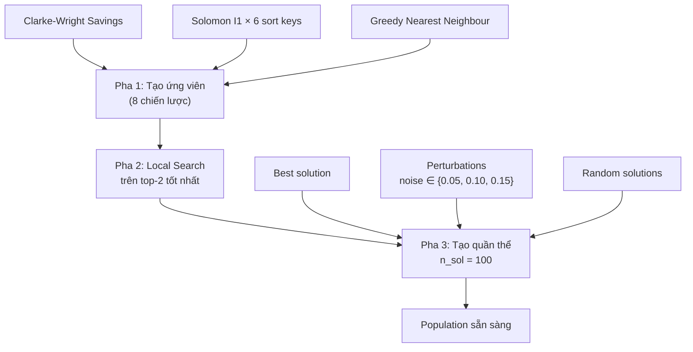
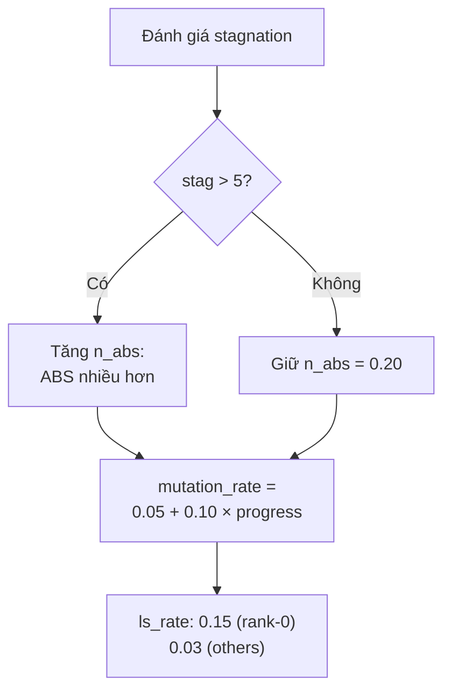
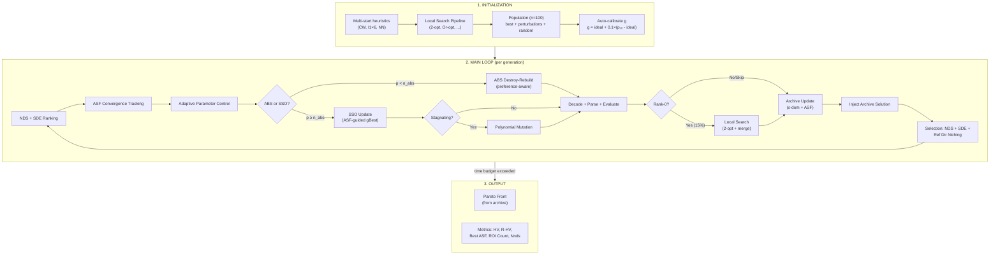
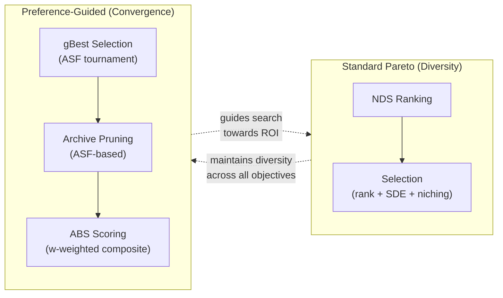
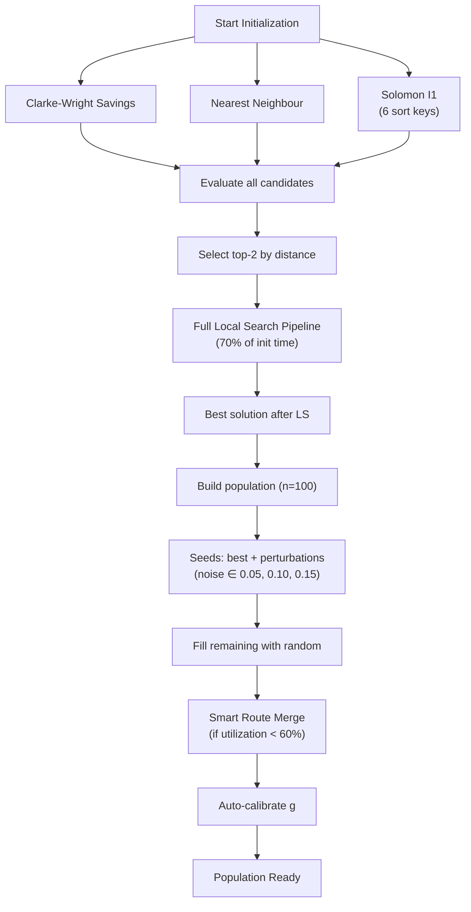
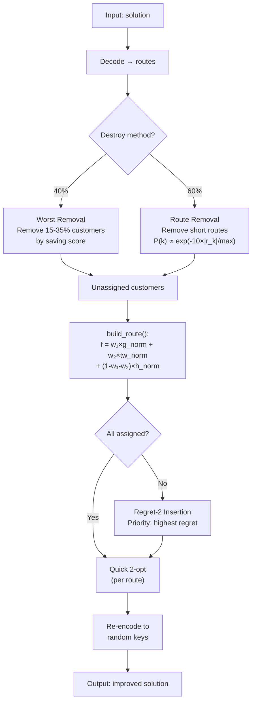
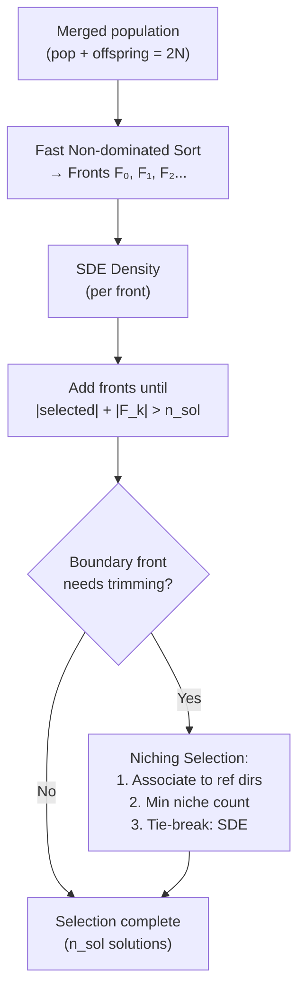
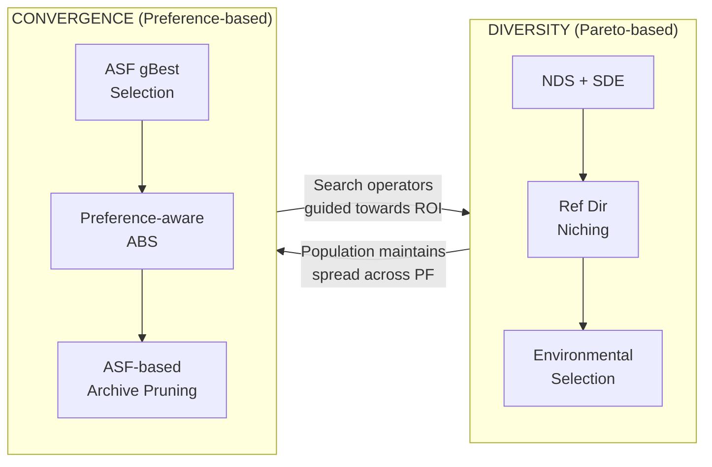

# Tài liệu Kỹ thuật Chi tiết: Preference-Based iNSSSO cho Many-Objective VRPTW

> **Mục đích:** Tài liệu tham khảo đầy đủ để viết bài báo Q1 về thuật toán iNSSSO (improved Non-dominated Sorting Squirrel Search Optimization) kết hợp preference-based optimization cho bài toán Many-Objective Vehicle Routing Problem with Time Windows (MO-VRPTW) với 5 mục tiêu.

---

## Mục lục

1. [Tổng quan & Động lực](#1-tổng-quan--động-lực)
2. [Mô hình Toán học MO-VRPTW](#2-mô-hình-toán-học-mo-vrptw)
3. [Mã hoá Lời giải — Random-Key Encoding](#3-mã-hoá-lời-giải--random-key-encoding)
4. [Khởi tạo Quần thể — Multi-start Heuristics](#4-khởi-tạo-quần-thể--multi-start-heuristics)
5. [Fast Non-dominated Sorting](#5-fast-non-dominated-sorting)
6. [Shift-based Density Estimation (SDE)](#6-shift-based-density-estimation-sde)
7. [Reference Direction Niching (NSGA-III style)](#7-reference-direction-niching-nsga-iii-style)
8. [Achievement Scalarizing Function (ASF)](#8-achievement-scalarizing-function-asf)
9. [Region of Interest (ROI)](#9-region-of-interest-roi)
10. [R-Dominance Ranking](#10-r-dominance-ranking)
11. [SSO Update Rule](#11-sso-update-rule)
12. [A\*-Based Search (ABS) — Preference-Aware Local Search](#12-a-based-search-abs--preference-aware-local-search)
13. [Polynomial Mutation](#13-polynomial-mutation)
14. [External Archive với ε-Dominance](#14-external-archive-với-ε-dominance)
15. [Auto-Calibration của Reference Point](#15-auto-calibration-của-reference-point)
16. [Adaptive Parameter Control](#16-adaptive-parameter-control)
17. [Main Loop — Hybrid Preference Strategy](#17-main-loop--hybrid-preference-strategy)
18. [Thuật toán So sánh (6 thuật toán)](#18-thuật-toán-so-sánh)
19. [Performance Metrics](#19-performance-metrics)
20. [Phân tích Ưu – Nhược điểm Tổng thể](#20-phân-tích-ưu--nhược-điểm-tổng-thể)
21. [Flowcharts](#21-flowcharts)
22. [Bảng So sánh Tổng hợp](#22-bảng-so-sánh-tổng-hợp)
23. [Cấu trúc Bài báo Đề xuất](#23-cấu-trúc-bài-báo-đề-xuất)

---

## 1. Tổng quan & Động lực

### 1.1 Bối cảnh

Vehicle Routing Problem with Time Windows (VRPTW) là bài toán tối ưu tổ hợp NP-hard nền tảng trong logistics. Trong thực tế, người ra quyết định (Decision Maker — DM) cần tối ưu **đồng thời nhiều mục tiêu** mâu thuẫn nhau: không chỉ tổng khoảng cách mà còn số phương tiện, thời gian chờ, cân bằng tải trọng, và makespan.

Khi số mục tiêu $M \geq 4$ (gọi là **many-objective optimization**), các phương pháp Pareto truyền thống gặp khó khăn:

1. **Pareto dominance mất hiệu quả:** Gần như tất cả solutions đều non-dominated — không phân biệt được chất lượng.
2. **Crowding Distance mất ý nghĩa:** Trong không gian $M$ chiều cao, CD không đo được mật độ chính xác.
3. **Pareto front quá lớn:** DM không thể chọn giải pháp phù hợp từ hàng trăm solutions.

### 1.2 Khoảng trống Nghiên cứu

| # | Khoảng trống | Giải pháp đề xuất |
|---|---|---|
| 1 | SSO chưa được áp dụng cho many-objective VRPTW | iNSSSO với 5 mục tiêu |
| 2 | Các MOEA hiện tại không tích hợp preference vào search operators | Hybrid Pareto + ASF-guided strategy |
| 3 | Crowding Distance không hiệu quả khi $M \geq 4$ | SDE + Reference Direction Niching |
| 4 | Thiếu cơ chế auto-calibrate reference point | Auto-calibration từ initial population |

### 1.3 Đóng góp chính (4 đóng góp)

1. **Hybrid Preference Strategy:** Kết hợp Pareto ranking (giữ diversity) với ASF-guided gBest selection (hội tụ tới vùng ưu tiên)
2. **Preference-Aware ABS:** Destroy-rebuild local search sử dụng composite score tích hợp trọng số ưu tiên của DM
3. **SDE + Preference-Biased Reference Direction Niching:** Thay thế CD bằng SDE cho many-objective; 70% reference directions tập trung quanh hướng ưu tiên
4. **Auto-Calibration of $\mathbf{g}$:** Reference point tự động tính từ initial population — instance-adaptive, không cần DM cung cấp thủ công

---

## 2. Mô hình Toán học MO-VRPTW

### 2.1 Định nghĩa Bài toán

Cho đồ thị có hướng $G = (V, A)$ với:
- $V = \{0, 1, 2, \dots, n\}$: tập đỉnh — node 0 là depot, $1 \dots n$ là customers
- $A = \{(i, j) : i, j \in V, i \neq j\}$: tập cung
- $K = \{1, 2, \dots, K_{max}\}$: tập phương tiện đồng nhất

**Tham số:**

| Ký hiệu | Ý nghĩa |
|----------|---------|
| $q_i$ | Demand (nhu cầu) của customer $i$ |
| $[e_i, l_i]$ | Time window: $e_i$ = ready time, $l_i$ = due date |
| $s_i$ | Service time tại customer $i$ |
| $Q$ | Capacity (sức chứa) mỗi phương tiện |
| $d_{ij}$ | Khoảng cách Euclid giữa $i$ và $j$: $d_{ij} = \sqrt{(x_i - x_j)^2 + (y_i - y_j)^2}$ |
| $t_{ij}$ | Thời gian di chuyển từ $i$ đến $j$ (giả định $t_{ij} = d_{ij}$) |

**Biến quyết định:**

| Biến | Miền | Ý nghĩa |
|------|------|---------|
| $x_{ijk}$ | $\{0, 1\}$ | = 1 nếu vehicle $k$ đi từ $i$ đến $j$ |
| $y_{ik}$ | $\{0, 1\}$ | = 1 nếu customer $i$ được phục vụ bởi vehicle $k$ |
| $a_i$ | $\mathbb{R}_{\geq 0}$ | Thời điểm bắt đầu phục vụ tại $i$ |
| $w_i$ | $\mathbb{R}_{\geq 0}$ | Thời gian chờ tại $i$: $w_i = \max(0, e_i - \text{arrival}_i)$ |

### 2.2 Hàm Mục tiêu (5 mục tiêu — minimize all)

$$Z_1 = \sum_{k=1}^{K_{max}} \mathbb{1}\left[\sum_{j=1}^{n} x_{0jk} \geq 1\right] \quad \text{(Số phương tiện sử dụng)}$$

$$Z_2 = \sum_{k=1}^{K_{max}} \sum_{(i,j) \in A} d_{ij} \cdot x_{ijk} \quad \text{(Tổng khoảng cách di chuyển)}$$

$$Z_3 = \sum_{i=1}^{n} w_i = \sum_{i=1}^{n} \max\left(0, \; e_i - \text{arrival}_i\right) \quad \text{(Tổng thời gian chờ)}$$

$$Z_4 = \max_{k \in K_{active}} L_k - \min_{k \in K_{active}} L_k, \quad L_k = \sum_{i: y_{ik}=1} q_i \quad \text{(Độ lệch tải trọng)}$$

$$Z_5 = \max_{k \in K_{active}} T_k \quad \text{(Makespan — thời gian hoàn thành muộn nhất)}$$

trong đó $T_k$ là thời điểm vehicle $k$ trở về depot, $K_{active} = \{k : \sum_j x_{0jk} \geq 1\}$.

### 2.3 Ràng buộc

**(C1) Mỗi customer được phục vụ đúng 1 lần:**

$$\sum_{k=1}^{K_{max}} y_{ik} = 1, \quad \forall i \in \{1, \dots, n\}$$

**(C2) Flow conservation:**

$$\sum_{j \in V} x_{ijk} = \sum_{j \in V} x_{jik} = y_{ik}, \quad \forall i \in V \setminus \{0\}, \; \forall k$$

**(C3) Capacity:**

$$\sum_{i=1}^{n} q_i \cdot y_{ik} \leq Q, \quad \forall k \in K$$

**(C4) Time Window:**

$$e_i \leq a_i \leq l_i, \quad \forall i \in V$$

**(C5) Time precedence:**

$$a_i + s_i + t_{ij} \leq a_j + M(1 - x_{ijk}), \quad \forall (i,j) \in A, \; \forall k$$

**(C6) Depot return:**

$$T_k = a_0^{return,k} \leq l_0, \quad \forall k \in K$$

### 2.4 Ví dụ minh hoạ

Xét instance nhỏ với depot (0) và 5 customers:

| Node | x | y | $q$ | $e$ | $l$ | $s$ |
|------|---|---|-----|-----|-----|-----|
| 0 (depot) | 40 | 50 | — | 0 | 230 | 0 |
| 1 | 45 | 68 | 10 | 0 | 100 | 10 |
| 2 | 42 | 66 | 30 | 5 | 80 | 10 |
| 3 | 42 | 68 | 20 | 0 | 50 | 10 |
| 4 | 40 | 69 | 40 | 50 | 120 | 10 |
| 5 | 38 | 55 | 20 | 10 | 150 | 10 |

Với $Q = 50$:
- **Route 1:** 0 → 3 → 2 → 0 (load = 20 + 30 = 50 ≤ Q ✓)
- **Route 2:** 0 → 1 → 4 → 0 (load = 10 + 40 = 50 ≤ Q ✓)
- **Route 3:** 0 → 5 → 0 (load = 20 ≤ Q ✓)

Tính $Z_1 = 3$, $Z_2 = \sum d$, $Z_3 = \sum w_i$, $Z_4 = L_{max} - L_{min} = 50 - 20 = 30$, $Z_5 = \max T_k$.

---

## 3. Mã hoá Lời giải — Random-Key Encoding

### 3.1 Nguyên lý

Mỗi lời giải được biểu diễn bởi vector số thực:

$$\mathbf{X} = (x_1, x_2, \dots, x_{n_{var}}), \quad x_j \in [0, 1), \quad n_{var} = |C| + |V| - 1$$

trong đó $|C|$ = số customer, $|V|$ = số vehicle tối đa.

### 3.2 Giải mã (Decode)

```
Input: X = (x_1, ..., x_nvar)
1. Z ← argsort(X) + 1     // 1-indexed
2. FOR mỗi phần tử z trong Z:
     IF z > |C|:
       z là separator → kết thúc route hiện tại, bắt đầu route mới
     ELSE:
       Thêm z vào route hiện tại
3. Return danh sách routes
```

### 3.3 Ví dụ Chi tiết

Cho $|C| = 5$, $|V| = 3$ → $n_{var} = 5 + 3 - 1 = 7$.

**Bước 1 — Random keys:**

| Index $j$ | 1 | 2 | 3 | 4 | 5 | 6 | 7 |
|-----------|-------|-------|-------|-------|-------|-------|-------|
| $x_j$     | 0.73  | 0.12  | 0.45  | 0.91  | 0.28  | 0.65  | 0.08  |

**Bước 2 — Argsort + 1:**

Sắp xếp $x_j$ tăng dần → thứ tự index: $7, 2, 5, 3, 6, 1, 4$

$$\mathbf{Z} = [7, 2, 5, 3, 6, 1, 4]$$

**Bước 3 — Tách route** (separator khi $z > |C| = 5$):

- $Z[0] = 7 > 5$ → **separator** (route rỗng, bỏ qua)
- $Z[1] = 2$ → Route 1: [2]
- $Z[2] = 5$ → Route 1: [2, 5]
- $Z[3] = 3$ → Route 1: [2, 5, 3]
- $Z[4] = 6 > 5$ → **separator** → kết thúc Route 1
- $Z[5] = 1$ → Route 2: [1]
- $Z[6] = 4$ → Route 2: [1, 4]

**Kết quả:** Route 1 = [2, 5, 3], Route 2 = [1, 4].

### 3.4 Mã hoá ngược (Encode — from_routes)

Cho routes cần mã hoá: Route 1 = [2, 5, 3], Route 2 = [1, 4].

1. Xây dựng $\mathbf{Z}$ mong muốn: $[2, 5, 3, \underbrace{6}_{sep}, 1, 4, \underbrace{7}_{sep}] $
2. Gán keys sao cho $\text{argsort}(\mathbf{keys}) + 1 = \mathbf{Z}$:
   - Vị trí có rank 0 trong Z là $z_0 = 2$ → `keys[1]` = random trong $[0/7, 1/7)$
   - Vị trí có rank 1 trong Z là $z_1 = 5$ → `keys[4]` = random trong $[1/7, 2/7)$
   - ...tiếp tục cho tất cả.

### 3.5 Ưu & Nhược điểm

| Ưu điểm | Nhược điểm |
|----------|-----------|
| Không gian liên tục → dễ áp dụng SSO, PSO, GA | Giải mã có thể tạo route infeasible |
| Luôn tạo permutation hợp lệ | Không biểu diễn trực tiếp số route |
| Dễ lai ghép (crossover) và đột biến (mutation) | Perturbation nhỏ có thể thay đổi route lớn |
| $O(n \log n)$ decode (do argsort) | Mã hoá ngược phức tạp hơn |

---

## 4. Khởi tạo Quần thể — Multi-start Heuristics

### 4.1 Tổng quan 3 pha



### 4.2 Clarke-Wright Savings Algorithm

**Ý tưởng:** Ban đầu mỗi customer là 1 route riêng. Ghép cặp route có "savings" lớn nhất.

**Công thức savings:**

$$s_{ij} = d_{0i} + d_{0j} - d_{ij}$$

Savings đo lượng khoảng cách tiết kiệm khi ghép 2 route (thay vì đi riêng depot→i→depot và depot→j→depot, giờ đi depot→...→i→j→...→depot).

```
ALGORITHM: Clarke-Wright Savings
Input: Instance (customers, depot, capacity Q)
Output: Tập routes

1. routes ← {[i] : i = 1..n}                    // n route đơn
2. savings ← []
3. FOR i = 1..n, j = i+1..n:
     s ← d[0][i] + d[0][j] - d[i][j]
     savings.append((s, i, j))
4. SORT savings giảm dần theo s
5. FOR (s, i, j) in savings:
     ri ← route chứa i, rj ← route chứa j
     IF ri ≠ rj AND i ở đầu/cuối ri AND j ở đầu/cuối rj:
       merged ← nối ri + rj (thử 4 cách nối)
       IF merged feasible (capacity, time window):
         Thay ri, rj bằng merged
6. RETURN routes (loại bỏ route rỗng)
```

**Độ phức tạp:** $O(n^2 \log n)$ (tạo + sắp xếp savings).

**Ví dụ:** Với 4 customers và depot:

| Cặp | $d_{0i}$ | $d_{0j}$ | $d_{ij}$ | Savings |
|-----|----------|----------|----------|---------|
| (1,2) | 10 | 12 | 5 | 17 |
| (1,3) | 10 | 15 | 8 | 17 |
| (2,3) | 12 | 15 | 6 | 21 ← max |
| (3,4) | 15 | 8 | 9 | 14 |

Ghép (2,3) trước → Route [2,3]. Tiếp tục ghép nếu feasible.

### 4.3 Solomon I1 Insertion Heuristic

```
ALGORITHM: Insertion Heuristic
Input: Instance, sort_key ∈ {due_date, ready_time, demand, distance, angle, tw_center}
Output: Tập routes

1. Sắp xếp customers theo sort_key
2. routes ← []
3. FOR mỗi customer cid (theo thứ tự đã sắp):
     best_cost ← ∞
     FOR mỗi route ri:
       FOR mỗi vị trí pos = 0..len(ri):
         candidate ← chèn cid vào ri tại pos
         IF candidate feasible:
           cost ← distance(candidate) - distance(ri)
           IF cost < best_cost: ghi nhận (ri, pos, cost)
     IF best_cost < ∞: chèn cid vào vị trí tốt nhất
     ELSE: tạo route mới [cid]
4. RETURN routes
```

**6 tiêu chí sắp xếp:**

| sort_key | Công thức | Ý tưởng |
|----------|-----------|---------|
| `due_date` | $l_i$ tăng dần | Customer gấp trước |
| `ready_time` | $e_i$ tăng dần | Customer sẵn sàng sớm trước |
| `demand` | $q_i$ giảm dần | Customer lớn trước (bin-packing) |
| `distance` | $d_{0i}$ tăng dần | Customer gần depot trước |
| `angle` | $\text{atan2}(y_i - y_0, x_i - x_0)$ | Quét theo góc (sweep) |
| `tw_center` | $(e_i + l_i)/2$ tăng dần | Theo tâm time window |

### 4.4 Greedy Nearest Neighbour

```
ALGORITHM: Nearest Neighbour
1. unvisited ← {1..n}
2. WHILE unvisited ≠ ∅:
     Tạo route mới, prev ← 0 (depot), t ← 0, load ← 0
     WHILE TRUE:
       best ← customer trong unvisited gần nhất thỏa:
         (a) load + q[best] ≤ Q
         (b) max(t + travel, e[best]) ≤ l[best]
         (c) return-to-depot feasible
       IF không tìm thấy: BREAK
       Thêm best vào route, cập nhật t, load
       unvisited.remove(best)
     Thêm route vào danh sách
3. RETURN routes
```

### 4.5 Local Search Pipeline

Áp dụng lên **top-2** ứng viên tốt nhất (theo tổng khoảng cách):

```
ALGORITHM: Full Local Search Pipeline
Input: routes, time_limit
REPEAT:
  old_dist ← total_distance(routes)
  routes ← 2-opt(routes)           // đảo ngược đoạn trong route
  routes ← Or-opt(routes)          // di chuyển 1-3 customer
  routes ← Relocate-inter(routes)  // chuyển customer sang route khác
  routes ← Swap-inter(routes)      // đổi customer giữa 2 route
  routes ← Cross-exchange(routes)  // 2-opt* đổi đuôi giữa 2 route
  routes ← Ruin-and-Recreate(routes) // phá 15-40% → chèn lại
  routes ← 2-opt(routes)           // post-pass
  IF total_distance(routes) ≥ old_dist - 0.5: BREAK
RETURN routes
```

**Mỗi operator chi tiết:**

| Operator | Loại | Mô tả | Độ phức tạp |
|----------|------|-------|-------------|
| 2-opt | Intra-route | Đảo ngược đoạn $(i, \dots, j)$ | $O(n_r^2)$ per route |
| Or-opt | Intra-route | Di chuyển segment 1-3 customer | $O(n_r^2)$ per route |
| Relocate | Inter-route | Chuyển 1 customer sang route khác | $O(R^2 \cdot n_r^2)$ |
| Swap | Inter-route | Đổi 1 customer giữa 2 route | $O(R^2 \cdot n_r^2)$ |
| Cross-exchange | Inter-route | Đổi "đuôi" giữa 2 route (2-opt*) | $O(R^2 \cdot n_r^2)$ |
| Ruin & Recreate | Hybrid | Loại ngẫu nhiên 15-40% → chèn lại | $O(n^2)$ per iteration |

### 4.6 Smart Route Merge

Giảm số phương tiện bằng cách ghép route ngắn:

```
ALGORITHM: Merge Routes
Input: routes, max_attempts, max_dist_increase (5%)
FOR attempt = 1..max_attempts:
  Sắp xếp routes theo số customer (tăng)
  FOR mỗi route_short (ngắn nhất):
    TRY chèn tất cả customer của route_short vào các route khác
    IF thành công AND tổng distance tăng ≤ 5%:
      Xóa route_short, áp dụng 2-opt lên routes mới
      BREAK
  IF không ghép được: BREAK
RETURN routes
```

---

## 5. Fast Non-dominated Sorting

### 5.1 Định nghĩa Dominance

**Pareto dominance:** Solution $\mathbf{a}$ **dominates** $\mathbf{b}$ (ký hiệu $\mathbf{a} \prec \mathbf{b}$) nếu và chỉ nếu:

$$\forall m \in \{1, \dots, M\}: f_m(\mathbf{a}) \leq f_m(\mathbf{b}) \quad \wedge \quad \exists m: f_m(\mathbf{a}) < f_m(\mathbf{b})$$

### 5.2 Thuật toán Deb (2002)

```
ALGORITHM: Fast Non-dominated Sort
Input: objectives[N][M]
Output: fronts = [F₀, F₁, F₂, ...]

1. Tính domination matrix D[N×N]:
     D[i][j] = TRUE nếu i dominates j
   // Vectorised: a[N,1,M] vs b[1,N,M] → broadcast (N,N,M)
   // all_leq = (a ≤ b).all(axis=2), any_lt = (a < b).any(axis=2)
   // D = all_leq AND any_lt

2. domination_count[i] = Σⱼ D[j][i]     // cột-sum: bao nhiêu solutions dominate i
3. dominated_set[i] = {j : D[i][j]}      // i dominates những ai

4. F₀ ← {i : domination_count[i] = 0}   // Pareto front
5. k ← 0
6. WHILE F_k ≠ ∅:
     F_{k+1} ← ∅
     FOR mỗi p ∈ F_k:
       FOR mỗi q ∈ dominated_set[p]:
         domination_count[q] ← domination_count[q] - 1
         IF domination_count[q] = 0: F_{k+1} ← F_{k+1} ∪ {q}
     k ← k + 1
7. RETURN [F₀, F₁, ..., F_k]
```

### 5.3 Độ phức tạp

- Xây dựng $D$: $O(MN^2)$
- Front extraction: $O(N^2)$ worst case
- **Tổng:** $O(MN^2)$
- **Vectorised speedup:** NumPy broadcasting tính toán $D$ đồng thời → ~5-10x nhanh hơn Python loop

### 5.4 Ví dụ minh hoạ (2 mục tiêu)

Cho 5 solutions:

| Solution | $f_1$ | $f_2$ |
|----------|-------|-------|
| A | 1 | 5 |
| B | 2 | 3 |
| C | 3 | 1 |
| D | 2 | 4 |
| E | 4 | 2 |

**Domination matrix:**

|   | A | B | C | D | E |
|---|---|---|---|---|---|
| A | - | ✗ | ✗ | ✗ | ✗ |
| B | ✗ | - | ✗ | ✓ | ✗ |
| C | ✗ | ✗ | - | ✗ | ✗ |
| D | ✗ | ✗ | ✗ | - | ✗ |
| E | ✗ | ✗ | ✗ | ✗ | - |

- $\text{domination\_count}$: A=0, B=0, C=0, D=1, E=0
- **Front 0** = {A, B, C, E} (non-dominated)
- Sau khi xử lý Front 0: domination_count[D] giảm xuống 0 → **Front 1** = {D}

### 5.5 Ưu & Nhược điểm

| Ưu điểm | Nhược điểm |
|---------|-----------|
| Không cần tham số | $O(MN^2)$ — chậm khi $N$ lớn |
| Phân tầng rõ ràng (rank 0, 1, 2...) | Khi $M$ lớn: hầu hết solutions rơi vào Front 0 |
| Vectorised hiệu quả với NumPy | Không phân biệt chất lượng trong cùng front |

---

## 6. Shift-based Density Estimation (SDE)

### 6.1 Vấn đề với Crowding Distance khi M ≥ 4

**Crowding Distance (CD)** đo mật độ bằng cách tính khoảng cách trung bình tới 2 neighbour gần nhất trong từng mục tiêu:

$$CD(i) = \sum_{m=1}^{M} \frac{f_m^{i+1} - f_m^{i-1}}{f_m^{max} - f_m^{min}}$$

Khi $M$ lớn:
- Biên (boundary) solutions luôn có $CD = \infty$
- Hầu hết solutions nội bộ cũng có $CD$ rất lớn (gần $\infty$)
- → CD **không phân biệt** được giữa solutions → selection gần như random

### 6.2 SDE — Định nghĩa Toán học

**(Li et al., IEEE TEC, 2014)**

Cho tập solutions đã normalize: $\hat{f}_m^i = \frac{f_m^i - f_m^{min}}{f_m^{max} - f_m^{min}}$

**Bước 1 — Shift operation:** Cho solution $i$, "shift" mọi solution $j \neq i$:

$$\hat{f}_m^{j \rightarrow i} = \max\left(\hat{f}_m^j, \; \hat{f}_m^i\right), \quad \forall m = 1 \dots M$$

**Bước 2 — Shifted distance:**

$$d_{shift}(i, j) = \sqrt{\sum_{m=1}^{M} \left(\hat{f}_m^{j \rightarrow i} - \hat{f}_m^i\right)^2}$$

**Bước 3 — SDE value:**

$$SDE(i) = \min_{j \neq i} d_{shift}(i, j)$$

**Ý nghĩa hình học:** Phép shift đẩy $j$ ra xa ideal point so với $i$. Nếu $j$ thực sự tốt hơn $i$ ở nhiều mục tiêu thì shifted distance lớn → $i$ được bảo vệ. Ngược lại nếu $j$ rất gần $i$ → SDE nhỏ → $i$ bị coi là "crowded".

### 6.3 Ví dụ Tính toán SDE (3 mục tiêu)

Cho 3 solutions (đã normalize):

| Solution | $\hat{f}_1$ | $\hat{f}_2$ | $\hat{f}_3$ |
|----------|-------------|-------------|-------------|
| A | 0.1 | 0.8 | 0.3 |
| B | 0.2 | 0.5 | 0.4 |
| C | 0.7 | 0.2 | 0.6 |

**Tính SDE(A):**

Shift B theo A: $\hat{f}^{B \to A} = (\max(0.2, 0.1), \max(0.5, 0.8), \max(0.4, 0.3)) = (0.2, 0.8, 0.4)$

$d_{shift}(A, B) = \sqrt{(0.2-0.1)^2 + (0.8-0.8)^2 + (0.4-0.3)^2} = \sqrt{0.01 + 0 + 0.01} = 0.141$

Shift C theo A: $\hat{f}^{C \to A} = (0.7, 0.8, 0.6)$

$d_{shift}(A, C) = \sqrt{(0.7-0.1)^2 + (0.8-0.8)^2 + (0.6-0.3)^2} = \sqrt{0.36 + 0 + 0.09} = 0.671$

$$SDE(A) = \min(0.141, 0.671) = 0.141$$

Tương tự: $SDE(B) = ?$, $SDE(C) = ?$ (tính tương tự cho mỗi solution).

**SDE lớn = isolated = được ưu tiên giữ lại. SDE nhỏ = crowded = ứng viên bị loại.**

### 6.4 So sánh CD vs SDE

| Tiêu chí | Crowding Distance | SDE |
|----------|------------------|-----|
| **Độ phức tạp** | $O(MN \log N)$ | $O(MN^2)$ |
| **Hiệu quả khi M = 2-3** | Tốt | Tốt (nhưng chậm hơn) |
| **Hiệu quả khi M ≥ 4** | Kém (hầu hết = ∞) | Tốt (phân biệt được) |
| **Boundary bias** | Có (endpoints = ∞) | Không |
| **Xét tương tác mục tiêu** | Không (cộng độc lập) | Có (qua shift) |
| **Tính ổn định** | Không ổn định khi M lớn | Ổn định hơn |
| **Cần normalize** | Có (per objective) | Có (toàn bộ) |

### 6.5 Pseudocode

```
ALGORITHM: SDE Density
Input: objectives[N][M]
Output: sde[N]

1. Normalize objectives → norm[N][M] (mỗi objective về [0,1])
2. FOR i = 0..N-1:
     min_dist ← ∞
     FOR j = 0..N-1, j ≠ i:
       shifted ← element-wise max(norm[j], norm[i])
       dist ← ‖shifted - norm[i]‖₂
       IF dist < min_dist: min_dist ← dist
     sde[i] ← min_dist
3. RETURN sde
```

---

## 7. Reference Direction Niching (NSGA-III style)

### 7.1 Das-Dennis Method

Tạo các reference direction phân bố đều trên unit simplex $M$ chiều:

$$\Lambda = \left\{ \mathbf{d} = \frac{1}{H}(d_1, \dots, d_M) : d_m \in \{0, 1, \dots, H\}, \; \sum_m d_m = H \right\}$$

Số directions: $|\Lambda| = \binom{H + M - 1}{M - 1}$

| M (objectives) | H (partitions) | Số directions |
|-----------------|-----------------|---------------|
| 3 | 12 | 91 |
| 5 | 4 | 70 |
| 5 | 6 | 210 |

### 7.2 Preference-Biased Reference Directions

Thay vì phân bố đều trên toàn simplex, **70% directions tập trung quanh hướng ưu tiên** $\mathbf{w}$:

```
ALGORITHM: Preference-Biased Directions
Input: M, g, w, n_total = 105, pref_ratio = 0.7
Output: dirs[N_total][M]

1. // Uniform layer (30%)
   H_uniform ← tìm H sao cho C(H+M-1, M-1) ≈ 0.3 × n_total
   uniform_dirs ← Das-Dennis(H_uniform, M)

2. // Preference layer (70%)
   center ← w / sum(w)        // normalize weight → simplex center
   H_pref ← tìm H cho ~2 × n_pref directions
   dense_dirs ← Das-Dennis(H_pref, M)

3. // Blend: dịch chuyển về phía center
   α ← 0.5
   shifted ← (1 - α) × dense_dirs + α × center
   shifted ← shifted / sum(shifted, per row)    // re-normalize to simplex

4. // Chọn n_pref directions gần center nhất
   dists ← ‖shifted - center‖₂
   pref_dirs ← shifted[argsort(dists)[:n_pref]]

5. all_dirs ← [uniform_dirs; pref_dirs]
6. Remove near-duplicates (tolerance = 1e-4)
7. RETURN all_dirs
```

**Ý nghĩa:** Tập trung search quanh vùng ưu tiên nhưng vẫn giữ 30% diversity trên toàn Pareto front.

### 7.3 Association & Niching Selection

**Association (liên kết solution → reference direction):**

Cho solution $\mathbf{p}$ (đã normalize) và reference direction $\mathbf{d}$, khoảng cách vuông góc:

$$d_\perp(\mathbf{p}, \mathbf{d}) = \left\| \mathbf{p} - \frac{\mathbf{p} \cdot \mathbf{d}}{\mathbf{d} \cdot \mathbf{d}} \cdot \mathbf{d} \right\|_2$$

Mỗi solution được liên kết tới direction có $d_\perp$ nhỏ nhất.

**Niching Selection (cho boundary front):**

```
ALGORITHM: Niching Selection
Input: front_indices, n_select, ref_dirs, sde_values, niche_counts
Output: selected indices

1. Tính niche assignment cho mỗi solution trong front
2. remaining ← front_indices
3. FOR k = 1..n_select:
     min_count ← min niche_count trong remaining
     candidate_niches ← {niche : count = min_count}
     best ← solution trong remaining thuộc candidate_niches
               có SDE thấp nhất (most isolated)
     selected.append(best)
     niche_counts[niche(best)] += 1
     remaining.remove(best)
4. RETURN selected
```

**Logic:** Ưu tiên niche ít member nhất → đảm bảo phân bố đều theo mọi hướng reference.

### 7.4 Ví dụ

Cho 3 ref directions: $d_1 = (1/2, 1/2, 0)$, $d_2 = (1/3, 1/3, 1/3)$, $d_3 = (0, 1/2, 1/2)$

Niche counts hiện tại: $d_1: 3$, $d_2: 1$, $d_3: 2$

Cần chọn 1 solution từ boundary front {X, Y, Z}:
- X liên kết tới $d_1$, Y liên kết tới $d_2$, Z liên kết tới $d_3$
- Niche ít nhất: $d_2$ (count = 1) → **chọn Y**

---

## 8. Achievement Scalarizing Function (ASF)

### 8.1 Định nghĩa Toán học

Cho reference point $\mathbf{g} = (g_1, \dots, g_M)$ và weight vector $\mathbf{w} = (w_1, \dots, w_M)$ với $\sum w_i = 1$:

$$ASF(\mathbf{x}, \mathbf{g}, \mathbf{w}) = \max_{i=1}^{M} \left\{ w_i \cdot \left(f_i(\mathbf{x}) - g_i\right) \right\}$$

**Ý nghĩa hình học:**
- Đo "deviation tệ nhất" (worst-case weighted deviation) từ reference point $\mathbf{g}$
- **ASF càng nhỏ càng tốt** — solution càng gần $\mathbf{g}$ theo tất cả hướng có trọng số
- Đường đồng mức (contour) của ASF là hình "hộp" nghiêng theo $\mathbf{w}$

### 8.2 Augmented ASF (chống tie)

$$ASF_{aug}(\mathbf{x}) = \max_{i=1}^{M} \left\{ w_i(f_i - g_i) \right\} + \rho \sum_{i=1}^{M} w_i(f_i - g_i)$$

với $\rho = 10^{-3}$. Số hạng tổng đảm bảo thứ tự nghiêm ngặt khi max term bằng nhau.

### 8.3 Tính chất Lý thuyết

**Định lý (Wierzbicki, 1980):** Mọi điểm Pareto optimal $\mathbf{x}^*$ là nghiệm của $\min_\mathbf{x} ASF(\mathbf{x}, \mathbf{g}, \mathbf{w})$ với reference point $\mathbf{g}$ nào đó nằm bên dưới Pareto front.

→ ASF **có thể tìm mọi điểm trên Pareto front**, kể cả vùng lõm (concave) mà Weighted Sum không tìm được.

### 8.4 Ví dụ Tính toán Chi tiết

Cho 5 mục tiêu, $\mathbf{g} = (10, 830, 0.5, 0, 100)$, $\mathbf{w} = (0.3, 0.3, 0.15, 0.1, 0.15)$

**Solution A:** $\mathbf{f}_A = (10, 835, 2.0, 5, 110)$

$$ASF(A) = \max\begin{cases} 0.3 \times (10 - 10) = 0 \\ 0.3 \times (835 - 830) = 1.5 \\ 0.15 \times (2.0 - 0.5) = 0.225 \\ 0.1 \times (5 - 0) = 0.5 \\ 0.15 \times (110 - 100) = 1.5 \end{cases} = 1.5$$

**Solution B:** $\mathbf{f}_B = (11, 828, 1.0, 3, 105)$

$$ASF(B) = \max\begin{cases} 0.3 \times (11 - 10) = 0.3 \\ 0.3 \times (828 - 830) = -0.6 \\ 0.15 \times (1.0 - 0.5) = 0.075 \\ 0.1 \times (3 - 0) = 0.3 \\ 0.15 \times (105 - 100) = 0.75 \end{cases} = 0.75$$

**B tốt hơn A** vì $ASF(B) = 0.75 < 1.5 = ASF(A)$. B gần $\mathbf{g}$ hơn.

### 8.5 Batch Computation (Vectorised)

Cho $N$ solutions, ma trận mục tiêu $\mathbf{F} \in \mathbb{R}^{N \times M}$:

$$\text{ASF\_batch}(\mathbf{F}) = \max_{axis=1}\left(\mathbf{w}_{1 \times M} \odot (\mathbf{F}_{N \times M} - \mathbf{g}_{1 \times M})\right) \in \mathbb{R}^N$$

Tính toán $O(NM)$ với NumPy broadcasting.

### 8.6 Vai trò trong iNSSSO

| Thành phần | Cách sử dụng ASF |
|-----------|-----------------|
| **gBest Selection** | Binary tournament trên Pareto front rank-0: chọn solution có ASF nhỏ nhất |
| **Archive Pruning** | Khi archive đầy: loại solutions có ASF lớn nhất |
| **ε-box Tie-breaking** | Cùng ε-box: giữ solution có ASF nhỏ hơn |
| **Stagnation Detection** | Theo dõi $\min(ASF)$ qua các thế hệ |
| **Convergence Tracking** | Log $\min(ASF)$ thay vì IGD |

### 8.7 So sánh các Phương pháp Scalarization

| Phương pháp | Công thức | Tìm Pareto lõm? | Hướng ưu tiên? | Tham số |
|-------------|-----------|:---:|:---:|---------|
| **Weighted Sum** | $\sum w_i f_i$ | Không | Có | $\mathbf{w}$ |
| **Tchebycheff** | $\max_i w_i |f_i - g_i|$ | Có | $\mathbf{g}, \mathbf{w}$ |
| **ASF** | $\max_i w_i (f_i - g_i)$ | Có | Có (mạnh) | $\mathbf{g}, \mathbf{w}$ |
| **PBI** | $d_1 + \theta \cdot d_2$ | Có | Có | $\theta$ |
| **Augmented ASF** | $ASF + \rho \sum w_i(f_i - g_i)$ | Có (nghiêm ngặt) | Có (mạnh) | $\mathbf{g}, \mathbf{w}, \rho$ |

---

## 9. Region of Interest (ROI)

### 9.1 Định nghĩa Toán học

Solution $\mathbf{x}$ nằm trong ROI nếu:

$$\sum_{i=1}^{M} \left( \frac{w_i \cdot (f_i(\mathbf{x}) - g_i)}{\delta \cdot (nadir_i - ideal_i)} \right)^2 \leq 1$$

trong đó:
- $\delta > 0$: bán kính ROI (nhỏ = tập trung, lớn = rộng)
- $ideal_i = \min_{\mathbf{x} \in PF} f_i(\mathbf{x})$: điểm lý tưởng
- $nadir_i = \max_{\mathbf{x} \in PF} f_i(\mathbf{x})$: điểm nadir

### 9.2 Ý nghĩa Hình học

ROI là một **hyper-ellipsoid** trong không gian mục tiêu:
- Tâm: $\mathbf{g}$ (reference point)
- Trục thứ $i$: bán trục = $\frac{\delta \cdot (nadir_i - ideal_i)}{w_i}$ — mục tiêu quan trọng hơn ($w_i$ lớn) có bán trục ngắn hơn → "chặt" hơn
- Tổng thể: vùng ellipsoid quanh $\mathbf{g}$, co giãn theo range và weight

### 9.3 Ví dụ Tính toán

Cho $M = 3$, $\mathbf{g} = (830, 0.5, 0.15)$, $\mathbf{w} = (0.5, 0.3, 0.2)$, $\delta = 0.5$

$ideal = (800, 0.0, 0.05)$, $nadir = (900, 5.0, 0.50)$

**Solution X:** $\mathbf{f}_X = (840, 1.0, 0.20)$

$$ROI\_check = \left(\frac{0.5 \times (840 - 830)}{0.5 \times (900 - 800)}\right)^2 + \left(\frac{0.3 \times (1.0 - 0.5)}{0.5 \times (5.0 - 0.0)}\right)^2 + \left(\frac{0.2 \times (0.20 - 0.15)}{0.5 \times (0.50 - 0.05)}\right)^2$$

$$= \left(\frac{5}{50}\right)^2 + \left(\frac{0.15}{2.5}\right)^2 + \left(\frac{0.01}{0.225}\right)^2 = 0.01 + 0.0036 + 0.00198 = 0.01558$$

$0.01558 \leq 1$ → **X nằm trong ROI ✓**

**Solution Y:** $\mathbf{f}_Y = (890, 4.0, 0.45)$

$$= \left(\frac{0.5 \times 60}{50}\right)^2 + \left(\frac{0.3 \times 3.5}{2.5}\right)^2 + \left(\frac{0.2 \times 0.30}{0.225}\right)^2 = 0.36 + 0.1764 + 0.0711 = 0.6075$$

$0.6075 \leq 1$ → **Y nằm trong ROI ✓** (vẫn trong, nhưng xa hơn X)

### 9.4 Ảnh hưởng của δ

| δ | Ý nghĩa | ROI size | Trường hợp sử dụng |
|---|---------|----------|-------------------|
| 0.1 | Rất chặt | Nhỏ | DM biết chính xác muốn gì |
| 0.3 | Vừa | Trung bình | Cân bằng exploration/exploitation |
| 0.5 | Rộng | Lớn | DM muốn nhiều lựa chọn (mặc định) |
| 1.0 | Rất rộng | Gần như toàn PF | DM chưa chắc chắn |

---

## 10. R-Dominance Ranking

### 10.1 Định nghĩa

Solution $\mathbf{x}$ **R-dominates** $\mathbf{y}$ (ký hiệu $\mathbf{x} \prec_R \mathbf{y}$) nếu **ít nhất một** điều sau đúng:

1. $\mathbf{x}$ Pareto-dominates $\mathbf{y}$: $\mathbf{x} \prec \mathbf{y}$
2. $\mathbf{x}$ trong ROI và $\mathbf{y}$ không trong ROI
3. Cả hai cùng trạng thái ROI (cùng trong hoặc cùng ngoài) **VÀ** $ASF(\mathbf{x}) < ASF(\mathbf{y})$

### 10.2 Ma trận R-Dominance (Vectorised)

$$R_{dom}[i,j] = \underbrace{P_{dom}[i,j]}_{\text{Pareto}} \; \lor \; \underbrace{(ROI[i] \land \neg ROI[j])}_{\text{ROI advantage}} \; \lor \; \underbrace{(Same\_ROI[i,j] \land ASF[i] < ASF[j] - \epsilon)}_{\text{ASF advantage}}$$

với $\epsilon = 10^{-10}$ (numerical tolerance).

### 10.3 Ví dụ

| Solution | $f_1$ | $f_2$ | In ROI? | ASF |
|----------|-------|-------|---------|-----|
| A | 2 | 5 | Có | 0.3 |
| B | 3 | 4 | Có | 0.5 |
| C | 1 | 7 | Không | 0.8 |
| D | 4 | 3 | Không | 1.2 |

**R-dominance relationships:**

- A R-dominates C: A trong ROI, C không (Rule 2) ✓
- A R-dominates B: Cùng trong ROI, ASF(A)=0.3 < ASF(B)=0.5 (Rule 3) ✓
- A R-dominates D: A trong ROI, D không (Rule 2) ✓
- B R-dominates C: B trong ROI, C không (Rule 2) ✓
- B R-dominates D: B trong ROI, D không (Rule 2) ✓
- C vs D: Cùng ngoài ROI, ASF(C)=0.8 < ASF(D)=1.2 → C R-dominates D (Rule 3) ✓

**R-Front 0 = {A}**, R-Front 1 = {B}, R-Front 2 = {C}, R-Front 3 = {D}

So sánh: Nếu chỉ dùng Pareto sort → A, B, C, D có thể đều non-dominated. R-dominance phân biệt rõ hơn nhờ preference.

### 10.4 Tại sao dùng Hybrid thay vì Full R-Dominance?

| Phương pháp | Ưu | Nhược |
|-------------|-----|-------|
| Full R-Dominance | Hội tụ mạnh quanh $\mathbf{g}$ | $O(N^2)$ với hệ số lớn (ROI check + ASF), **mất diversity** xa $\mathbf{g}$ |
| Pure Pareto | Nhanh, diversity tốt | Không hướng tới ưu tiên |
| **Hybrid (iNSSSO)** | **Vừa nhanh, vừa hướng tới g** | **Cân bằng tốt** |

**Hybrid strategy:** Pareto rank cho selection (giữ diversity) + ASF cho gBest & archive (hướng tới $\mathbf{g}$).

---

## 11. SSO Update Rule

### 11.1 Squirrel Search Optimization — Nguồn gốc

SSO (Jain et al., 2019) mô phỏng hành vi tìm kiếm thức ăn của sóc bay:
- Sóc trên cây hickory (gBest) → cây oak (tốt) → cây bình thường
- Mùa đông: sóc lượn (gliding) → exploration toàn cục

### 11.2 Quy tắc Cập nhật (Eq. 2)

Với mỗi chiều $j$ của vector keys:

$$x_{i,j}^{new} = \begin{cases} g_{best,j} & \text{nếu } \rho_j \leq c_g \\ x_{i,j} & \text{nếu } c_g < \rho_j \leq c_w \\ \text{rand}(0,1) & \text{nếu } \rho_j > c_w \end{cases}$$

trong đó:
- $\rho_j \sim U(0, 1)$: số ngẫu nhiên cho chiều $j$
- $c_g = 0.95$: xác suất copy từ gBest (**exploitation**)
- $c_w = 0.99$: ngưỡng giữ nguyên

### 11.3 Phân tích Xác suất

| Hành vi | Xác suất | Vai trò |
|---------|----------|---------|
| Copy từ gBest | $P = c_g = 0.95$ | **Khai thác mạnh** — hội tụ nhanh tới vùng tốt |
| Giữ nguyên key | $P = c_w - c_g = 0.04$ | **Bảo tồn** — giữ lại thông tin cá thể |
| Random key mới | $P = 1 - c_w = 0.01$ | **Khám phá** — tránh hội tụ sớm |

**Nhận xét:** Với $c_g = 0.95$, trung bình 95% keys được copy từ gBest. Điều này tạo ra **exploitation rất mạnh**. Để bù, thuật toán cần:
- Polynomial mutation (Section 13) khi stagnation
- ABS search (Section 12) để diversify

### 11.4 Vectorised Implementation

```python
rho = np.random.rand(nvar)           # (nvar,)
random_keys = np.random.rand(nvar)   # (nvar,)
new_keys = np.where(
    rho <= cg,      gbest.keys,      # copy from gBest
    np.where(
        rho <= cw,  xi.keys,         # keep current
        random_keys                   # random exploration
    )
)
```

Tính toán $O(n_{var})$ với NumPy — rất nhanh.

### 11.5 gBest Selection — Hybrid Strategy

**Khi có preference (ASF-based binary tournament):**

```
ALGORITHM: ASF-based gBest Selection
Input: population objectives, preference, PF indices
Output: index of gBest

1. candidates ← solutions trong Pareto Front (rank = 0)
2. Chọn ngẫu nhiên 2 candidates: i1, i2
3. Tính ASF_aug(i1) và ASF_aug(i2)
4. RETURN candidate có ASF nhỏ hơn
```

**Khi không có preference (SDE-based binary tournament):**

```
1. Chọn ngẫu nhiên 2 candidates từ PF
2. RETURN candidate có SDE lớn hơn (more isolated)
```

### 11.6 Ưu & Nhược điểm SSO Update

| Ưu điểm | Nhược điểm |
|---------|-----------|
| Đơn giản: chỉ 2 tham số ($c_g$, $c_w$) | Hội tụ nhanh → premature convergence |
| Vectorised hiệu quả O(nvar) | Phụ thuộc nhiều vào chất lượng gBest |
| Tự nhiên chuyển đổi exploitation/exploration | Diversity thấp (95% copy) |
| Không cần tính gradient hay velocity | Không "nhớ" hướng tìm kiếm trước đó (khác PSO) |

---

## 12. A\*-Based Search (ABS) — Preference-Aware Local Search

### 12.1 Tổng quan

ABS là thuật toán **destroy-and-rebuild** local search lấy cảm hứng từ A* graph search, bao gồm:
- **g-cost**: chi phí thực tế (khoảng cách) — greedy component
- **h-cost**: ước lượng heuristic (reachability) — look-ahead component
- **Preference-aware scoring**: tích hợp trọng số $\mathbf{w}$ của DM

### 12.2 Pha Destroy — 2 Chiến lược

#### 12.2.1 Worst Removal (xác suất 40%)

Loại bỏ $n_{remove}$ customers gây tăng khoảng cách nhiều nhất:

$$\text{saving}(c) = d(\text{prev}_c, c) + d(c, \text{next}_c) - d(\text{prev}_c, \text{next}_c)$$

```
ALGORITHM: Worst Removal
Input: routes, n_remove ∈ [15%, 35%] × total_customers
Output: kept_routes, removed_list

1. FOR mỗi customer c trong routes:
     Tính saving(c)
2. Sắp xếp customers theo saving giảm dần
3. removed ← top n_remove customers
4. Xây dựng kept_routes bằng cách loại removed
5. RETURN kept_routes, removed
```

#### 12.2.2 Route Removal (xác suất 60%)

Loại bỏ nguyên route ngắn:

$$P(\text{chọn route } k) = \frac{\exp(-10 \cdot |route_k| / \max_j |route_j|)}{\sum_k \exp(-10 \cdot |route_k| / \max_j |route_j|)}$$

Route ngắn hơn → xác suất bị loại cao hơn. Loại $\max(1, \lfloor|routes|/3\rfloor)$ routes.

**Ý tưởng:** Route ngắn thường là kết quả "dư thừa" — loại bỏ chúng và phân phối lại customers có thể giảm $Z_1$ (số phương tiện).

### 12.3 Pha Rebuild — build_route()

#### 12.3.1 Feasibility Check (calVcost — Table 4)

Kiểm tra customer $c$ có thể chèn sau $prev$ không:

```
calVcost(c, prev, current_time, current_load):
  IF current_load + q[c] > Q: RETURN ∞     // capacity violation
  arrival ← current_time + travel_time[prev][c]
  start ← max(arrival, e[c])
  IF start > l[c]: RETURN ∞                 // time window violation
  return_time ← start + s[c] + travel_time[c][0]
  IF return_time > l[depot]: RETURN ∞       // depot deadline violation
  RETURN 0                                   // feasible
```

#### 12.3.2 Heuristic Estimate (calHcost — Table 5)

Ước lượng số customers còn có thể phục vụ sau khi chọn $c$:

$$h(c) = |\{c_j \in \text{open} : c_j \text{ feasible after visiting } c\}|$$

$h(c)$ lớn = chọn $c$ vẫn giữ được nhiều lựa chọn → **look-ahead tốt**.

#### 12.3.3 Preference-Weighted Composite Score

$$f_{composite} = w_1 \cdot \hat{g} + w_2 \cdot \hat{tw} + (1 - w_1 - w_2) \cdot \hat{h}$$

trong đó:
- $\hat{g} = d(\text{prev}, c) / \max_j d(\text{prev}, j)$: khoảng cách normalize
- $\hat{tw} = \frac{1/(l_c - e_c)}{\max_j 1/(l_j - e_j)}$: độ khẩn cấp time window normalize
- $\hat{h} = \frac{h_{max} - h(c)}{h_{max}}$: reachability đảo ngược normalize

**Lưu ý:** Khi không có preference: $f = \hat{g} + \hat{h}$ (giống A* search thuần).

#### 12.3.4 Customer Selection — Roulette Wheel

$$P(\text{chọn } c) = \frac{f_{max} - f(c) + \epsilon}{\sum_j (f_{max} - f(j) + \epsilon)}$$

($\epsilon = 10^{-10}$ tránh xác suất = 0)

### 12.4 Pha Hậu xử lý

#### 12.4.1 Regret-2 Insertion

Cho customers chưa được phân bổ, chèn theo thứ tự **regret cao nhất**:

$$\text{regret}(c) = \text{cost}_{2nd\_best}(c) - \text{cost}_{best}(c)$$

Customer có regret lớn = nếu không chèn sớm, cost sẽ tăng nhiều → ưu tiên chèn trước.

```
ALGORITHM: Regret-2 Insertion
WHILE remaining ≠ ∅:
  FOR mỗi customer c trong remaining:
    Tìm 2 vị trí chèn tốt nhất (best_cost, 2nd_best_cost)
    regret[c] ← 2nd_best_cost - best_cost
  Chọn c* với regret lớn nhất
  Chèn c* vào vị trí tốt nhất
  remaining.remove(c*)
```

#### 12.4.2 Quick 2-opt

Áp dụng 1 pass 2-opt (không lặp) trên mỗi route mới để cải thiện nhanh.

### 12.5 Ví dụ ABS Hoàn chỉnh

**Input:** 3 routes, $\mathbf{w} = (0.5, 0.3, 0.2)$

| Route | Customers | Distance |
|-------|-----------|----------|
| R1 | [1, 4, 7] | 45.2 |
| R2 | [2, 5] | 32.1 |
| R3 | [3, 6, 8, 9] | 58.3 |

**Bước 1 — Route Removal:** Chọn R2 (ngắn nhất, 2 customers) → unassigned = [2, 5]

**Bước 2 — build_route():**
- Tính $f_{composite}$ cho customer 2 và 5 từ depot
- Giả sử $f(2) = 0.6$, $f(5) = 0.3$ → $P(5) = 0.75$, $P(2) = 0.25$
- Roulette → chọn 5 trước
- Tiếp tục build...

**Bước 3 — Regret-2:** Chèn customers còn lại vào routes hiện có

**Bước 4 — 2-opt:** Tối ưu nội route

### 12.6 Stopping Criteria trong build_route

1. Không còn customer feasible (hết lựa chọn)
2. Route hiện tại đã đầy capacity
3. **Makespan balance:** $\text{current\_time} \geq \text{avg\_makespan}$ → dừng route hiện tại để bắt đầu route mới → giảm $Z_5$ (makespan)

### 12.7 Ưu & Nhược điểm ABS

| Ưu điểm | Nhược điểm |
|---------|-----------|
| Kết hợp g-cost + h-cost như A* | h-cost = $O(|open|^2)$ per step — chậm |
| Preference-aware qua $\mathbf{w}$ | Stochastic selection có thể bỏ lỡ optimal |
| 2 chiến lược destroy đa dạng | Không đảm bảo cải thiện (local search) |
| Regret-2 → chèn thông minh | Chỉ 1-pass 2-opt (không tối ưu hoàn toàn) |

---

## 13. Polynomial Mutation

### 13.1 Nguồn gốc

Từ NSGA-II (Deb et al., 2002), polynomial mutation tạo perturbation với phân bố polynomial quanh giá trị hiện tại.

### 13.2 Công thức Toán học

Cho giá trị hiện tại $y \in [0, 1)$:

$$y^{new} = y + \delta_q$$

trong đó $\delta_q$ được tính:

$$\delta_q = \begin{cases} \left[2u + (1-2u)(1-\delta_1)^{\eta_m+1}\right]^{1/(\eta_m+1)} - 1 & \text{nếu } u < 0.5 \\[6pt] 1 - \left[2(1-u) + 2(u-0.5)(1-\delta_2)^{\eta_m+1}\right]^{1/(\eta_m+1)} & \text{nếu } u \geq 0.5 \end{cases}$$

với:
- $u \sim U(0, 1)$: số ngẫu nhiên
- $\delta_1 = y - 0 = y$ (khoảng cách tới biên dưới)
- $\delta_2 = 1 - y$ (khoảng cách tới biên trên)
- $\eta_m = 20$: **distribution index** — lớn = mutation nhỏ, nhỏ = mutation lớn

### 13.3 Phân bố Xác suất

Với $\eta_m = 20$: phần lớn mutations rất nhỏ (gần 0), hiếm khi tạo thay đổi lớn → **fine-tuning** quanh solution hiện tại.

Với $\eta_m = 5$: mutation phân tán hơn → **exploration** mạnh hơn.

### 13.4 Khi nào Áp dụng trong iNSSSO

```
IF stagnation_count > 3 AND random() < mutation_rate:
    offspring ← polynomial_mutation(offspring, η_m = 20)
```

- `mutation_rate` = $0.05 + 0.10 \times \text{progress}$ (tăng dần theo thời gian)
- Mỗi key bị mutate với xác suất `mutation_rate`

### 13.5 Ví dụ

Key hiện tại: $y = 0.45$, $\eta_m = 20$, $u = 0.3$ (< 0.5):

$\delta_1 = 0.45$, $xy = 1 - 0.45 = 0.55$

$val = 2 \times 0.3 + (1 - 0.6) \times 0.55^{21} = 0.6 + 0.4 \times 3.73 \times 10^{-6} ≈ 0.6$

$\delta_q = 0.6^{1/21} - 1 = 0.976 - 1 = -0.024$

$y^{new} = 0.45 + (-0.024) = 0.426$

→ Thay đổi rất nhỏ (từ 0.45 → 0.426), phù hợp fine-tuning.

---

## 14. External Archive với ε-Dominance

### 14.1 ε-Box Discretization

$$\epsilon\text{-box}(\mathbf{x})_i = \left\lfloor \frac{f_i(\mathbf{x})}{\epsilon} \right\rfloor, \quad \forall i = 1 \dots M$$

Mỗi solution được ánh xạ tới một "box" trong grid M chiều. Chỉ giữ 1 solution per box → đảm bảo Pareto front phân bố đều.

### 14.2 Quy tắc Cập nhật Archive

```
ALGORITHM: Archive Update
Input: archive, new_solution s
Output: updated archive

1. Tính ε-box(s)
2. FOR mỗi member m trong archive:
   a. Nếu cùng ε-box(m) = ε-box(s):
      - Có preference: giữ solution có ASF nhỏ hơn
      - Không preference: giữ solution có sum(objectives) nhỏ hơn
      RETURN
   b. Nếu m dominates s: RETURN (không thêm)
   c. Nếu s dominates m: đánh dấu m để xóa
3. Xóa các members bị dominated
4. Thêm clone(s) vào archive
5. IF len(archive) > max_size: PRUNE
```

### 14.3 Pruning Strategy

```
IF preference ≠ None:
    asf_vals ← ASF_augmented_batch(archive_objectives)
    Giữ top max_size solutions theo ASF (nhỏ = tốt)
ELSE:
    cd_vals ← crowding_distance(archive_objectives)
    Giữ top max_size solutions theo CD (lớn = tốt)
```

### 14.4 Ví dụ (2 mục tiêu, ε = 0.5)

| Solution | $f_1$ | $f_2$ | ε-box |
|----------|-------|-------|-------|
| A | 1.2 | 3.1 | (2, 6) |
| B | 1.4 | 2.8 | (2, 5) |
| C | 1.3 | 3.0 | (2, 6) ← cùng box với A |

Khi thêm C: cùng ε-box với A → so sánh ASF(A) vs ASF(C). Giả sử ASF(C) < ASF(A) → **thay A bằng C**.

### 14.5 Tham số

| Tham số | Giá trị | Ảnh hưởng |
|---------|---------|-----------|
| `epsilon` | 0.01 | ε nhỏ = grid mịn = archive lớn, chính xác hơn |
| `max_size` | 200 | Giới hạn bộ nhớ; pruning bằng ASF/CD |

---

## 15. Auto-Calibration của Reference Point

### 15.1 Vấn đề

Reference point $\mathbf{g}$ phụ thuộc instance:

| Instance | $Z_2$ range | Nếu $g_2 = 830$ |
|----------|-----------|------------------|
| C101 | 800–900 | Hợp lý |
| R101 | 1500–1800 | Quá nhỏ → ASF luôn âm → vô nghĩa |
| RC201 | 1200–1600 | Không phù hợp |

### 15.2 Giải pháp — Auto-Calibration

$$\mathbf{g} = \mathbf{ideal} + 0.1 \times \max(\mathbf{p}_{10} - \mathbf{ideal}, \; \mathbf{0})$$

trong đó:
- $\mathbf{ideal} = \min_{\mathbf{x} \in \text{feasible}} f_i(\mathbf{x})$: tốt nhất mỗi mục tiêu
- $\mathbf{p}_{10}$: percentile thứ 10 mỗi mục tiêu (near-best, loại outlier)
- $0.1$: margin — aspiration nhẹ hơn ideal 1 chút

**Đảm bảo thêm:** $g_i \geq ideal_i + 0.01 \times (max_i - ideal_i)$ — không bao giờ trùng ideal.

### 15.3 Ví dụ

Initial population có 100 feasible solutions:

| Objective | Ideal | P10 | g (auto) |
|-----------|-------|-----|----------|
| $Z_1$ (vehicles) | 10 | 10 | $10 + 0.1 \times 0 = 10.0$ → clamp ≥ $10 + 0.01 \times 5 = 10.05$ |
| $Z_2$ (distance) | 828 | 840 | $828 + 0.1 \times 12 = 829.2$ |
| $Z_3$ (wait) | 0.0 | 1.5 | $0 + 0.1 \times 1.5 = 0.15$ |
| $Z_4$ (balance) | 0 | 15 | $0 + 0.1 \times 15 = 1.5$ |
| $Z_5$ (makespan) | 95 | 110 | $95 + 0.1 \times 15 = 96.5$ |

→ $\mathbf{g} = (10.05, 829.2, 0.15, 1.5, 96.5)$ — tự động, instance-adaptive.

---

## 16. Adaptive Parameter Control

### 16.1 Bảng Tham số

| Parameter | Base Value | Điều kiện thay đổi | Công thức | Phạm vi |
|-----------|-----------|-------------------|-----------|---------|
| `n_abs` | 0.20 | stagnation > 5 gen | $\min(0.50, 0.20 + 0.05 \times \text{stag\_count})$ | [0.20, 0.50] |
| `mutation_rate` | 0.05 | Tăng dần theo progress | $0.05 + 0.10 \times \frac{\text{elapsed}}{t_{run}}$ | [0.05, 0.15] |
| `ls_rate` | 0.15 / 0.03 | Cố định | 0.15 (rank-0), 0.03 (rank > 0) | — |

### 16.2 Stagnation Detection

```
current_PF ← {s ∈ population : rank = 0}
IF preference:
    best_asf ← min(ASF(s) : s ∈ current_PF)
ELSE:
    best_asf ← min(f₁(s) : s ∈ current_PF)

IF |best_asf - last_best_asf| < 1e-6:
    stagnation_count += 1
ELSE:
    stagnation_count ← 0
    last_best_asf ← best_asf
```

### 16.3 Logic Thích ứng



**Ý nghĩa:**
- Stagnation → tăng ABS (destroy-rebuild) để thoát local optima
- Thời gian càng lâu → mutation càng mạnh → diversity lúc cuối

---

## 17. Main Loop — Hybrid Preference Strategy

### 17.1 Pseudocode Chi tiết

```
ALGORITHM: iNSSSO Main Loop
Input: instance, n_sol, cg, cw, n_abs, t_run, preference
Output: Pareto front (archive), metrics

 1. population ← initialize_population()
 2. auto_calibrate_g(population)           // §15
 3. archive.update(population)
 4. start_time ← now()

 5. WHILE elapsed < t_run:
      progress ← elapsed / t_run

      // ── RANKING ──
 6.   obj_matrix ← objectives(population)
 7.   ranks, sde_vals ← NDS + SDE(obj_matrix)      // §5, §6
 8.   Gán rank, SDE cho mỗi solution

      // ── CONVERGENCE TRACKING ──
 9.   PF ← {i : rank[i] = 0}
10.   IF preference: conv ← min(ASF(PF))
      ELSE: conv ← mean(f₁(PF))

      // ── ADAPTIVE PARAMETERS ──
11.   adapt_parameters(generation, progress)          // §16

      // ── GENERATE OFFSPRING ──
12.   offspring ← []
13.   FOR i = 0..n_sol-1:
14.     IF random() < n_abs:
15.       y[i] ← ABS_search(population[i])            // §12
16.     ELSE:
17.       IF preference:
18.         gb ← ASF_binary_tournament(PF)             // §11.5
19.       ELSE:
20.         gb ← SDE_binary_tournament(PF)
21.       y[i] ← SSO_update(population[i], gb)         // §11
22.       IF stagnation > 3 AND random() < mut_rate:
23.         y[i] ← polynomial_mutation(y[i])            // §13
24.     
25.     decode + parse + evaluate(y[i])
26.     
27.     // Adaptive local search
28.     ls_prob ← 0.15 IF rank[i]=0 ELSE 0.03
29.     IF y[i].feasible AND random() < ls_prob:
30.       y[i] ← local_search(y[i])                    // 2-opt + merge
31.       evaluate(y[i])
32.     offspring.append(y[i])

      // ── ARCHIVE UPDATE ──
33.   archive.update(offspring)                          // §14

      // ── DIVERSITY INJECTION ──
34.   Inject 1 random archive solution into offspring

      // ── SELECTION ──
35.   merged ← population + offspring
36.   merged_obj ← objectives(merged)
37.   best_indices ← select_best(merged_obj, n_sol, ref_dirs)  // §7
38.   population ← merged[best_indices]
39.   generation += 1

      // ── FINAL ──
40. ranks, cds ← NDS + CD(population)
41. archive.update(population)
42. RETURN archive.solutions, convergence_data
```

### 17.2 Flowchart Tổng thể



### 17.3 Tại sao gọi là "Hybrid"?



**Pareto side** (nhanh, diversity): NDS + SDE + niching → giữ solutions phân bố đều
**Preference side** (hội tụ, ROI): ASF gBest + ASF archive + w-weighted ABS → hướng tìm kiếm tới $\mathbf{g}$

---

## 18. Thuật toán So sánh

### 18.1 NSSSO (Base — Lai et al., 2025)

**Khác biệt so với iNSSSO:**

| Thành phần | NSSSO | iNSSSO |
|-----------|-------|--------|
| Ranking | NDS + CD | NDS + **SDE** |
| gBest selection | CD-based tournament | **ASF-based** tournament |
| Local search | ABS (không preference) | **Preference-aware** ABS |
| Archive | ε-dominance + sum tie-break | ε-dominance + **ASF** tie-break |
| Diversity control | CD | **SDE + Ref Dir Niching** |
| Reference point | Không | **Auto-calibrated g** |
| Mutation | Không | **Polynomial (adaptive)** |

### 18.2 NSGA-II (Deb et al., 2002)

```
ALGORITHM: NSGA-II
1. Init: random population + 1 greedy solution
2. REPEAT:
   a. NDS + CD ranking
   b. Binary tournament selection (rank → CD)
   c. SBX crossover (rate = 0.9):
      mask ~ Bernoulli(0.5), child = where(mask, p1, p2)
   d. Random mutation (rate = 0.1):
      keys[random positions] ← random values
   e. Merge + select best N (rank → CD)
3. RETURN Pareto front
```

**Tham số:** crossover_rate = 0.9, mutation_rate = 0.1

**Ưu điểm:** Đơn giản, hiệu quả cho 2-3 mục tiêu, nền tảng lý thuyết vững
**Nhược điểm:** CD mất hiệu quả khi M ≥ 4; không có preference; SBX không phù hợp random-key

### 18.3 MOEA/D (Zhang & Li, 2007)

```
ALGORITHM: MOEA/D
1. Tạo N weight vectors λ₁..λN phân bố đều
2. Tính neighborhood: T nearest weight vectors
3. Init population + ideal point z*
4. REPEAT:
   FOR i = 1..N:
     a. Chọn parents j, k từ neighbourhood(i)
     b. Crossover + mutation → child
     c. z* ← min(z*, child.objectives)
     d. FOR idx ∈ neighbourhood(i):
          IF Tchebycheff(child, λ[idx], z*) < Tchebycheff(pop[idx], λ[idx], z*):
            pop[idx] ← child
5. RETURN non-dominated solutions
```

**Tchebycheff decomposition:**

$$g^{te}(\mathbf{x} | \boldsymbol{\lambda}, \mathbf{z}^*) = \max_{i=1}^{M} \left\{ \lambda_i \cdot |f_i(\mathbf{x}) - z_i^*| \right\}$$

**Tham số:** n_neighbours = 20, mutation_rate = 0.1

**Ưu điểm:** Phân rã thành N bài toán đơn mục tiêu song song; phân bố PF đều theo weight vectors
**Nhược điểm:** Weight vectors fixed → khó thích ứng; neighbourhood update O(N×T) per generation

### 18.4 MOPSO (Coello et al., 2004)

```
ALGORITHM: MOPSO
1. Init population + velocities + personal bests
2. REPEAT:
   FOR i = 1..N:
     a. gBest ← SDE tournament từ Pareto front
     b. v[i] ← ω×v[i] + c₁×r₁×(pbest[i] - x[i]) + c₂×r₂×(gBest - x[i])
     c. x[i] ← clip(x[i] + v[i], 0, 1)
     d. IF x[i] dominates pbest[i]: pbest[i] ← x[i]
3. RETURN Pareto front
```

**Công thức velocity:**

$$\mathbf{v}_i^{new} = \omega \cdot \mathbf{v}_i + c_1 r_1 (\mathbf{pbest}_i - \mathbf{x}_i) + c_2 r_2 (\mathbf{gbest} - \mathbf{x}_i)$$

**Tham số:** $\omega = 0.4$, $c_1 = c_2 = 2.0$

**Ưu điểm:** Nhớ velocity (momentum) → exploration tốt; convergence nhanh nhờ pbest + gbest
**Nhược điểm:** Nhiều tham số ($\omega$, $c_1$, $c_2$); velocity có thể "bay" ra ngoài feasible region

### 18.5 SPEA2 (Zitzler et al., 2001)

```
ALGORITHM: SPEA2
1. Init population + empty archive
2. REPEAT:
   a. combined ← population + archive
   b. Fitness assignment:
      strength[i] ← |{j : i dominates j}|
      raw[i] ← Σ strength[j] (cho j dominates i)
      density[i] ← 1/(σ_k + 2), σ_k = k-th nearest distance, k = √|combined|
      fitness[i] ← raw[i] + density[i]
   c. Archive ← solutions có fitness < 1 (non-dominated)
      IF |archive| > max: truncate bằng k-th nearest
      IF |archive| < max: thêm dominated tốt nhất
   d. Offspring ← tournament selection trên archive → crossover + mutation
   e. population ← offspring
3. RETURN archive (non-dominated)
```

**Fitness formula:**

$$F(i) = R(i) + D(i) = \sum_{j \prec i} S(j) + \frac{1}{\sigma_k^i + 2}$$

**Tham số:** archive_size = 100, crossover_rate = 0.9, mutation_rate = 0.1

**Ưu điểm:** Fine-grained fitness (strength + density); archive giữ elitism
**Nhược điểm:** Fitness assignment $O(N^2)$; density estimation $O(N^2 \log N)$; không scale tốt cho M lớn

---

## 19. Performance Metrics

### 19.1 Hypervolume (HV)

$$HV(\mathcal{P}) = \text{Vol}\left(\bigcup_{\mathbf{x} \in \mathcal{P}} \left[\mathbf{f}(\mathbf{x}), \; \mathbf{r}\right]\right)$$

- $\mathcal{P}$: approximation set (Pareto front tìm được)
- $\mathbf{r} = (1.1, 1.1, 1.1, 1.1, 1.1)$: reference point (sau normalize)
- **Lớn = tốt**: PF bao phủ nhiều không gian → cả convergence lẫn diversity tốt

**Tính chất:**
- Pareto compliant: nếu A dominates B → HV(A) > HV(B)
- Metric duy nhất vừa đo convergence vừa đo diversity
- Tính toán: NP-hard cho M ≥ 4 → dùng pymoo HV hoặc Monte-Carlo

### 19.2 Reference-based Hypervolume (R-HV)

$$R\text{-}HV(\mathcal{P}) = HV\left(\{\mathbf{x} \in \mathcal{P} : \mathbf{x} \in ROI\}\right)$$

Chỉ tính HV cho solutions nằm trong ROI → đo **chất lượng hội tụ vào vùng ưu tiên**.

### 19.3 Best ASF

$$\text{Best ASF} = \min_{\mathbf{x} \in \mathcal{P}} ASF(\mathbf{x}, \mathbf{g}, \mathbf{w})$$

Nhỏ = tốt. Đo giải pháp **gần $\mathbf{g}$ nhất** theo hướng $\mathbf{w}$.

### 19.4 ROI Count

$$\text{ROI Count} = |\{\mathbf{x} \in \mathcal{P} : \mathbf{x} \in ROI\}|$$

Lớn = tốt. DM có nhiều lựa chọn trong vùng ưu tiên.

### 19.5 Number of Non-dominated Solutions ($N_{nds}$)

$$N_{nds} = |F_0|$$

Lớn = tốt. PF phong phú, đa dạng.

### 19.6 Coverage (Cov)

$$Cov(\mathcal{P}_{approx}, \mathcal{P}_{true}) = \frac{|\{\mathbf{v} \in \mathcal{P}_{true} : \exists \mathbf{v}' \in \mathcal{P}_{approx}, \; \mathbf{v}' \preceq \mathbf{v}\}|}{|\mathcal{P}_{true}|}$$

Tỷ lệ solutions trong true PF bị dominated (hoặc bằng) bởi approx PF.

### 19.7 Inverted Generational Distance (IGD)

$$IGD = \frac{1}{|\mathcal{P}_{true}|} \sum_{\mathbf{v} \in \mathcal{P}_{true}} \min_{\mathbf{v}' \in \mathcal{P}_{approx}} \|\mathbf{v} - \mathbf{v}'\|_2$$

Nhỏ = tốt. Đo khoảng cách trung bình từ true PF tới approx PF.

### 19.8 Tổng hợp

| Metric | Hướng tốt | Đo gì | Preference? |
|--------|-----------|-------|:-----------:|
| HV | ↑ Max | Convergence + Diversity | Không |
| R-HV | ↑ Max | Convergence vào ROI | Có |
| Best ASF | ↓ Min | Gần g nhất | Có |
| ROI Count | ↑ Max | Số solutions trong ROI | Có |
| $N_{nds}$ | ↑ Max | Kích thước PF | Không |
| Cov | ↑ Max | Tỷ lệ cover true PF | Không |
| IGD | ↓ Min | Khoảng cách tới true PF | Không |

---

## 20. Phân tích Ưu – Nhược điểm Tổng thể

### 20.1 Ưu điểm của iNSSSO

| # | Ưu điểm | Giải thích |
|---|---------|-----------|
| 1 | **Hybrid strategy** | Cân bằng tốt giữa diversity (Pareto) và convergence (ASF) |
| 2 | **5 mục tiêu thực tế** | Phản ánh đầy đủ yêu cầu logistics hơn 2-3 mục tiêu |
| 3 | **Auto-calibration** | Không cần DM cung cấp g thủ công — hoạt động trên mọi instance |
| 4 | **SDE + Niching** | Hiệu quả cho many-objective (M ≥ 4), phân bố PF đều |
| 5 | **Preference-aware ABS** | Local search hướng tới ưu tiên DM, không chỉ giảm distance |
| 6 | **Adaptive parameters** | Tự điều chỉnh n_abs, mutation_rate theo stagnation |
| 7 | **ε-dominance archive** | PF phân bố đều, không cluster |
| 8 | **Vectorised implementation** | Nhanh: NumPy broadcasting cho NDS, SDE, ASF |

### 20.2 Nhược điểm & Hạn chế

| # | Nhược điểm | Hướng khắc phục |
|---|-----------|----------------|
| 1 | **SDE = $O(MN^2)$ per gen** — chậm hơn CD | Approximate SDE hoặc grid-based estimation |
| 2 | **Phụ thuộc khởi tạo** | Init chiếm ~40% thời gian; random solutions kém |
| 3 | **Nhiều tham số** ($c_g, c_w, n_{abs}, \delta, \epsilon, \eta_m$) | ANOVA tuning; sensitivity analysis cần thiết |
| 4 | **Chưa test $n > 100$** | Cần benchmark lớn hơn (200, 400, 1000 customers) |
| 5 | **ABS h-cost = $O(|open|^2)$** | Có thể dùng precomputed nearest-neighbor |
| 6 | **SSO exploitation quá mạnh** (95% copy) | Cần mutation + ABS để bù |
| 7 | **Auto-calibration dựa trên init** | Nếu init kém → g kém → ASF sai lệch |

### 20.3 So sánh Positioning


---

## 21. Flowcharts

### 21.1 Initialization Flow



### 21.2 ABS Search Flow



### 21.3 Selection Flow



### 21.4 Hybrid Strategy Overview



---

## 22. Bảng So sánh Tổng hợp

### 22.1 So sánh Cơ chế

| Thành phần | iNSSSO | NSSSO | NSGA-II | MOEA/D | MOPSO | SPEA2 |
|-----------|--------|-------|---------|--------|-------|-------|
| **Ranking** | NDS + SDE | NDS + CD | NDS + CD | Tchebycheff | NDS + CD | Strength + density |
| **Selection** | Ref Dir Niching | CD-based | CD-based | Weight vectors | CD tournament | Fitness tournament |
| **Search operator** | SSO (Eq.2) | SSO (Eq.2) | SBX crossover | Uniform CX | PSO velocity | SBX crossover |
| **Local search** | ABS (pref-aware) | ABS | Không | Không | Không | Không |
| **Mutation** | Polynomial (adaptive) | Không | Random key reset | Random key reset | Không (velocity) | Random key reset |
| **Archive** | ε-dom + ASF | ε-dom | Không | Không | Không | Fixed-size |
| **Preference** | ASF + ROI + w | Không | Không | Không | Không | Không |
| **Many-objective** | SDE + Niching | CD only | CD only | Weight vectors | CD only | k-NN density |

### 22.2 So sánh Tham số

| Tham số | iNSSSO | NSSSO | NSGA-II | MOEA/D | MOPSO | SPEA2 |
|---------|--------|-------|---------|--------|-------|-------|
| `n_sol` | 100 | 100 | 100 | 100 | 100 | 100 |
| `t_run` | 60s | 60s | 60s | 60s | 60s | 60s |
| `c_g` | 0.95 | 0.95 | — | — | — | — |
| `c_w` | 0.99 | 0.99 | — | — | — | — |
| `crossover_rate` | — | — | 0.9 | — | — | 0.9 |
| `mutation_rate` | 0.05–0.15 | — | 0.1 | 0.1 | — | 0.1 |
| ω, c₁, c₂ | — | — | — | — | 0.4, 2.0, 2.0 | — |
| `archive_size` | 200 | 200 | — | — | — | 100 |
| Neighbourhood T | — | — | — | 20 | — | — |

### 22.3 So sánh Độ phức tạp (per generation)

| Thuật toán | Ranking | Selection | Search | Tổng |
|-----------|---------|-----------|--------|------|
| **iNSSSO** | $O(MN^2)$ NDS + $O(MN^2)$ SDE | $O(ND)$ niching | $O(N \cdot n_r^2)$ SSO/ABS | $O(MN^2 + ND)$ |
| **NSSSO** | $O(MN^2)$ NDS + $O(MN \log N)$ CD | $O(N)$ | $O(N \cdot n_r^2)$ SSO/ABS | $O(MN^2)$ |
| **NSGA-II** | $O(MN^2)$ NDS + $O(MN \log N)$ CD | $O(N)$ tournament | $O(N)$ SBX+PM | $O(MN^2)$ |
| **MOEA/D** | — | $O(NT)$ neighbourhood | $O(NT)$ update | $O(NT)$ |
| **MOPSO** | $O(MN^2)$ NDS + $O(MN \log N)$ CD | $O(N)$ | $O(N)$ velocity | $O(MN^2)$ |
| **SPEA2** | $O(N^2)$ strength + $O(N^2 \log N)$ density | $O(N)$ | $O(N)$ SBX+PM | $O(N^2 \log N)$ |

### 22.4 So sánh Ưu – Nhược điểm

| Thuật toán | Ưu điểm chính | Nhược điểm chính |
|-----------|--------------|-----------------|
| **iNSSSO** | Hybrid pref + many-objective; ABS local search; auto-calibration | Nhiều tham số; SDE chậm; phụ thuộc init |
| **NSSSO** | SSO đơn giản; ABS hiệu quả | Không preference; CD kém khi M≥4 |
| **NSGA-II** | Đơn giản, nền tảng vững; ít tham số | CD kém M≥4; không local search; không preference |
| **MOEA/D** | PF phân bố đều; $O(NT)$ nhanh | Weight vectors cố định; khó cho M lớn non-convex |
| **MOPSO** | Velocity momentum; convergence nhanh | Nhiều tham số; velocity drift; không local search |
| **SPEA2** | Fine-grained fitness; archive elitism | $O(N^2 \log N)$ chậm; k-NN không scale M lớn |

---

## 23. Cấu trúc Bài báo Đề xuất

### 23.1 Tạp chí Mục tiêu (Q1 — Scopus/ISI)

| Tạp chí | IF (2024) | Chủ đề phù hợp |
|---------|-----------|---------------|
| Applied Soft Computing | ~8.7 | Metaheuristics, MOO, VRPTW |
| Swarm and Evolutionary Computation | ~10.0 | SSO, evolutionary algorithms |
| Engineering Applications of AI | ~8.0 | AI for engineering problems |
| Expert Systems with Applications | ~8.5 | Expert systems, optimization |
| Computers & Operations Research | ~4.6 | VRP, operations research |

### 23.2 Tiêu đề Đề xuất

**English:**
"A Preference-Based Improved Squirrel Search Optimization with Shift-Based Density Estimation for Many-Objective Vehicle Routing Problem with Time Windows"

**Viết tắt:** PB-iNSSSO for MaO-VRPTW

### 23.3 Cấu trúc Chi tiết

| Section | Nội dung | Số từ | Tài liệu tham chiếu |
|---------|---------|-------|---------------------|
| **Abstract** | Problem, method, results, conclusion | 250 | — |
| **1. Introduction** | §1 + motivation, gaps, contributions | 1500 | §1.1–1.3 |
| **2. Related Work** | VRPTW, Many-obj, Preference, SSO | 1500 | §18 |
| **3. Problem Formulation** | Math model, objectives, constraints | 1000 | §2 |
| **4. Proposed Algorithm** | **Core** — tất cả sub-algorithms | 3000 | §3–17 |
| 4.1 Encoding | Random-key encoding/decoding | — | §3 |
| 4.2 Initialization | Multi-start + LS pipeline | — | §4 |
| 4.3 Hybrid Strategy | ASF + ROI + R-Dominance rationale | — | §8–10 |
| 4.4 SDE + Niching | SDE density + ref dir niching | — | §6–7 |
| 4.5 SSO Update | Eq. 2 + gBest selection | — | §11 |
| 4.6 ABS Search | Destroy-rebuild + preference | — | §12 |
| 4.7 Archive | ε-dominance + ASF pruning | — | §14 |
| 4.8 Auto-calibration | g = ideal + margin × p10 | — | §15 |
| 4.9 Adaptive Control | n_abs, mutation_rate, stagnation | — | §16 |
| **5. Experimental Setup** | Benchmark, metrics, parameters | 1000 | §19 |
| **6. Results & Discussion** | Tables, Wilcoxon, Friedman, analysis | 2500 | — |
| **7. Conclusion** | Summary + future work | 500 | §20 |
| **References** | 60–80 refs | — | — |

**Tổng ước tính:** 12,000–14,000 từ

### 23.4 Danh sách Bảng và Hình dự kiến

**Bảng:**
1. Solomon instance characteristics (6 groups)
2. Algorithm parameters
3. ANOVA parameter tuning results
4. HV comparison (mean ± std, 6 algorithms × 6 groups)
5. R-HV comparison
6. Best ASF comparison
7. ROI Count comparison
8. Wilcoxon test results (pairwise)
9. Friedman ranking

**Hình:**
1. Algorithm flowchart (Fig. 1 — main loop)
2. Pareto front visualization (3D scatter — 3 representative instances)
3. Convergence curves (6 algorithms)
4. Box plots (HV, R-HV per instance group)
5. Route visualization (best solution on C101)
6. Reference direction distribution (uniform vs preference-biased)
7. Sensitivity analysis (δ, n_abs, c_g)

### 23.5 Keywords

Many-objective optimization, Vehicle routing problem with time windows, Preference-based optimization, Squirrel search optimization, Achievement scalarizing function, Shift-based density estimation, Reference direction, Solomon benchmarks
