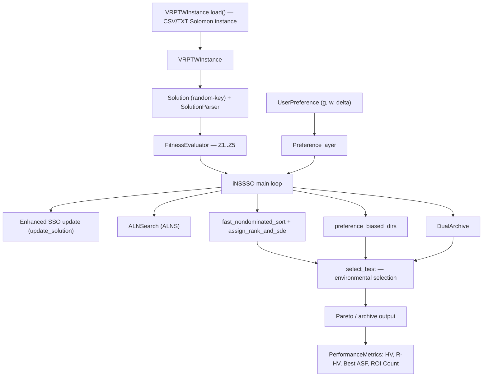
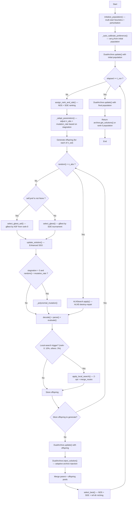
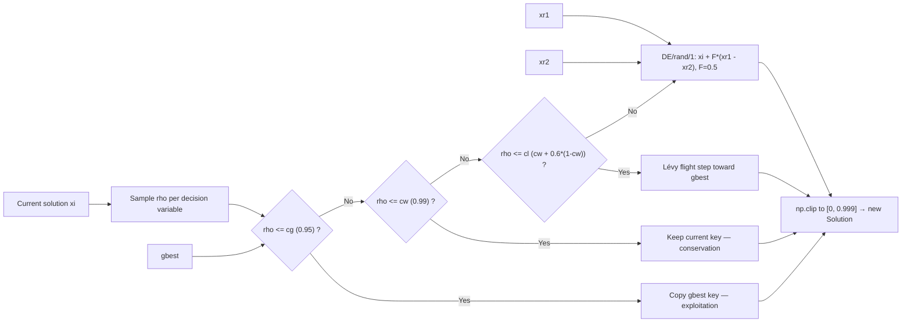
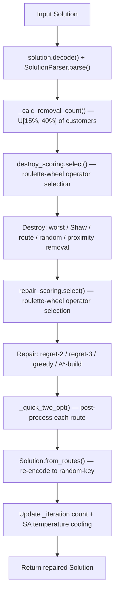
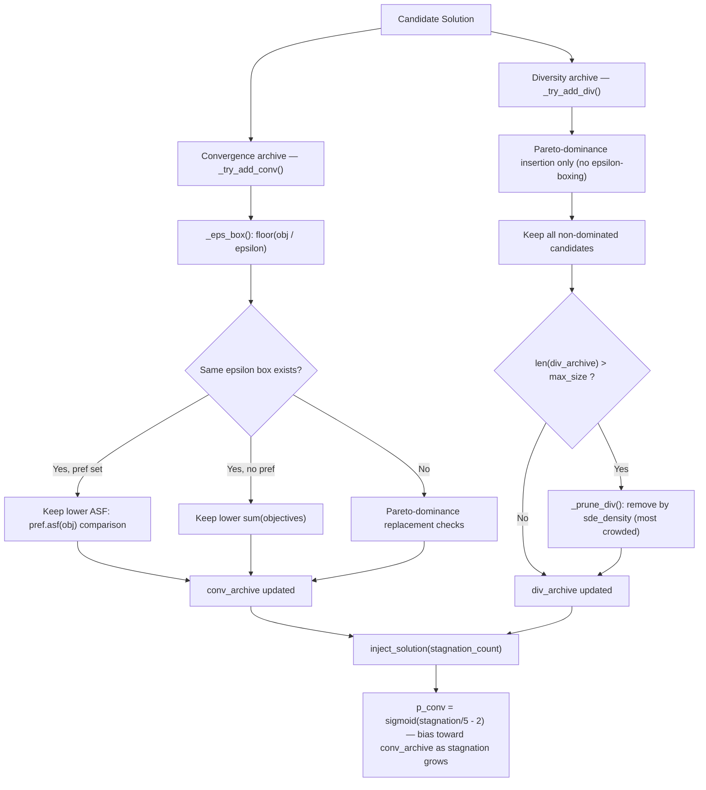
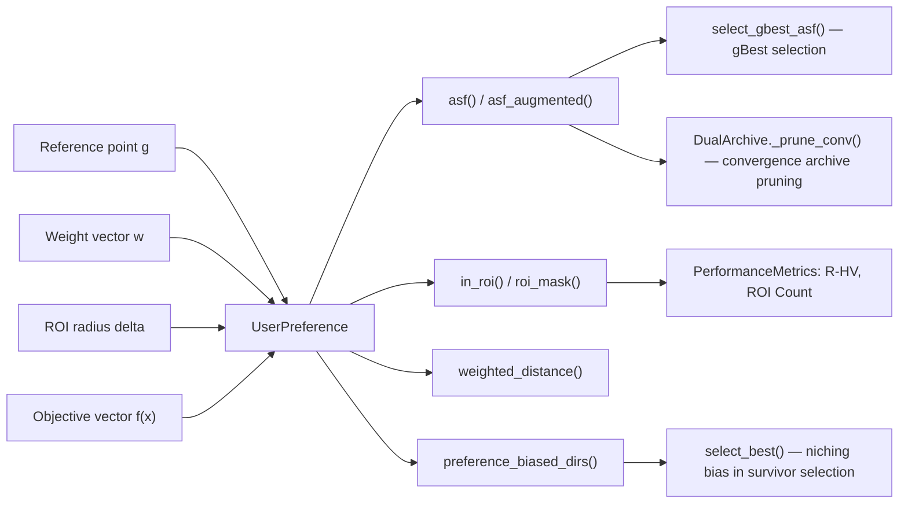
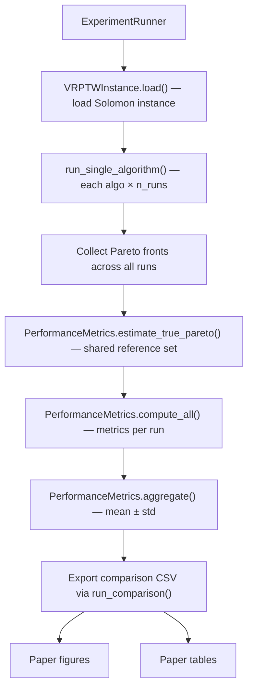

# Q1 Diagrams (Mermaid, Code-Aligned)

These diagrams are intentionally aligned with the current implementation, not with the strongest possible draft narrative.

Citation and claim keys are defined in `q1_evidence_matrix_2024_2026.md`.

---

## Diagram 1: System Architecture

### Giải thích

Bản đồ toàn cảnh hệ thống — các bộ phận nào tồn tại và chúng nối với nhau ra sao.

1. **Input**: File Solomon (.csv/.txt) → `VRPTWInstance.load()` tự phát hiện format → tạo `VRPTWInstance` chứa danh sách khách hàng, kho depot, ma trận khoảng cách, sức chứa xe.
2. **Encoding**: `Solution` (dãy số thực random-key) + `SolutionParser` (giải mã thành tuyến đường, kiểm tra tính khả thi).
3. **Evaluation**: `FitnessEvaluator` tính 5 mục tiêu — Z1 (số xe), Z2 (tổng quãng đường), Z3 (tổng thời gian chờ), Z4 (cân bằng tải max-min), Z5 (makespan).
4. **Preference**: `UserPreference(g, w, delta)` cung cấp thông tin ưu tiên: điểm tham chiếu g, trọng số w, bán kính ROI delta.
5. **Core loop**: `iNSSSO` sử dụng 5 công cụ con: Enhanced SSO, ALNSearch (ALNS), NDS+SDE ranking, preference-biased directions, DualArchive.
6. **Selection**: `select_best()` — chọn lọc sống sót kết hợp NDS + SDE + reference-direction niching.
7. **Output**: Pareto front từ archive hoặc rank-0 → `PerformanceMetrics` tính HV, R-HV, ASF, ROI Count.

---

## Diagram 2: Data Flow from Raw Instance to Final Objective Vector

```mermaid
flowchart LR
    A["CSV/TXT Solomon file"] --> B["VRPTWInstance.build_matrices() — distance + travel-time"]
    B --> C["Solution — random-key vector X"]
    C --> D["Solution.decode() — argsort(keys)+1"]
    D --> E["Routes: separators (val > n_customers) removed"]
    E --> F["SolutionParser.parse() — feasibility check + repair"]
    F --> G["SolutionParser.route_details() — distance, waits, completion"]
    G --> H["FitnessEvaluator.evaluate() — Z1..Z5"]
    H --> I["UserPreference: ASF, ROI mask"]
```

### Giải thích

Hành trình dữ liệu từ file thô đến vector mục tiêu:

1. Đọc file Solomon (.csv/.txt), ví dụ `C101.csv`.
2. `VRPTWInstance.build_matrices()` tính **ma trận khoảng cách** (khách i cách khách j bao xa) và **ma trận thời gian** (đi từ i đến j mất bao lâu).
3. Tạo **lời giải random-key** — dãy số thực ngẫu nhiên, ví dụ `[0.31, 0.87, 0.12, 0.95, ...]`.
4. `Solution.decode()` — sắp xếp dãy theo thứ tự tăng dần (`argsort`), cộng 1 → chuỗi số nguyên `[3, 1, 5, 2, ...]`.
5. Giá trị **> n_customers** là **dấu ngăn cách route** → bỏ chúng ra → ta được: Route 1 = [3, 1], Route 2 = [5, 2], ...
6. `SolutionParser.parse()` kiểm tra: xe có quá tải không? Khung giờ có vi phạm không? Khách vi phạm → `unassigned`.
7. `SolutionParser.route_details()` tính cho từng route: tổng quãng đường, thời gian chờ, thời gian hoàn thành.
8. `FitnessEvaluator.evaluate()` gộp thành **5 con số**: Z1..Z5. Đây là "điểm số" của lời giải.
9. Nếu có preference → `UserPreference` tính thêm ASF (gần g cỡ nào?) và ROI mask (nằm trong vùng quan tâm?).

---

## Diagram 3: iNSSSO Main Loop

### Giải thích

Trái tim thuật toán — mọi thứ lặp đi lặp lại ở đây.

**Giai đoạn khởi tạo:**

1. `initialize_population()` — Tạo ~100 lời giải ban đầu bằng nhiều chiến lược: Clarke-Wright savings, insertion heuristic (sắp theo ready_time, distance, angle, demand, due_date, tw_center), nearest neighbour, rồi perturbation (nhiễu nhẹ) để tạo đa dạng.
2. `_auto_calibrate_preference()` — Nhìn quần thể ban đầu, tự tính điểm tham chiếu g hợp lý (g = ideal + margin × (p10 - ideal)).
3. `DualArchive.update()` — Đưa quần thể ban đầu vào kho lưu trữ.

**Vòng lặp chính** (chạy cho đến hết `t_run`):

4. `assign_rank_and_sde()` — **Xếp hạng** quần thể:
   - **NDS**: chia thành tầng 0 (tốt nhất), tầng 1, tầng 2...
   - **SDE**: đo mỗi lời giải "đông đúc" hay "cô đơn" → ưu tiên giữ lời giải ở vùng thưa.

5. `_adapt_parameters()` — Tự điều chỉnh: nếu trì trệ > 5 thế hệ → tăng `n_abs` (dùng ALNS nhiều hơn, tối đa 50%); mutation_rate tăng dần theo progress.

6. **Sinh con** — Với mỗi cá thể (~100 lần), chọn 1 trong 2 cách:

   **Cách A** (xác suất `n_abs`, mặc định 20%): `ALNSearch.apply()` — Phá bỏ 15-40% khách hàng, xây lại bằng regret/greedy/A*-build, polish bằng 2-opt.

   **Cách B** (xác suất 80%):
   - Chọn gBest: có preference → `select_gbest_asf()` (ASF thấp nhất trong rank-0); không preference → `select_gbest()` (SDE tournament).
   - `update_solution()` — Enhanced SSO: 95% copy gBest, 4% giữ nguyên, 0.6% Lévy flight, 0.4% DE perturbation.
   - Nếu trì trệ > 3 → có thể thêm `_polynomial_mutation()`.

7. Giải mã + đánh giá: `decode()` → `parse()` → `evaluate()`.

8. **Local search**: rank-0 → 10% cơ hội; rank khác → 3%. Gọi `apply_local_search()` (2-opt + merge routes).

9. Lặp lại cho đến đủ ~100 con.

**Sau khi sinh xong:**

10. `DualArchive.update()` cập nhật archive với offspring.
11. `DualArchive.inject_solution()` — Lấy 1 lời giải từ archive chèn vào pool (bias theo stagnation).
12. Merge cha (~100) + con (~101) → `select_best()` chọn 100 sống sót bằng NDS + SDE + ref-dir niching.
13. Quay lại kiểm tra thời gian.

**Kết thúc:** `DualArchive.update()` lần cuối → trả về Pareto front.

---

## Diagram 4: Enhanced SSO Update (update_solution)

### Giải thích

Chi tiết cách cập nhật **từng biến** (từng vị trí trong dãy random-key):

1. Random số ρ ∈ [0, 1] cho **mỗi biến j**.
2. So sánh ρ với các ngưỡng:
   - **ρ ≤ 0.95 (cg)** → Copy key từ gBest. Khai thác mạnh, chiếm 95% cơ hội.
   - **0.95 < ρ ≤ 0.99 (cw)** → Giữ nguyên key hiện tại. Bảo toàn đa dạng.
   - **0.99 < ρ ≤ cl** → Lévy flight: nhảy bước ngẫu nhiên theo phân phối Lévy hướng về gbest (bước nhỏ nhiều, bước lớn ít). Khám phá có hướng.
   - **ρ > cl** → DE/rand/1: `xi + 0.5*(xr1 - xr2)` với xr1, xr2 là 2 lời giải ngẫu nhiên. Khám phá cấu trúc quần thể.
3. `np.clip(0, 0.999)` đảm bảo key hợp lệ → tạo Solution mới.

Nói đơn giản: **95% copy lời giải tốt nhất, 5% khám phá** để không bị kẹt cục bộ.

---

## Diagram 5: ALNSearch (ALNS) Flow

### Giải thích

ALNS (Adaptive Large Neighbourhood Search) — phá rồi sửa lời giải:

1. Nhận lời giải → `decode()` + `parse()` để có danh sách tuyến đường.
2. `_calc_removal_count()` — Random chọn xoá 15-40% tổng số khách.
3. `destroy_scoring.select()` — Dùng roulette wheel (operator tốt → được dùng nhiều) chọn 1 trong 5 cách phá:
   - **Worst removal**: xoá khách tiết kiệm distance nhiều nhất khi bỏ.
   - **Shaw removal**: xoá cụm khách "giống nhau" (gần nhau, khung giờ tương tự).
   - **Route removal**: xoá nguyên cả route (ưu tiên route nhỏ).
   - **Random removal**: xoá ngẫu nhiên.
   - **Proximity removal**: xoá cụm khách gần về mặt địa lý.
4. `repair_scoring.select()` — Chọn 1 trong 4 cách sửa:
   - **Regret-2/3**: chèn khách có "hối tiếc" lớn nhất trước (nếu không chèn bây giờ, chi phí tăng rất nhiều).
   - **Greedy**: chèn vào vị trí rẻ nhất.
   - **A\*-build**: xây route mới với scoring có preference.
5. `_quick_two_opt()` — Polish mỗi route (đảo đoạn giảm quãng đường).
6. `Solution.from_routes()` — Chuyển ngược từ tuyến đường → random-key.
7. Cập nhật iteration + giảm nhiệt độ SA. Mỗi 25 iteration → `end_segment()` cập nhật trọng số operator.

---

## Diagram 6: DualArchive Logic

### Giải thích

Kho lưu trữ lời giải tốt, chia 2 phần phục vụ 2 mục đích khác nhau:

**Convergence archive** (hội tụ) — `_try_add_conv()`:
1. `_eps_box()` tính "hộp" epsilon: `floor(obj / epsilon)`. Mỗi hộp đại diện cho một vùng nhỏ.
2. Cùng hộp đã có lời giải?
   - **Có + có preference**: giữ lời giải ASF thấp hơn (gần preference hơn).
   - **Có + không preference**: giữ lời giải tổng objectives nhỏ hơn.
   - **Chưa có**: kiểm tra Pareto-dominance bình thường.
3. Pruning khi quá đông: giữ `max_size` phần tử ASF thấp nhất.

**Diversity archive** (đa dạng) — `_try_add_div()`:
1. Chỉ dùng Pareto-dominance thuần (không epsilon boxing).
2. Quá đông → `_prune_div()`: tính `sde_density()`, xoá lời giải ở vùng đông đúc nhất.

**Injection** — `inject_solution(stagnation)`:
- `p_conv = sigmoid(stagnation/5 - 2)`.
- Trì trệ ít → lấy từ diversity archive (khám phá vùng mới).
- Trì trệ nhiều → lấy từ convergence archive (đẩy nhanh hội tụ).

---

## Diagram 7: UserPreference Layer

### Giải thích

Tầng ưu tiên — cho phép nói "tôi muốn lời giải như thế nào".

**3 Input:**
- **g** (reference point): "Tôi muốn lời giải gần giá trị này", ví dụ g = [10, 800, 0, 50, 200].
- **w** (weight vector): "Mục tiêu nào quan trọng hơn", ví dụ w = [0.3, 0.4, 0.1, 0.1, 0.1] → distance quan trọng nhất.
- **delta** (ROI radius): "Vùng quan tâm rộng bao nhiêu" — delta nhỏ = chỉ chấp nhận lời giải rất gần g.

**4 Output:**
1. `asf()` / `asf_augmented()` — Đo "lời giải cách g bao xa, có tính trọng số": `max(w_i × (f_i - g_i))`. Dùng cho chọn gBest và pruning convergence archive.
2. `in_roi()` / `roi_mask()` — Lời giải có nằm trong vùng ROI (elipsoid quanh g) không? Dùng tính R-HV và ROI Count.
3. `weighted_distance()` — Khoảng cách Euclid có trọng số từ lời giải đến g.
4. `preference_biased_dirs()` — Tạo reference directions: 70% tập trung quanh vùng preference, 30% phân bổ đều. Dùng trong `select_best()` để niching.

---

## Diagram 8: ExperimentRunner — Benchmark and Reporting Pipeline

### Giải thích

Quy trình chạy thí nghiệm so sánh thuật toán:

1. `ExperimentRunner` khởi tạo: thư mục data, n_runs, time_limit...
2. `VRPTWInstance.load()` đọc từng instance Solomon (C101, R101, RC101...).
3. `run_single_algorithm()` chạy mỗi thuật toán (iNSSSO, NSSSO, MOPSO, NSGA-II, MOEA/D, SPEA2) × n_runs lần. Mỗi lần trả về 1 Pareto front.
4. Thu thập tất cả Pareto front từ mọi lần chạy, mọi thuật toán.
5. `estimate_true_pareto()` — Gộp tất cả → tìm tập non-dominated chung làm "đáp án chuẩn".
6. `compute_all()` — So sánh PF mỗi lần chạy với đáp án → tính HV, IGD, Spread...
7. `aggregate()` — Tính mean ± std qua n_runs.
8. Export CSV (`comparison_C101.csv`, `full_benchmark.csv`) → vẽ figure + lập bảng cho paper.

---

## Figure Policy

Use these diagrams in the manuscript as follows:

- Fig. 1: Diagram 1 or Diagram 2
- Fig. 2: Diagram 3
- Fig. 3: Diagram 4
- Fig. 4: Diagram 5
- Fig. 5: Diagram 6
- Fig. 6: Diagram 7
- Fig. 7: Diagram 8

Do not reuse old flowcharts that mention:

- three-objective outputs only,
- full R-dominance survival selection,
- simulated annealing acceptance inside ALNS,
- seven-algorithm benchmark completion.
