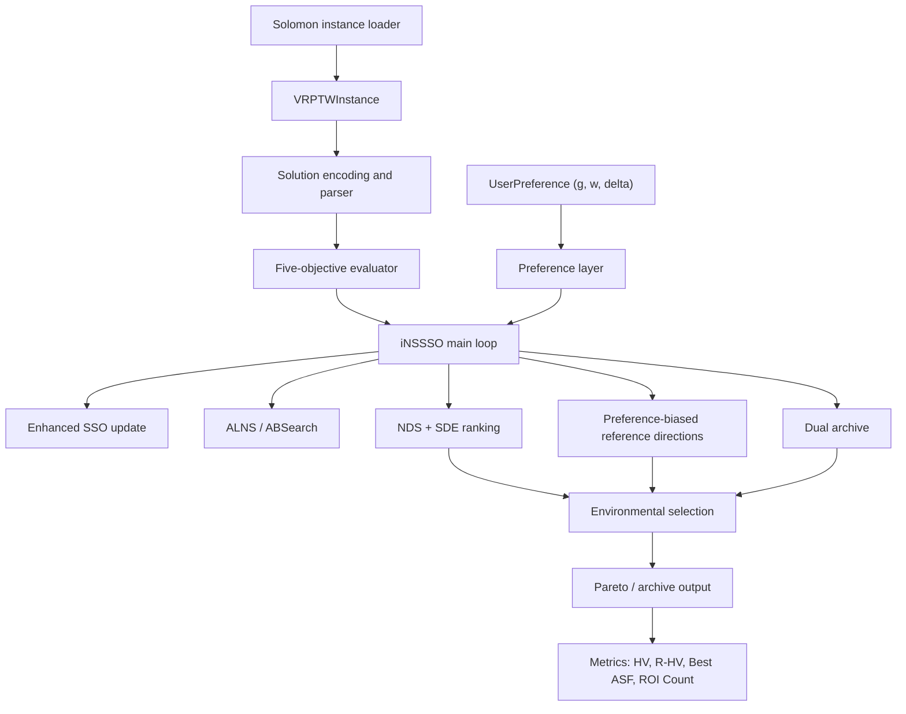
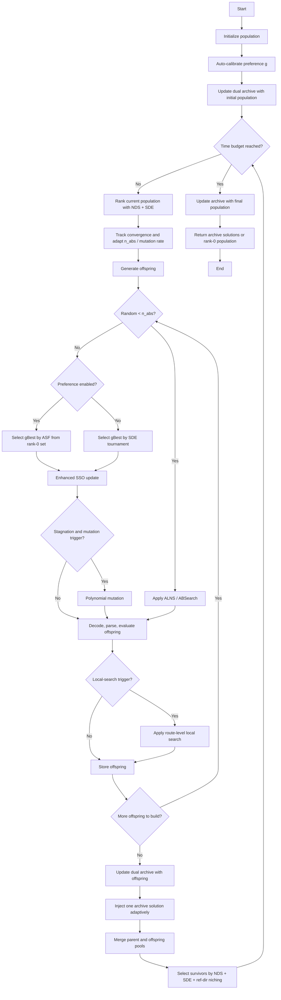
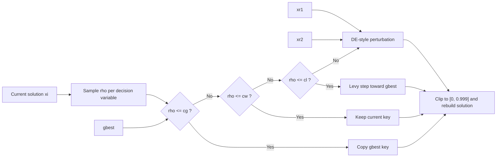
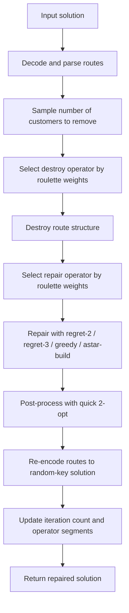
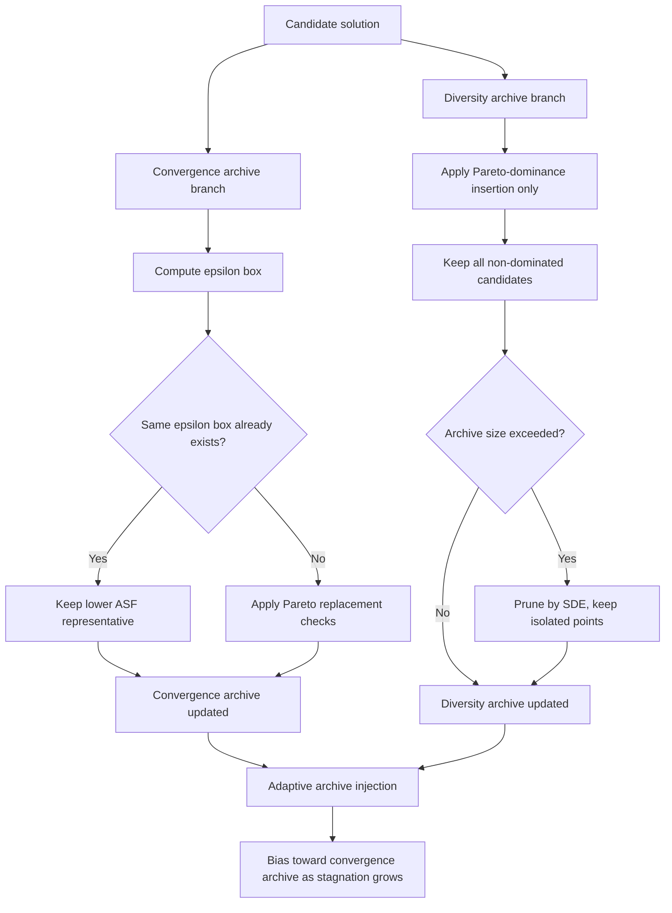
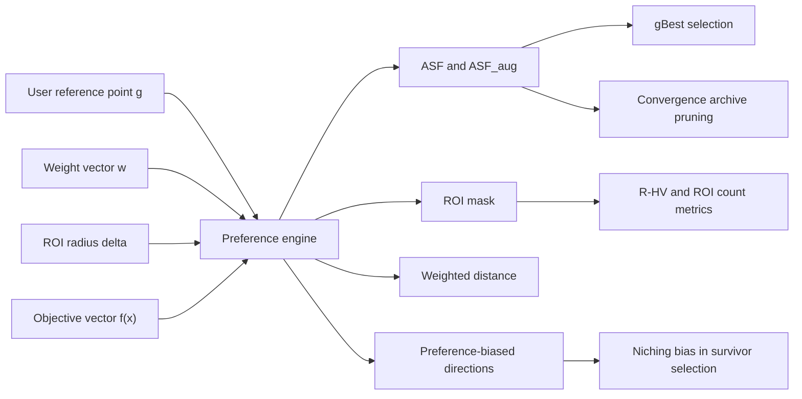
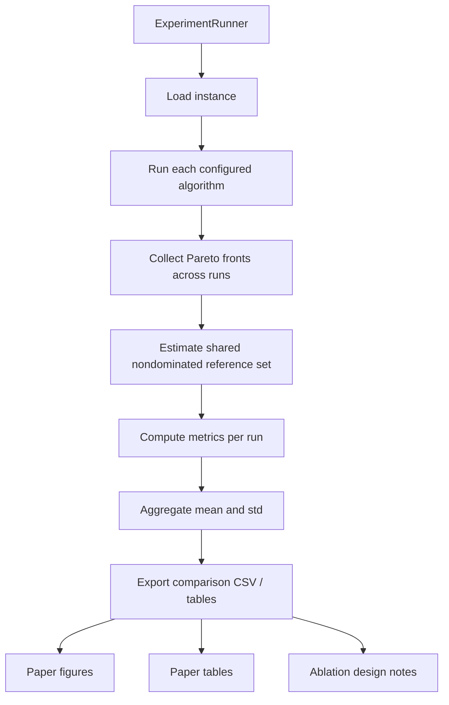

# Q1 Diagrams (Mermaid, Code-Aligned)

These diagrams are intentionally aligned with the current implementation, not with the strongest possible draft narrative.

Citation and claim keys are defined in `q1_evidence_matrix_2024_2026.md`.

## Diagram 1: System Architecture

## Diagram 2: Data Flow from Raw Instance to Final Objective Vector

```mermaid
flowchart LR
    A["CSV/TXT instance"] --> B["Distance and travel-time matrices"]
    B --> C["Random-key solution X"]
    C --> D["Decode via argsort"]
    D --> E["Routes with separators removed"]
    E --> F["Feasibility parse and repair"]
    F --> G["Route details: distance, waits, completion"]
    G --> H["Z1..Z5 evaluation"]
    H --> I["Preference evaluation: ASF, ROI"]
```

## Diagram 3: iNSSSO Main Loop

## Diagram 4: Enhanced SSO Update

## Diagram 5: ALNS / ABSearch Flow

## Diagram 6: Dual Archive Logic

## Diagram 7: Preference Layer

## Diagram 8: Benchmark and Reporting Pipeline

## Figure Policy

Use these diagrams in the manuscript as follows:

- Fig. 1: Diagram 1 or Diagram 2
- Fig. 2: Diagram 3
- Fig. 3: Diagram 4
- Fig. 4: Diagram 5
- Fig. 5: Diagram 6
- Fig. 6: Diagram 7
- Fig. 7: Diagram 8

Do not reuse old flowcharts that mention:

- three-objective outputs only,
- full R-dominance survival selection,
- simulated annealing acceptance inside ALNS,
- seven-algorithm benchmark completion.
